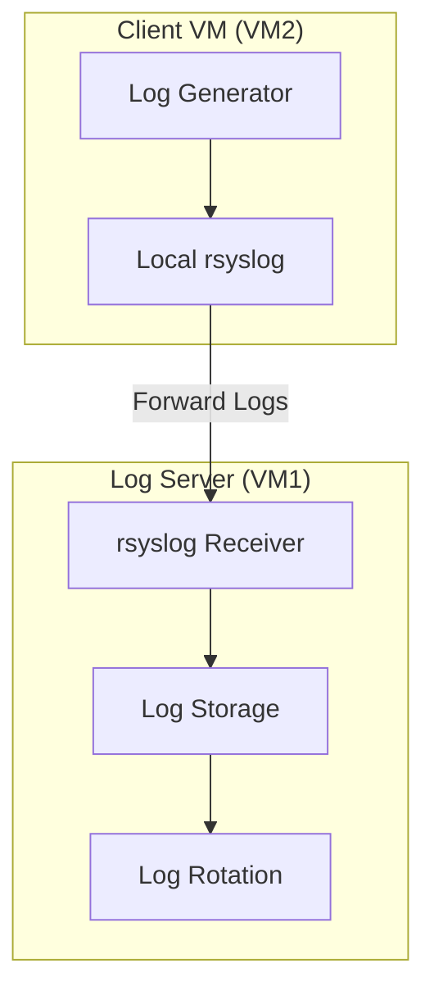

# Linux Logging Lab: Building Your First Log Server
## Overview

We'll build a centralized logging system using:
- 2 Virtual Machines (VMs)
- Ubuntu Server 22.04 LTS
- rsyslog for log management

### What We'll Build


## Part 1: Environment Setup (30-45 minutes)

### Required Software
- VirtualBox (latest version)
- Ubuntu Server 22.04 LTS ISO
- Text editor (like nano or vim)

### VM Setup
1. Create two VMs in VirtualBox:
   - **VM1 (Log Server)**:
     - Name: LogServer
     - Memory: 2GB
     - Disk: 20GB
     - Network: NAT Network
   
   - **VM2 (Client)**:
     - Name: LogClient
     - Memory: 1GB
     - Disk: 20GB
     - Network: NAT Network

2. Install Ubuntu Server on both VMs:
   - Choose "Ubuntu Server (minimized)"
   - Set username: sysadmin
   - Enable OpenSSH server

### Network Setup
1. Create NAT Network in VirtualBox:
   - Network name: LogLab
   - Network CIDR: 192.168.100.0/24
   - Enable DHCP

2. Configure Static IPs:
   On both VMs:
   ```bash
   # Edit netplan config
   sudo nano /etc/netplan/00-installer-config.yaml
   ```

   **For VM1 (Log Server)**:
   ```yaml
   network:
     ethernets:
       enp0s3:
         addresses: [192.168.100.10/24]
         routes:
           - to: default
             via: 192.168.100.1
         nameservers:
           addresses: [8.8.8.8]
     version: 2
   ```

   **For VM2 (Client)**:
   ```yaml
   network:
     ethernets:
       enp0s3:
         addresses: [192.168.100.20/24]
         routes:
           - to: default
             via: 192.168.100.1
         nameservers:
           addresses: [8.8.8.8]
     version: 2
   ```

   Apply network settings:
   ```bash
   sudo netplan apply
   # Verify connectivity
   ping 8.8.8.8
   ```

## Part 2: Basic Logging Setup (30 minutes)

### Install Required Packages
On both VMs:
```bash
# Update system
sudo apt update
sudo apt install -y rsyslog

# Verify installation
systemctl status rsyslog
```

### Configure Log Server (VM1)
1. Edit rsyslog configuration:
```bash
sudo nano /etc/rsyslog.conf

# Add these lines at the end:
# Enable UDP syslog reception
module(load="imudp")
input(type="imudp" port="514")

# Create log directories
sudo mkdir -p /var/log/remote
sudo chmod 755 /var/log/remote
```

2. Create log routing:
```bash
sudo nano /etc/rsyslog.d/remote.conf

# Add this line:
*.* /var/log/remote/syslog.log
```

3. Restart rsyslog:
```bash
sudo systemctl restart rsyslog
```

### Configure Client (VM2)
1. Edit rsyslog configuration:
```bash
sudo nano /etc/rsyslog.d/forward.conf

# Add this line (use VM1's IP):
*.* @192.168.100.10:514
```

2. Restart rsyslog:
```bash
sudo systemctl restart rsyslog
```

## Part 3: Testing & Verification (15 minutes)

### Test Log Forwarding
On VM2 (Client):
```bash
# Generate test log
logger "Test message from client"
```

On VM1 (Server):
```bash
# Check received logs
tail -f /var/log/remote/syslog.log
```

### Basic Log Generator
Create a simple log generator on VM2:
```bash
cat << 'EOF' > ~/generate_logs.sh
#!/bin/bash
while true; do
    logger "Test log: $(date)"
    sleep 5
done
EOF

chmod +x ~/generate_logs.sh
./generate_logs.sh
```

## Common Issues & Solutions

1. **Logs not forwarding?**
   - Check network connectivity: `ping 192.168.100.10`
   - Verify rsyslog is running: `systemctl status rsyslog`
   - Check firewall: `sudo ufw allow 514/udp`

2. **Permission issues?**
   ```bash
   sudo chmod 755 /var/log/remote
   sudo chown syslog:adm /var/log/remote
   ```

3. **Network issues?**
   - Verify IP settings: `ip addr show`
   - Check routing: `ip route`
   - Test connectivity: `ping 8.8.8.8`

## Optional Extensions

If you finish early, try:
1. Setting up log rotation
2. Creating different log categories
3. Adding timestamps to logs

## Submission Requirements

Create a file called `lab_report.txt` containing:
1. Your name and date
2. VM IP addresses
3. Any issues encountered
4. Output from:
   ```bash
   # On both VMs
   ip addr show
   systemctl status rsyslog
   ```

## Need Help?

If you get stuck:
1. Check the troubleshooting section above
2. Ask your instructor
3. Google the exact error message
4. Check rsyslog documentation at https://www.rsyslog.com/doc/