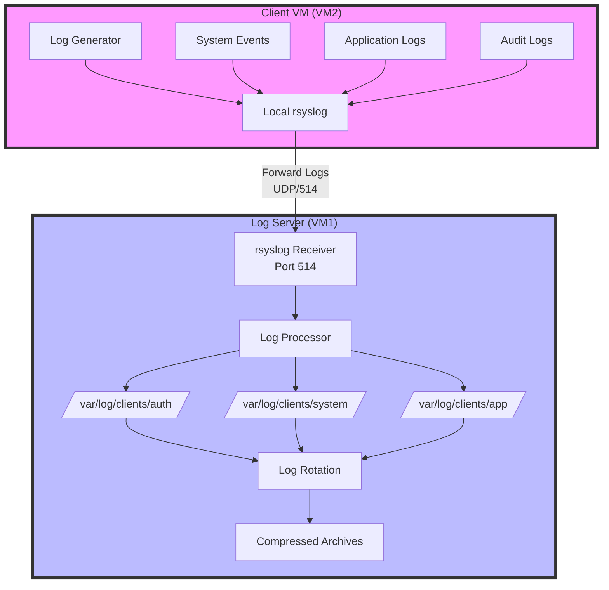
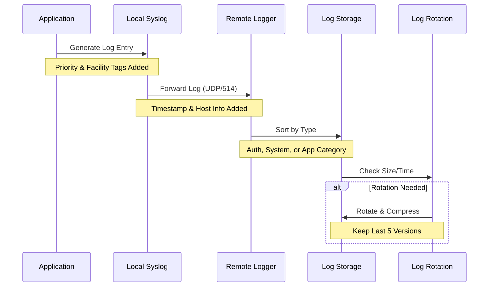
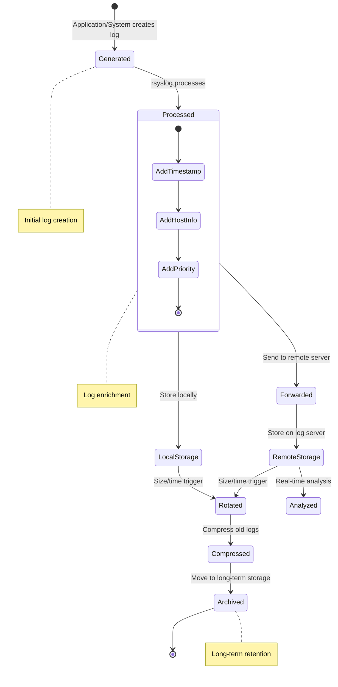
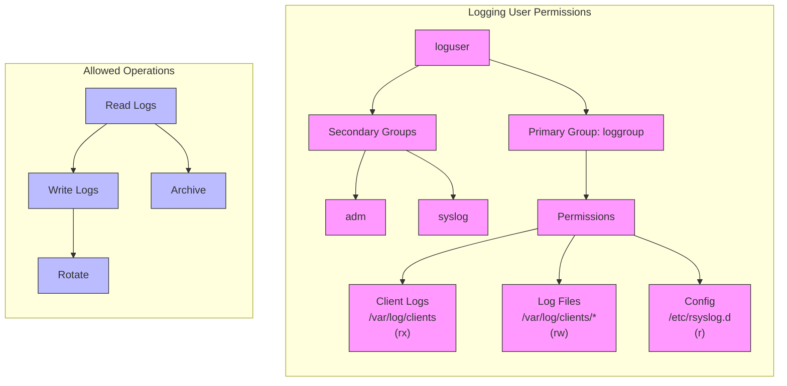

# Linux Logging Deep Dive: From Basics to Advanced Monitoring
## A Hands-on Workshop

### Lab Overview

First, let's understand the architecture we'll be building. This diagram shows how logs flow through our system:



The above diagram shows how logs are generated, processed, and stored in our two-VM setup. Notice how all logs from VM2 are forwarded to VM1 for centralized processing and storage.

The following sequence diagram shows how individual log entries are processed:



This sequence shows the journey of each log entry from creation to storage.

Finally, here's a state diagram showing all possible states a log entry can be in:



And here's our user permissions structure:



Understanding these flows will help you better grasp the practical exercises that follow.
Welcome to this immersive hands-on workshop on Linux logging systems! In this lab, you'll build a complete logging infrastructure from the ground up, learning how Linux logging works by doing. Instead of just configuring components, you'll understand why each piece matters and how they work together.

### Learning Objectives
By the end of this lab, you will be able to:
- Build and manage a production-grade logging infrastructure
- Troubleshoot common logging issues
- Implement security monitoring using logs
- Create automated log analysis solutions

### Prerequisites
- Basic Linux command line experience
- VirtualBox installed on your computer
- 2-4 hours of focused time
- Coffee ☕ (optional but recommended!)

--------------------------------

## Lab Environment Setup

### Virtual Machine Requirements
You'll need two VMs for this lab:
- **VM1 (LogServer)**: 2GB RAM, 20GB storage
- **VM2 (ClientServer)**: 1GB RAM, 20GB storage

Both VMs should run either Ubuntu 22.04 LTS or AlmaLinux 9. Choose one distribution and stick with it throughout the lab.

### Initial Setup Steps

#### 1. Basic VM Setup
1. Download the appropriate ISO
2. Create both VMs in VirtualBox
3. Configure networking:
   ```bash
   # On both VMs
   ip addr show
   # Note down the IP addresses - you'll need these later
   ```

#### 2. Security Setup: Creating a Dedicated Logging User

The diagram below shows the permissions structure we'll implement for our logging user:


### Dependency Installation

1. On both VMs:

For Ubuntu/Debian:
```bash
sudo apt update
sudo apt install rsyslog logrotate acl syslog-ng
```

For RHEL/AlmaLinux:
```bash
sudo dnf update
sudo dnf install rsyslog logrotate acl syslog-ng
```

2. Verify installations:
```bash
rsyslogd -v
logrotate --version
```

3. Enable services:
```bash
sudo systemctl enable rsyslog
sudo systemctl start rsyslog
sudo systemctl status rsyslog
```

4. Test rsyslog:
```bash
logger "Test log message"
tail /var/log/syslog  # Ubuntu
tail /var/log/messages  # AlmaLinux
```

Let's create a dedicated logging user with proper permissions. This is crucial for security:

```bash
# On both VMs:

# Create logging group
sudo groupadd loggroup

# Create logging user with no login shell
sudo useradd -r -s /sbin/nologin -g loggroup -G adm,syslog loguser

# Set up log directories with proper permissions
sudo mkdir -p /var/log/clients/{auth,system,app}
sudo chown -R loguser:loggroup /var/log/clients
sudo chmod -R 750 /var/log/clients

# Set up specific directory permissions
sudo find /var/log/clients -type d -exec chmod 750 {} \;
sudo find /var/log/clients -type f -exec chmod 640 {} \;

# Allow loguser to read rsyslog configuration
sudo setfacl -m u:loguser:r /etc/rsyslog.conf
sudo setfacl -m u:loguser:r-x /etc/rsyslog.d/

# Create log rotation directory with proper permissions
sudo mkdir -p /var/log/archive
sudo chown loguser:loggroup /var/log/archive
sudo chmod 750 /var/log/archive

# Verify permissions
ls -la /var/log/clients
getfacl /etc/rsyslog.conf
id loguser
```

Key security features of this setup:
- Dedicated `loguser` with no login shell
- Restricted permissions using ACLs
- Separate group for log management
- Minimal necessary permissions following principle of least privilege

--------------------------------

### Story-Driven Scenario
You're a system administrator at TechCorp, a growing startup. After several minor incidents where important logs were lost, management has tasked you with building a robust logging infrastructure. This lab simulates that real-world scenario.

## Part 1: Understanding the Logging Basics (45 minutes)

### 1.1 The Anatomy of Linux Logs
```bash
# Let's first explore where logs live
cd /var/log
ls -la

# What processes are writing logs right now?
sudo lsof | grep /var/log
```

### 1.2 Your First Custom Logger
```bash
# Create a simple script that generates interesting logs
cat << 'EOF' > ~/log_generator.sh
#!/bin/bash
while true; do
    # Simulate different types of events
    case $((RANDOM % 4)) in
        0) logger -p auth.info "User login successful from $(shuf -n 1 /etc/hosts)";;
        1) logger -p kern.warning "High CPU usage detected: $((50 + RANDOM % 50))%";;
        2) logger -p daemon.error "Database connection timeout after 30s";;
        3) logger -p syslog.info "Backup completed successfully, $(date)";;
    esac
    sleep $((2 + RANDOM % 5))
done
EOF

chmod +x ~/log_generator.sh
```

### 1.3 Log Detective Game
Before moving to centralized logging, let's practice finding information in logs:

1. Start the log generator:
   ```bash
   ~/log_generator.sh &
   ```

2. Complete these challenges:
   - Find all failed database connections
   - Identify the highest CPU usage reported
   - List all successful backups
   - Calculate the average time between events

## Part 2: Building a Central Logging Infrastructure (60 minutes)

### 2.1 Setting Up the Log Server (VM1)
```bash
# Install and configure rsyslog for remote reception
sudo apt update
sudo apt install rsyslog

# Use the dedicated logging user for operations
sudo chown -R loguser:loggroup /var/log/clients
sudo chmod -R 750 /var/log/clients

# Set specific rsyslog permissions
sudo chown loguser:loggroup /etc/rsyslog.d/client-sorting.conf
sudo chmod 640 /etc/rsyslog.d/client-sorting.conf
```

### 2.2 Implementing Log Segregation
Configure rsyslog to sort incoming logs by type:

```bash
# Create a new configuration file
sudo nano /etc/rsyslog.d/client-sorting.conf

# Add intelligent log routing rules
if $fromhost-ip startswith '192.168.' then {
    auth.* /var/log/clients/auth/auth.log
    kern.* /var/log/clients/system/kern.log
    *.* /var/log/clients/app/catch-all.log
    stop
}
```

### 2.3 Setting Up Log Forwarding (VM2)
Now we'll configure VM2 to forward its logs intelligently.

## Part 3: Advanced Logging Features (45 minutes)

### 3.1 Implementing Log Rotation with Strategy
Instead of just setting up logrotate, let's create a smart rotation strategy:

```bash
# Create a size-based rotation for high-volume logs
sudo nano /etc/logrotate.d/high-volume
/var/log/clients/app/*.log {
    size 50M
    rotate 5
    compress
    delaycompress
    notifempty
    create 0640 loguser loggroup
    postrotate
        systemctl reload rsyslog
    endscript
}
```

### Log Analysis Dashboard Setup (VM1 - Central Log Server)

The dashboard should be implemented on VM1 (the central log server) since this is where all logs are collected. Here's the complete setup:

1. **Installation Location**
```bash
# On VM1 (Central Log Server):

# Create monitoring directory with proper permissions
sudo mkdir -p /opt/monitoring
sudo chown loguser:loggroup /opt/monitoring
sudo chmod 750 /opt/monitoring

# Create the dashboard script
sudo nano /opt/monitoring/log_dashboard.sh

# Set proper permissions
sudo chown loguser:loggroup /opt/monitoring/log_dashboard.sh
sudo chmod 750 /opt/monitoring/log_dashboard.sh
```

2. **Required Packages**
```bash
# Install required utilities
sudo apt install -y gawk bc sysstat net-tools

# Verify installation
which awk bc sar netstat
```

3. **Log Access Setup**
```bash
# Ensure loguser has read access to all required logs
sudo setfacl -R -m u:loguser:rx /var/log/clients/
sudo setfacl -R -m u:loguser:rx /var/log/audit/
```

4. **Running the Dashboard**
```bash
# Method 1: Run in current terminal
sudo -u loguser /opt/monitoring/log_dashboard.sh

# Method 2: Run in a screen session (recommended for long-term monitoring)
sudo apt install screen
screen -S log_dashboard
sudo -u loguser /opt/monitoring/log_dashboard.sh
# Press Ctrl+A+D to detach
# Use 'screen -r log_dashboard' to reattach

# Method 3: Run in a tmux session (alternative to screen)
sudo apt install tmux
tmux new -s log_dashboard
sudo -u loguser /opt/monitoring/log_dashboard.sh
# Press Ctrl+B+D to detach
# Use 'tmux attach -t log_dashboard' to reattach
```

5. **Automated Dashboard Startup**
```bash
# Create a systemd service for automatic startup
sudo nano /etc/systemd/system/log-dashboard.service

[Unit]
Description=Log Analysis Dashboard
After=rsyslog.service

[Service]
Type=simple
User=loguser
Group=loggroup
ExecStart=/opt/monitoring/log_dashboard.sh
Restart=always
StandardOutput=journal
StandardError=journal

[Install]
WantedBy=multi-user.target
```

```bash
# Enable and start the service
sudo systemctl daemon-reload
sudo systemctl enable log-dashboard
sudo systemctl start log-dashboard

# Check status
sudo systemctl status log-dashboard
```

6. **Dashboard Access Methods**

A. **Direct Console Access**:
```bash
# View the dashboard directly
sudo systemctl status log-dashboard --no-pager -n 50
```

B. **Web Access Setup** (Optional Enhanced Feature):
```bash
# Install lightweight web server
sudo apt install nginx

# Create web dashboard wrapper
sudo nano /opt/monitoring/web_dashboard.sh
#!/bin/bash
while true; do
    /opt/monitoring/log_dashboard.sh | \
        ansi2html > /var/www/html/dashboard.html
    sleep 10
done

# Set up web access
sudo nano /etc/nginx/sites-available/dashboard
server {
    listen 8080;
    root /var/www/html;
    location / {
        auth_basic "Log Dashboard";
        auth_basic_user_file /etc/nginx/.htpasswd;
    }
}

# Create dashboard user
sudo htpasswd -c /etc/nginx/.htpasswd dashboard_user

# Enable site
sudo ln -s /etc/nginx/sites-available/dashboard /etc/nginx/sites-enabled/
sudo nginx -t
sudo systemctl restart nginx
```

### Dashboard Access Security

1. **Access Control**:
```bash
# Limit dashboard access to specific IPs
sudo nano /etc/hosts.allow
dashboard: 192.168.1.0/24

# Deny all other access
sudo nano /etc/hosts.deny
dashboard: ALL
```

2. **Monitoring Dashboard Access**:
```bash
# Create access log
sudo touch /var/log/dashboard_access.log
sudo chown loguser:loggroup /var/log/dashboard_access.log

# Add to dashboard rotation
sudo nano /etc/logrotate.d/dashboard
/var/log/dashboard_access.log {
    daily
    rotate 7
    compress
    delaycompress
    missingok
    create 0640 loguser loggroup
}
```

Remember to include all these configurations in your submission package!

```bash
#!/bin/bash
# log_dashboard.sh - Real-time Log Analysis Dashboard

# Colors for better visibility
RED='\033[0;31m'
GREEN='\033[0;32m'
YELLOW='\033[1;33m'
NC='\033[0m' # No Color

# Function to clear screen and show header
show_header() {
    clear
    echo -e "${GREEN}=== Real-time Log Analysis Dashboard ===${NC}"
    echo "Last Updated: $(date '+%Y-%m-%d %H:%M:%S')"
    echo "----------------------------------------"
}

# Function to count events by severity
analyze_logs() {
    local log_file=$1
    local minutes=$2
    
    # Get timestamp from X minutes ago
    local time_threshold=$(date -d "$minutes minutes ago" '+%s')
    
    # Analysis results
    local error_count=0
    local warning_count=0
    local info_count=0
    local auth_failures=0
    
    while IFS= read -r line; do
        # Convert log timestamp to epoch
        local log_time=$(date -d "$(echo "$line" | awk '{print $1" "$2" "$3}')" '+%s' 2>/dev/null)
        
        # Only process recent logs
        if [[ $log_time -ge $time_threshold ]]; then
            if echo "$line" | grep -q "ERROR"; then
                ((error_count++))
            elif echo "$line" | grep -q "WARNING"; then
                ((warning_count++))
            elif echo "$line" | grep -q "INFO"; then
                ((info_count++))
            fi
            
            # Count authentication failures
            if echo "$line" | grep -q "authentication failure"; then
                ((auth_failures++))
            fi
        fi
    done < "$log_file"
    
    # Display results
    echo -e "${RED}Errors (last $minutes min): $error_count${NC}"
    echo -e "${YELLOW}Warnings (last $minutes min): $warning_count${NC}"
    echo -e "${GREEN}Info (last $minutes min): $info_count${NC}"
    echo "----------------------------------------"
    echo -e "Authentication Failures: $auth_failures"
    
    # Calculate rates
    local total=$((error_count + warning_count + info_count))
    if [ $total -gt 0 ]; then
        local error_rate=$(( (error_count * 100) / total ))
        echo "Error Rate: ${error_rate}%"
    fi
}

# Function to show top IP addresses
show_top_ips() {
    echo "----------------------------------------"
    echo "Top Source IPs (last hour):"
    grep -oE "\b([0-9]{1,3}\.){3}[0-9]{1,3}\b" "$1" | sort | uniq -c | sort -nr | head -5
}

# Function to monitor disk usage
check_disk_usage() {
    echo "----------------------------------------"
    echo "Log Storage Status:"
    df -h /var/log | tail -n 1 | awk '{print "Used: "$5" of "$2" ("$3" used, "$4" free)"}'
}

# Main loop
main() {
    local log_file="/var/log/clients/app/catch-all.log"
    local refresh_rate=10 # seconds
    
    while true; do
        show_header
        analyze_logs "$log_file" 5  # Show last 5 minutes
        show_top_ips "$log_file"
        check_disk_usage
        
        echo "----------------------------------------"
        echo "Press Ctrl+C to exit. Refreshing every ${refresh_rate}s..."
        sleep $refresh_rate
    done
}

main
```

## Part 4: Security Monitoring (30 minutes)

### 4.1 Setting Up Audit Rules
```bash
# Install auditd
sudo apt install auditd

# Create focused audit rules
sudo auditctl -w /etc/passwd -p wa -k user_changes
sudo auditctl -w /etc/ssh/sshd_config -p wa -k ssh_config
```

### 4.2 Creating a Security Dashboard
Let's build a simple security monitoring dashboard that integrates audit logs with system logs.

## Bonus Challenges

1. **Log Analysis Competition**: Find specific patterns in the logs fastest
2. **Failure Injection**: Deliberately break logging and fix it
3. **Performance Testing**: How many logs can your system handle?

## Security Best Practices

### Logging Security Checklist

1. **User and Permission Management**
   - Use dedicated `loguser` account for all logging operations
   - Implement principle of least privilege
   - Regular permission audits
   - No direct root access to log files

2. **Log File Security**
   ```bash
   # Verify file permissions regularly
   sudo find /var/log/clients -type f -exec stat -c "%n %a %U %G" {} \;
   
   # Monitor for permission changes
   sudo auditctl -w /var/log/clients -p wa -k log_security
   ```

3. **Transport Security**
   ```bash
   # Enable TLS for log transmission
   # In /etc/rsyslog.conf on both servers:
   module(load="imtls")
   input(type="imtls" port="6514")
   ```

4. **Regular Security Audits**
   ```bash
   # Create a simple audit script
   cat << 'EOF' > ~/audit_logs.sh
   #!/bin/bash
   echo "=== Log File Permissions Audit ==="
   find /var/log/clients -type f -exec stat -c "%n %a %U %G" {} \;
   echo "=== Logging User Privileges ==="
   sudo -u loguser touch /var/log/clients/test 2>&1
   echo "=== Open Log Files ==="
   lsof | grep /var/log/clients
   EOF
   ```

### Security Monitoring

1. **Set up log tampering detection**
   ```bash
   # Install inotify-tools
   sudo apt install inotify-tools
   
   # Monitor for suspicious access
   inotifywait -m -r /var/log/clients
   ```

2. **Regular integrity checks**
   ```bash
   # Create checksums of critical log files
   find /var/log/clients -type f -name '*.log' -exec sha256sum {} \; > checksums.txt
   ```

## Troubleshooting Guide

Common issues you might encounter and how to solve them:
1. Logs not forwarding? Check:
   - Network connectivity
   - Firewall rules
   - rsyslog service status
2. High CPU usage? Check:
   - Log rotation settings
   - Disk I/O
   - Network bottlenecks

--------------------------------
# Submission Guide

You can submit your work in **one** of these two ways:

## 1. GitHub Repository (Preferred)
1. Create a public GitHub repository with following structure:
```
lab_01/
├── submission.md          # Your main documentation (including Mermaid diagrams)
├── scripts/              # Your scripts
│   ├── log_generator.sh
│   ├── log_dashboard.sh
│   └── audit_logs.sh
├── configs/              # Your configurations
│   ├── rsyslog.d/
│   └── logrotate.d/
└── system_info.txt       # System information
```

2. For Mermaid diagrams in submission.md:
   - Copy these sections from the lab instructions into your submission.md:
   ```markdown
   ## Architecture Diagram
   ```mermaid
   flowchart TD
       subgraph Client["Client VM (VM2)"]
           A[Log Generator] --> B[Local rsyslog]
           ...
   ```
   - Make sure to include all four diagrams:
     - Logging Architecture Overview
     - Log Processing Sequence
     - Log Entry States
     - User Permissions Structure

3. Submit your repository URL in Google Classroom

## 2. Archive File
1. Create and package your files:
```bash
# Create submission directory
mkdir -p ~/lab_submission/{scripts,configs}

# Copy your files
cp ~/log_*.sh lab_submission/scripts/
sudo cp -r /etc/rsyslog.d/custom* lab_submission/configs/
sudo cp -r /etc/logrotate.d/high-volume lab_submission/configs/

# Generate system info
{
    echo "=== System Information ==="
    uname -a
    echo -e "\n=== Network Configuration ==="
    ip addr show
    echo -e "\n=== Package Versions ==="
    dpkg -l | grep -E 'rsyslog|auditd|logrotate'
} > lab_submission/system_info.txt

# Create archive
cd ~/
tar -czf lab_submission_$(date +%Y%m%d).tar.gz lab_submission/
```
2. Submit the generated .tar.gz file in Google Classroom

Both submission methods must include:
- Complete documentation (submission.md)
- All Mermaid diagrams (copy from lab instructions)
- All scripts and configurations
- System information
- Dashboard screenshots/output

#### Required Documentation Structure (submission.md)

Create your submission.md following this template:

```markdown
# Lab 01: Linux Logging Implementation
## Student Information
- **Name:** [Your Name]
- **Repository URL:** [Your GitHub Repository URL]
- **Date:** [Submission Date]

## Environment Setup
### VM Configuration
- **VM1 (Log Server)**
  - IP Address: [IP]
  - OS Version: [e.g., Ubuntu 22.04]
  - Role: Central Log Server

- **VM2 (Client)**
  - IP Address: [IP]
  - OS Version: [e.g., Ubuntu 22.04]
  - Role: Log Generator

--------------------------------

## Implementation Details

### 1. Security Setup
- [ ] Created loguser and loggroup
- [ ] Configured proper permissions
- [ ] Verified access controls

### 2. Logging Configuration
- [ ] Set up rsyslog forwarding
- [ ] Configured log rotation
- [ ] Implemented audit rules

### 3. Dashboard Implementation
- [ ] Created monitoring dashboard
- [ ] Implemented real-time analysis
- [ ] Added visualization features

--------------------------------
## Testing Results

### Security Tests
\`\`\`bash
# Output of permission verification
[Your command output here]
\`\`\`

### Log Generation Tests
\`\`\`bash
# Output showing logs being generated
[Your command output here]
\`\`\`

### Dashboard Output
[Screenshot or output of your dashboard]

## Challenges and Solutions
1. [Describe any challenges you faced]
2. [How you solved them]

## Additional Implementations
- [Any extra features you added]
- [Performance improvements]
- [Security enhancements]
```

Submit your work following one of the methods above in Google Classroom.

--------------------------------

## Implementation Verification

### 1. Logging User Setup
```bash
# Show user and group information
id loguser

# Show log directory permissions
ls -la /var/log/clients

# Show rsyslog configuration permissions
getfacl /etc/rsyslog.conf
```

### 2. Log Generation and Forwarding
```bash
# On VM2 - Show logs being generated
tail -n 5 /var/log/syslog

# On VM1 - Show logs being received
tail -n 5 /var/log/clients/app/catch-all.log
```

### 3. Log Rotation Configuration
```bash
# Display logrotate configuration
cat /etc/logrotate.d/high-volume

# Show current log files including rotated ones
ls -la /var/log/clients/app/
```

### 4. Security Implementation
```bash
# Display current audit rules
sudo auditctl -l

# Show recent security events
sudo ausearch -k log_security | tail -n 5
```

### 5. Log Analysis Dashboard
Include a screenshot or output of your log analyzer showing:
- Real-time log analysis
- Error/Warning counts
- System statistics
- Security alerts

### Challenges Encountered
1. [Describe any issues you faced]
   - How you identified the problem
   - Steps taken to resolve it

2. [Additional challenges]
   - Impact on implementation
   - Solution approach
   - Lessons learned

### Bonus Implementations
* **Extra Features**
  - [Describe any additional functionality]
  - [Include relevant commands or screenshots]

* **Security Enhancements**
  - [Additional security measures implemented]
  - [How they improve the system]

* **Performance Optimizations**
  - [Performance improvements made]
  - [Metrics showing the impact]
```

### 2. Script Collection
Create a tar archive containing all your custom scripts:

```bash
tar -czf scripts.tar.gz \
    ~/log_generator.sh \
    ~/log_analyzer.sh \
    ~/audit_logs.sh \
    # Add any other custom scripts
```

### 3. Configuration Files
Create a tar archive of your configuration files:

```bash
sudo tar -czf configs.tar.gz \
    /etc/rsyslog.d/client-sorting.conf \
    /etc/logrotate.d/high-volume \
    # Add any other custom configs
```

### 4. Submission Command
Run this command to generate your submission package:

```bash
# Create submission directory
mkdir -p ~/lab_submission
cd ~/lab_submission

# Copy all required files
cp ~/submission.md .
cp ~/scripts.tar.gz .
cp ~/configs.tar.gz .

# Create system info file
{
    echo "=== System Information ==="
    uname -a
    echo -e "\n=== IP Configuration ==="
    ip addr show
    echo -e "\n=== Installed Packages ==="
    dpkg -l | grep -E 'rsyslog|auditd|logrotate'
} > system_info.txt

# Create final archive
tar -czf lab_submission_$(date +%Y%m%d).tar.gz \
    submission.md \
    scripts.tar.gz \
    configs.tar.gz \
    system_info.txt

echo "Submit the file: lab_submission_$(date +%Y%m%d).tar.gz"
```

### 5. Grading Criteria

| Component | Points | Criteria |
|-----------|--------|----------|
| Basic Setup | 20 | - Proper VM configuration<br>- Network connectivity<br>- Logging user setup |
| Log Management | 25 | - Log generation working<br>- Log forwarding functional<br>- Proper log rotation |
| Security | 25 | - Correct permissions<br>- Audit rules in place<br>- Security monitoring active |
### Dashboard Requirements

Your log analysis dashboard must show:

1. **Real-time Metrics**:
   - Error/Warning/Info counts for last 5 minutes
   - Current error rate percentage
   - Authentication failures count

2. **Security Information**:
   - Top 5 source IP addresses
   - Failed authentication attempts
   - Suspicious activity patterns

3. **System Status**:
   - Log storage usage
   - Log rotation status
   - System performance impact

4. **Expected Output Format**:
```
=== Real-time Log Analysis Dashboard ===
Last Updated: 2024-03-18 14:30:45
----------------------------------------
Errors (last 5 min): 12
Warnings (last 5 min): 45
Info (last 5 min): 234
----------------------------------------
Authentication Failures: 3
Error Rate: 4%
----------------------------------------
Top Source IPs (last hour):
     15 192.168.1.100
      8 192.168.1.101
      6 192.168.1.102
      4 192.168.1.103
      2 192.168.1.104
----------------------------------------
Log Storage Status:
Used: 45% of 50G (22G used, 28G free)
```

5. **Submission Requirements**:
   - Working dashboard script
   - Screenshot of dashboard running
   - 5-minute log of dashboard output
   - Documentation of any customizations

6. **Grading Criteria for Dashboard (20 points)**:
   - Real-time updates (5 points)
   - All required metrics shown (5 points)
   - Error handling (3 points)
   - Performance optimization (3 points)
   - Visual presentation (2 points)
   - Code documentation (2 points)
| Documentation | 10 | - Clear documentation<br>- Well-organized submission<br>- Complete system info |
| Bonus | 10 | - Additional features<br>- Performance optimizations<br>- Creative solutions |

### 6. Verification Steps

Before submitting, verify:

1. **Log Generation**
   ```bash
   # On VM2
   logger "TEST SUBMISSION $(date)"
   
   # On VM1 (should see the message)
   tail -f /var/log/clients/app/catch-all.log
   ```

2. **Security**
   ```bash
   # Test permissions
   sudo -u loguser touch /var/log/clients/test.log
   
   # Verify audit
   sudo ausearch -k log_security
   ```

3. **Monitoring**
   ```bash
   # Run analyzer for 5 minutes
   timeout 5m ~/log_analyzer.sh
   ```

Submit your lab_submission_YYYYMMDD.tar.gz file to the designated submission system.