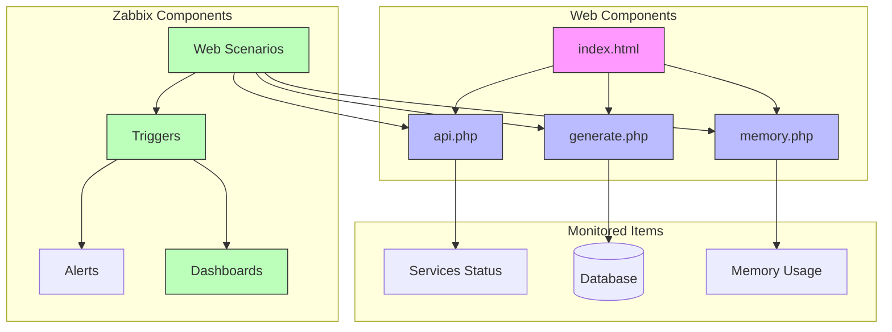
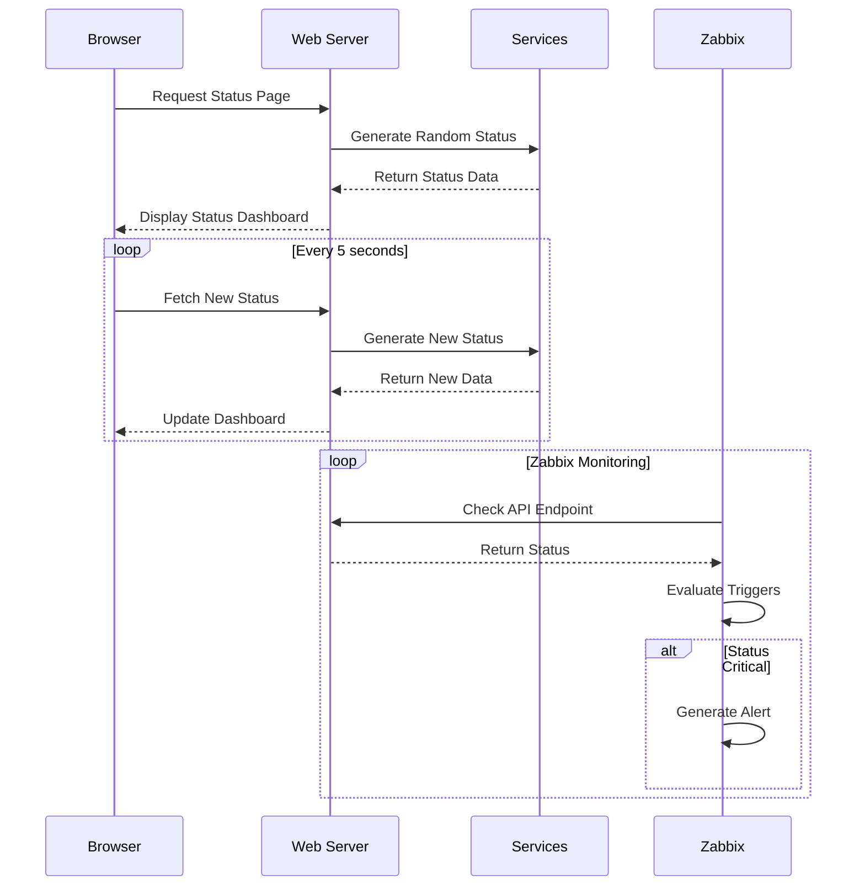

# Additional Zabbix Monitoring Exercises


## Prerequisites
- Completed main Zabbix lab setup
- PHP and MySQL installed on test server
- Basic understanding of web monitoring

## Exercise List
1. Service Status Monitor - Real-time service health dashboard
2. Database Load Simulator - Monitor database performance
3. RAM Monitor Dashboard - Memory usage visualization



## Exercise 1: Service Status Monitor

### Overview
Create a service health monitoring system that displays statuses of multiple services with simulated issues.

### Setup Instructions

#### 1.1. Create Directory and Files
```bash
# Create directory
sudo mkdir -p /var/www/html/status
cd /var/www/html/status

# Create API file
sudo nano api.php
```

```php
<?php
header('Content-Type: application/json');

// Simulate services with random health status
$services = [
    'database' => [
        'status' => rand(0, 100),
        'connections' => rand(10, 1000),
        'latency' => rand(1, 100)
    ],
    'cache' => [
        'status' => rand(0, 100),
        'memory_used' => rand(20, 95),
        'hit_rate' => rand(50, 99)
    ],
    'storage' => [
        'status' => rand(0, 100),
        'disk_usage' => rand(30, 90),
        'io_wait' => rand(0, 30)
    ]
];

// Random delay (0-2 seconds)
usleep(rand(0, 2000000));

// 10% chance of error
if (rand(1, 10) == 1) {
    http_response_code(500);
    echo json_encode(['error' => 'Service temporarily unavailable']);
    exit;
}

echo json_encode([
    'timestamp' => time(),
    'services' => $services,
    'environment' => 'production'
]);
?>
```

#### 1.2. Create Dashboard Interface
```bash
sudo nano index.html
```

```html
<!DOCTYPE html>
<html>
<head>
    <title>Service Health Monitor</title>
    <style>
        body { 
            font-family: Arial; 
            margin: 20px;
            background: #f5f5f5;
        }
        .service { 
            margin: 10px;
            padding: 15px;
            border-radius: 4px;
            box-shadow: 0 2px 4px rgba(0,0,0,0.1);
        }
        .critical { background: #ffebee; }
        .warning { background: #fff3e0; }
        .healthy { background: #e8f5e9; }
        .metrics {
            display: grid;
            grid-template-columns: repeat(auto-fit, minmax(150px, 1fr));
            gap: 10px;
            margin-top: 10px;
        }
        .metric {
            background: rgba(255,255,255,0.7);
            padding: 5px;
            border-radius: 3px;
        }
    </style>
</head>
<body>
    <h2>Service Health Dashboard</h2>
    <div id="status">Connecting...</div>
    <div id="services"></div>

    <script>
        function getHealthClass(status) {
            if (status < 50) return 'critical';
            if (status < 80) return 'warning';
            return 'healthy';
        }

        function updateDashboard() {
            fetch('api.php')
                .then(response => {
                    if (!response.ok) throw new Error('API Error');
                    return response.json();
                })
                .then(data => {
                    const servicesDiv = document.getElementById('services');
                    servicesDiv.innerHTML = '';

                    Object.entries(data.services).forEach(([name, metrics]) => {
                        const healthClass = getHealthClass(metrics.status);
                        const serviceHtml = `
                            <div class="service ${healthClass}">
                                <h3>${name.toUpperCase()}</h3>
                                <div>Health: ${metrics.status}%</div>
                                <div class="metrics">
                                    ${Object.entries(metrics)
                                        .filter(([key]) => key !== 'status')
                                        .map(([key, value]) => `
                                            <div class="metric">
                                                ${key}: ${value}
                                            </div>
                                        `).join('')}
                                </div>
                            </div>
                        `;
                        servicesDiv.innerHTML += serviceHtml;
                    });

                    document.getElementById('status').textContent = 
                        `Last Updated: ${new Date().toLocaleString()}`;
                })
                .catch(error => {
                    document.getElementById('services').innerHTML = 
                        '<div class="service critical">System Error: Cannot fetch service status</div>';
                });
        }

        setInterval(updateDashboard, 5000);
        updateDashboard();
    </script>
</body>
</html>
```

## Exercise 2: Database Load Simulator

### Overview
Create and monitor a database load simulation system.

### Setup Instructions

#### 2.1. Create Database
```bash
# Login to MySQL
sudo mysql -u root -p
```

```sql
CREATE DATABASE loadtest;
USE loadtest;

CREATE TABLE orders (
    id INT AUTO_INCREMENT PRIMARY KEY,
    customer VARCHAR(50),
    amount DECIMAL(10,2),
    created_at TIMESTAMP DEFAULT CURRENT_TIMESTAMP
);
```

#### 2.2. Create Load Generator
```bash
sudo mkdir -p /var/www/html/dbload
sudo nano /var/www/html/dbload/generate.php
```

```php
<?php
$mysqli = new mysqli("localhost", "root", "your_password", "loadtest");

// Simulate order creation with random delays
$customers = ["John", "Jane", "Bob", "Alice", "Charlie"];
$customer = $customers[array_rand($customers)];
$amount = rand(10, 1000);

// Add random delay
usleep(rand(100000, 2000000));

$query = "INSERT INTO orders (customer, amount) VALUES (?, ?)";
$stmt = $mysqli->prepare($query);
$stmt->bind_param("sd", $customer, $amount);

$success = $stmt->execute();
$insert_time = $stmt->affected_rows > 0 ? "OK" : "FAIL";

// Get current stats
$result = $mysqli->query("SELECT COUNT(*) as total, AVG(amount) as avg FROM orders");
$stats = $result->fetch_assoc();

echo json_encode([
    "insert_status" => $insert_time,
    "total_orders" => $stats['total'],
    "average_amount" => round($stats['avg'], 2),
    "timestamp" => time()
]);
?>
```

## Exercise 3: RAM Monitor Dashboard

### Overview
Create a memory usage monitoring dashboard.

### Setup Instructions

#### 3.1. Create Memory Monitor
```bash
sudo mkdir -p /var/www/html/memory
sudo nano /var/www/html/memory/status.php
```

```php
<?php
header('Content-Type: application/json');

// Simulate different applications using memory
$apps = [
    'webapp' => [
        'allocated' => rand(100, 500),
        'used' => rand(50, 450),
        'peak' => rand(300, 600)
    ],
    'database' => [
        'allocated' => rand(200, 800),
        'used' => rand(100, 700),
        'peak' => rand(500, 1000)
    ],
    'cache' => [
        'allocated' => rand(50, 200),
        'used' => rand(25, 150),
        'peak' => rand(150, 300)
    ]
];

// Calculate total usage
$total = [
    'allocated' => array_sum(array_column($apps, 'allocated')),
    'used' => array_sum(array_column($apps, 'used')),
    'peak' => array_sum(array_column($apps, 'peak'))
];

echo json_encode([
    'apps' => $apps,
    'total' => $total,
    'timestamp' => time()
]);
?>
```

#### 3.2. Create Memory Dashboard
```bash
sudo nano /var/www/html/memory/index.html
```

```html
<!DOCTYPE html>
<html>
<head>
    <title>Memory Monitor</title>
    <style>
        .memory-bar {
            height: 25px;
            background: #e0e0e0;
            margin: 10px 0;
            position: relative;
        }
        .used {
            position: absolute;
            height: 100%;
            background: #2196F3;
        }
        .warning { background: #FFA726; }
        .critical { background: #EF5350; }
    </style>
</head>
<body>
    <h2>Memory Usage Monitor</h2>
    <div id="memory-stats"></div>
    <script>
        function updateStats() {
            fetch('status.php')
                .then(response => response.json())
                .then(data => {
                    const statsDiv = document.getElementById('memory-stats');
                    statsDiv.innerHTML = '';
                    
                    Object.entries(data.apps).forEach(([app, metrics]) => {
                        const usagePercent = (metrics.used / metrics.allocated) * 100;
                        const barClass = usagePercent > 90 ? 'critical' : 
                                       usagePercent > 70 ? 'warning' : '';
                        
                        statsDiv.innerHTML += `
                            <div>
                                <h3>${app}</h3>
                                <div class="memory-bar">
                                    <div class="used ${barClass}" 
                                         style="width: ${usagePercent}%"></div>
                                </div>
                                <div>Used: ${metrics.used}MB / ${metrics.allocated}MB</div>
                            </div>
                        `;
                    });
                });
        }
        setInterval(updateStats, 5000);
        updateStats();
    </script>
</body>
</html>
```

## Zabbix Configuration for All Exercises

### 1. Service Status Monitor Configuration

Create web scenario "Service Status Monitor":
```plaintext
Step 1: API Check
- URL: http://your-server/status/api.php
- Required response codes: 200
- Parse response for service statuses

Step 2: Dashboard Check
- URL: http://your-server/status/
- Required string: "Service Health Dashboard"
```

Triggers:
```plaintext
Response Time:
{host:web.test.time[Service Health Monitor,API Check].avg(5m)}>2

Error Rate:
{host:web.test.fail[Service Health Monitor].min(5m)}>0

Service Degradation:
{host:web.test.in[Service Health Monitor,API Check,database.status].last()}<50
```

### 2. Database Load Monitor Configuration

Create web scenario "Database Load Monitor":
```plaintext
Step 1: Generate Load
- URL: http://your-server/dbload/generate.php
- Required string: "insert_status":"OK"
```

Triggers:
```plaintext
Slow Inserts:
{host:web.test.time[Database Load Monitor,Generate Load].avg(5m)}>1

Failed Inserts:
{host:web.test.fail[Database Load Monitor].min(5m)}>0
```

### 3. Memory Monitor Configuration

Create web scenario "Memory Monitor":
```plaintext
Step 1: Memory Status
- URL: http://your-server/memory/status.php
- Required response codes: 200
```

Triggers:
```plaintext
High Memory Usage:
{host:web.test.in[Memory Monitor,status,apps.webapp.used].last()} / 
{host:web.test.in[Memory Monitor,status,apps.webapp.allocated].last()} * 100 > 90
```

## Testing Instructions

### Test Case 1: Service Status
```bash
# Force API delay
sudo nano /var/www/html/status/api.php
# Add: sleep(3);
```

### Test Case 2: Database Load
```bash
# Increase insert delay
sudo nano /var/www/html/dbload/generate.php
# Modify: usleep(rand(2000000, 3000000));
```

### Test Case 3: Memory Alert
```bash
# Force high memory usage
sudo nano /var/www/html/memory/status.php
# Modify webapp used memory:
'used' => rand(450, 500),
```

## Required Screenshots

For all three exercises, provide one combined screenshot showing:
1. Working dashboards in browser
2. Corresponding Zabbix monitoring pages

## Learning Assessment

Document for each exercise:
1. What you learned about:
   - Real-time monitoring
   - Error handling
   - Performance tracking
2. Any issues encountered and how you resolved them
3. Suggestions for improvements

## Common Issues and Solutions

1. PHP not processing files:
```bash
sudo apt install php php-mysql
sudo systemctl restart apache2
```

2. MySQL connection issues:
```bash
sudo mysql
ALTER USER 'root'@'localhost' IDENTIFIED WITH mysql_native_password BY 'your_password';
FLUSH PRIVILEGES;
```

3. Permission issues:
```bash
sudo chown -R www-data:www-data /var/www/html
sudo chmod -R 755 /var/www/html
```