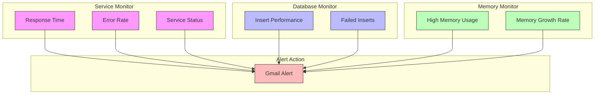

# Alert Triggers for Monitoring Exercises



## Exercise 1: Service Status Monitor Triggers

1. Response Time Alert:
```plaintext
Name: Service API Response Too Slow
Expression: {host:web.test.time[Service Health Monitor,API Check].avg(5m)}>2
Severity: Warning
Description: API response time exceeds 2 seconds for 5 minutes
```

2. Error Rate Alert:
```plaintext
Name: Service API Errors Detected
Expression: {host:web.test.fail[Service Health Monitor].min(5m)}>0
Severity: High
Description: Service API is returning errors
```

3. Service Status Alert:
```plaintext
Name: Database Service Degraded
Expression: {host:web.test.in[Service Health Monitor,API Check,database.status].last()}<50
Severity: Average
Description: Database service health dropped below 50%
```

## Exercise 2: Database Load Simulator Triggers

1. Insert Performance Alert:
```plaintext
Name: Slow Database Inserts
Expression: {host:web.test.time[Database Load Monitor,Generate Load].avg(5m)}>1
Severity: Warning
Description: Database inserts taking longer than 1 second
```

2. Failed Inserts Alert:
```plaintext
Name: Database Insert Failures
Expression: {host:web.test.fail[Database Load Monitor].min(5m)}>0
Severity: High
Description: Database insert operations are failing
```

## Exercise 3: Memory Monitor Triggers

1. High Memory Usage:
```plaintext
Name: Web Application High Memory
Expression: {host:web.test.in[Memory Monitor,status,apps.webapp.used].last()} / {host:web.test.in[Memory Monitor,status,apps.webapp.allocated].last()} * 100 > 90
Severity: Warning
Description: Web application using more than 90% of allocated memory
```

2. Memory Growth Rate:
```plaintext
Name: Rapid Memory Growth
Expression: {host:web.test.in[Memory Monitor,status,apps.webapp.used].delta(1h)}>100
Severity: High
Description: Memory usage increased by more than 100MB in one hour
```

## How to Set Up These Triggers

1. Go to: Configuration → Hosts
2. Select your host
3. Go to Triggers tab
4. Click: Create trigger
5. Add expression using the trigger expressions above
6. Configure severity and dependencies

## Gmail Alert Action

Create one action to handle all triggers:
```plaintext
Name: Service Monitoring Alerts
Conditions:
- Trigger severity >= Warning
- Host group equals your monitoring group

Operations:
- Send to: your.email@gmail.com
- Custom message:
Problem: {EVENT.NAME}
Host: {HOST.NAME}
Severity: {EVENT.SEVERITY}
Value: {ITEM.VALUE}
Time: {EVENT.TIME} {EVENT.DATE}

Recovery operations:
- Send recovery message
Recovery message:
RESOLVED: {EVENT.NAME}
Duration: {EVENT.DURATION}
