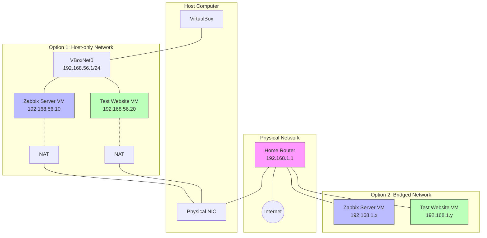
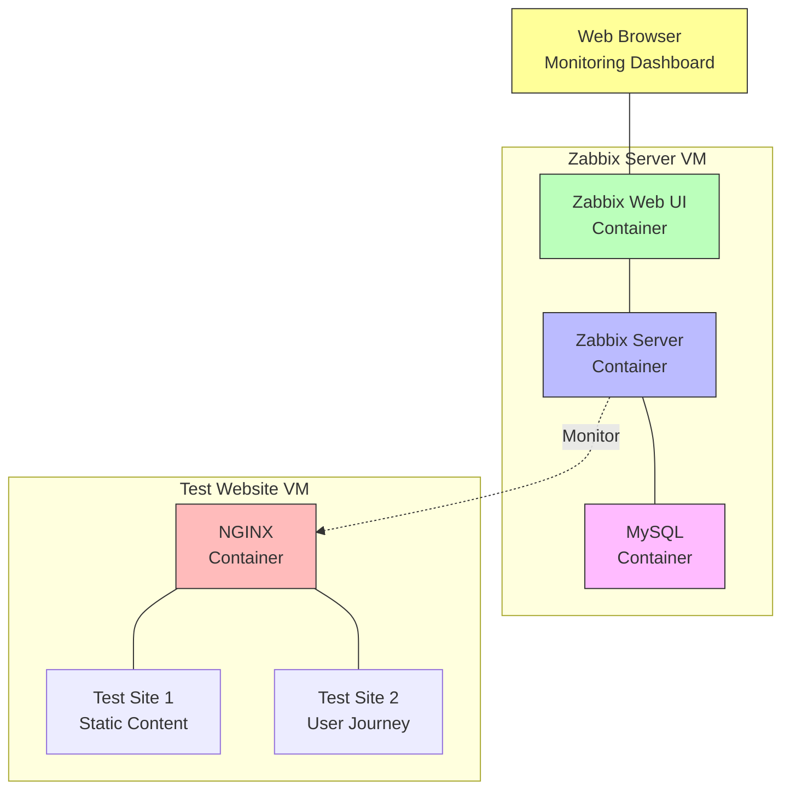

# Complete Zabbix Monitoring Lab Setup Guide

## Prerequisites
- VirtualBox installed on your computer
- Ubuntu Server 22.04 LTS ISO downloaded
- At least 8GB RAM available on host machine
- 50GB free disk space

## Submitting Guide

### Required Screenshots for Lab Submission

### 1. Virtual Machine Setup
```
Screenshot 1: VirtualBox Manager showing both VMs
- Show VMs: ZabbixServer-[YourName] and TestWeb-[YourName]
- Include VM settings (RAM, CPU, Storage)
```
### 2. Test Website
```
Screenshot 10: Test Website Running
- Browser showing your test website
- URL visible (http://192.168.56.20)

Screenshot 11: Website Monitoring Results
- Show monitoring results in Zabbix
- Include response times and availability
```
### 3. Honeycomb Visualization
```
Screenshot 12: Honeycomb Widget
- Show configured honeycomb visualization
- Include performance metrics
```
## Naming Convention
```
Virtual Machines:
- ZabbixServer-[YourName]  (Example: ZabbixServer-JohnSmith)
- TestWeb-[YourName]       (Example: TestWeb-JohnSmith)

Hostnames:
- zabbix-[yourname]        (Example: zabbix-johnsmith)
- webserver-[yourname]     (Example: webserver-johnsmith)

Docker Containers:
- zabbix-server-[yourname]
- zabbix-web-[yourname]
- mysql-[yourname]
- testsite-[yourname]
```
## Submission Instructions
1. Create a single PDF ( DOCX) document containing:
   - All required screenshots
   - Any additional documentation

2. File naming:
   ```
   ZabbixLab-[YourName]-[Date].pdf/docx
   Example: ZabbixLab-JohnSmith-2024-11-28.pdf/docx
   ```

3. Submit to Google Classroom:
   - Attach files
   - Add any comments about specific challenges



## Part 1: Virtual Machine Setup

### VM1: Zabbix Server
```plaintext
Name: ZabbixServer
Specifications:
- OS: Ubuntu Server 22.04 LTS
- RAM: 4GB
- CPU: 2 cores
- Storage: 20GB
- Network Adapters:
  1. NAT (Internet access)
  2. Host-only (192.168.56.10)

Steps:
1. Open VirtualBox
2. Click "New"
3. Fill in details:
   - Name: ZabbixServer
   - Type: Linux
   - Version: Ubuntu 64-bit
4. Set memory: 4096MB
5. Create virtual hard disk: 20GB (VDI, Dynamically allocated)
6. Configure network:
   - Settings → Network
   - Adapter 1: NAT
   - Adapter 2: Host-only (vboxnet0)
```

### VM2: Test Website Server
```plaintext
Name: TestWebServer
Specifications:
- OS: Ubuntu Server 22.04 LTS
- RAM: 2GB
- CPU: 1 core
- Storage: 15GB
- Network Adapters:
  1. NAT (Internet access)
  2. Host-only (192.168.56.20)

Steps:
1. Open VirtualBox
2. Click "New"
3. Fill in details:
   - Name: TestWebServer
   - Type: Linux
   - Version: Ubuntu 64-bit
4. Set memory: 2048MB
5. Create virtual hard disk: 15GB (VDI, Dynamically allocated)
6. Configure network:
   - Settings → Network
   - Adapter 1: NAT
   - Adapter 2: Host-only (vboxnet0)
```



### Host-Only Network Configuration
```plaintext
1. VirtualBox → File → Host Network Manager
2. Create new network (if not exists):
   - Network Name: vboxnet0
   - IPv4 Address: 192.168.56.1
   - Network Mask: 255.255.255.0
   - Enable DHCP Server:
     - Server Address: 192.168.56.100
     - Lower Address Bound: 192.168.56.101
     - Upper Address Bound: 192.168.56.254
```

### **Bridged network adapter can work as an alternative. Here's the quick setup:**

---

1. VM Network Configuration:
```
Adapter 1: Bridged Adapter
- Select your physical network interface
- Each VM will get an IP from your local network DHCP
```

Benefits:
- Direct connection to local network
- Easier network setup
- No need for host-only configuration

Update VM network settings:
```bash
# Edit netplan
sudo nano /etc/netplan/00-installer-config.yaml

network:
  version: 2
  ethernets:
    enp0s3:   # Bridged adapter
      dhcp4: yes

sudo netplan apply
```

Note: Make sure to use the IP addresses assigned by your local network DHCP when accessing Zabbix and test websites.

---

## Part 2: Operating System Installation

### For Both VMs:
```plaintext
1. Start VM
2. Select Ubuntu ISO
3. Choose language and keyboard layout
4. Network configuration:
   - Configure both network interfaces
   - Primary interface: DHCP (NAT)
   - Secondary interface: Static IP
     VM1: 192.168.56.10
     VM2: 192.168.56.20
5. Storage configuration:
   - Use entire disk
   - Set up as LVM
6. Profile setup:
   VM1:
   - Your name: zabbix
   - Server name: zabbixserver
   - Username: zabbix
   - Password: <your_secure_password>
   
   VM2:
   - Your name: webadmin
   - Server name: webserver
   - Username: webadmin
   - Password: <your_secure_password>
7. Install OpenSSH server
8. No additional packages needed
9. Complete installation and reboot
```

### Post-Installation Network Setup
On both VMs:
```bash
# Edit netplan configuration
sudo nano /etc/netplan/00-installer-config.yaml

# Add configuration:
network:
  version: 2
  ethernets:
    enp0s3:   # NAT adapter
      dhcp4: yes
    enp0s8:   # Host-only adapter
      dhcp4: no
      addresses:
        - 192.168.56.10/24  # For ZabbixServer
        # OR
        - 192.168.56.20/24  # For TestWebServer
      routes:
        - to: 192.168.56.0/24
          via: 192.168.56.1

# Apply configuration
sudo netplan apply

# Verify
ip addr show
ping 192.168.56.1
```

# Guide to set-up Zabbix Web Monitoring

## Part 1: Basic Concepts

### What is Docker?
Docker is a platform that packages applications and their dependencies into containers. Think of containers as lightweight, standalone packages that include everything needed to run an application.

### What is Web Monitoring?
Web monitoring allows you to:
- Track website availability
- Measure load times
- Check specific content
- Monitor user interactions
- Capture screenshots
- Alert on issues

## Part 2: Installation Prerequisites

### Install Docker on Ubuntu
```bash
# Update system
sudo apt update
sudo apt upgrade -y

# Install required packages
sudo apt install -y \
    apt-transport-https \
    ca-certificates \
    curl \
    software-properties-common

# Add Docker's official GPG key
curl -fsSL https://download.docker.com/linux/ubuntu/gpg | sudo gpg --dearmor -o /usr/share/keyrings/docker-archive-keyring.gpg

# Add Docker repository
echo "deb [arch=amd64 signed-by=/usr/share/keyrings/docker-archive-keyring.gpg] https://download.docker.com/linux/ubuntu $(lsb_release -cs) stable" | sudo tee /etc/apt/sources.list.d/docker.list > /dev/null

# Install Docker
sudo apt update
sudo apt install -y docker-ce docker-ce-cli containerd.io

# Add your user to docker group (avoid using sudo with docker)
sudo usermod -aG docker $USER

# Install Docker Compose
sudo curl -L "https://github.com/docker/compose/releases/download/v2.20.0/docker-compose-$(uname -s)-$(uname -m)" -o /usr/local/bin/docker-compose
sudo chmod +x /usr/local/bin/docker-compose

# Verify installations
docker --version
docker-compose --version

# Start Docker service
sudo systemctl start docker
sudo systemctl enable docker
```

## Part 3: Setting Up Test Websites

### Create Test Website 1 (Simple Static)
```bash
# Create directory structure
mkdir -p ~/zabbix-lab/test-sites/site1
cd ~/zabbix-lab/test-sites/site1

# Create index.html
cat << EOF > index.html
<!DOCTYPE html>
<html>
<head>
    <title>Test Site 1</title>
    <style>
        body { font-family: Arial; margin: 40px; }
        .status { padding: 20px; margin: 20px 0; }
        .ok { background: #dff0d8; }
        .error { background: #f2dede; }
    </style>
</head>
<body>
    <h1>Test Site 1</h1>
    <div class="status ok" id="statusBox">Status: OK</div>
    <div>
        <p>Current Time: <span id="currentTime"></span></p>
        <button onclick="toggleStatus()">Toggle Status</button>
    </div>
    <script>
        function updateTime() {
            document.getElementById('currentTime').textContent = new Date().toLocaleString();
        }
        setInterval(updateTime, 1000);
        updateTime();

        function toggleStatus() {
            const box = document.getElementById('statusBox');
            if(box.classList.contains('ok')) {
                box.classList.replace('ok', 'error');
                box.textContent = 'Status: Error';
            } else {
                box.classList.replace('error', 'ok');
                box.textContent = 'Status: OK';
            }
        }
    </script>
</body>
</html>
EOF

# Create Dockerfile
cat << EOF > Dockerfile
FROM nginx:alpine
COPY index.html /usr/share/nginx/html/
EXPOSE 80
EOF
```

### Create Test Website 2 (Dynamic Content)
```bash
mkdir -p ~/zabbix-lab/test-sites/site2
cd ~/zabbix-lab/test-sites/site2

# Create index.html with forms and interactive elements
cat << EOF > index.html
<!DOCTYPE html>
<html>
<head>
    <title>Test Site 2 - User Journey</title>
    <style>
        body { font-family: Arial; margin: 40px; }
        .form-group { margin: 20px 0; }
        .step { padding: 20px; margin: 10px 0; background: #f8f9fa; }
    </style>
</head>
<body>
    <h1>Test Site 2 - User Journey</h1>
    
    <div class="step" id="step1">
        <h2>Step 1: Login</h2>
        <div class="form-group">
            <label>Username:</label>
            <input type="text" id="username">
        </div>
        <div class="form-group">
            <label>Password:</label>
            <input type="password" id="password">
        </div>
        <button onclick="nextStep(2)">Login</button>
    </div>

    <div class="step" id="step2" style="display:none;">
        <h2>Step 2: Product Selection</h2>
        <div class="form-group">
            <label>Select Product:</label>
            <select id="product">
                <option value="1">Product A</option>
                <option value="2">Product B</option>
            </select>
        </div>
        <button onclick="nextStep(3)">Add to Cart</button>
    </div>

    <div class="step" id="step3" style="display:none;">
        <h2>Step 3: Checkout</h2>
        <p>Order Summary</p>
        <div id="orderSummary"></div>
        <button onclick="complete()">Complete Order</button>
    </div>

    <script>
        function nextStep(step) {
            document.querySelectorAll('.step').forEach(el => el.style.display = 'none');
            document.getElementById('step' + step).style.display = 'block';
            
            if(step === 3) {
                const product = document.getElementById('product');
                document.getElementById('orderSummary').textContent = 
                    'Selected: ' + product.options[product.selectedIndex].text;
            }
        }

        function complete() {
            alert('Order completed successfully!');
            location.reload();
        }
    </script>
</body>
</html>
EOF

# Create Dockerfile
cat << EOF > Dockerfile
FROM nginx:alpine
COPY index.html /usr/share/nginx/html/
EXPOSE 80
EOF
```

## Part 4: Docker Compose Setup

### Create Docker Compose Configuration
```bash
cd ~/zabbix-lab
cat << EOF > docker-compose.yml
version: '3.5'

services:
  zabbix-server:
    image: zabbix/zabbix-server-mysql:ubuntu-6.0-latest
    restart: always
    ports:
      - "10051:10051"
    environment:
      - DB_SERVER_HOST=mysql-server
      - MYSQL_DATABASE=zabbix
      - MYSQL_USER=zabbix
      - MYSQL_PASSWORD=zabbix_pwd
      - MYSQL_ROOT_PASSWORD=root_pwd
    depends_on:
      - mysql-server

  zabbix-web:
    image: zabbix/zabbix-web-nginx-mysql:ubuntu-6.0-latest
    restart: always
    ports:
      - "80:8080"
    environment:
      - DB_SERVER_HOST=mysql-server
      - MYSQL_DATABASE=zabbix
      - MYSQL_USER=zabbix
      - MYSQL_PASSWORD=zabbix_pwd
      - ZBX_SERVER_HOST=zabbix-server
      - PHP_TZ=Europe/Tallinn
    depends_on:
      - zabbix-server

  mysql-server:
    image: mysql:8.0
    restart: always
    ports:
      - "3306:3306"
    environment:
      - MYSQL_DATABASE=zabbix
      - MYSQL_USER=zabbix
      - MYSQL_PASSWORD=zabbix_pwd
      - MYSQL_ROOT_PASSWORD=root_pwd
    command:
      - mysqld
      - --character-set-server=utf8
      - --collation-server=utf8_bin

  test-site1:
    build: ./test-sites/site1
    ports:
      - "8081:80"

  test-site2:
    build: ./test-sites/site2
    ports:
      - "8082:80"
EOF
```

## Part 5: Launch the Environment

```bash
# Build and start all containers
cd ~/zabbix-lab
docker-compose up -d --build

# Check status
docker-compose ps

# View logs
docker-compose logs -f
```

## Part 6: Configure Web Monitoring

1. Access Zabbix Web Interface:
   - Open browser: http://localhost
   - Default login: 
     - Username: Admin
     - Password: zabbix

2. Add Web Scenarios:

### Simple Website Monitoring (Site 1)
```
Configuration → Hosts → Create Host
- Host name: TestSite1
- Groups: Web scenarios
- Interfaces: Agent = localhost

Add Web Scenario:
- Name: Basic Website Monitoring
- Update interval: 30s
Steps:
1. Homepage Check
   - Name: Homepage
   - URL: http://test-site1:80
   - Required status codes: 200
   - Required string: Test Site 1
2. Status Check
   - Name: Status
   - URL: http://test-site1:80
   - Required string: Status: OK
```

### User Journey Monitoring (Site 2)
```
Configuration → Hosts → Create Host
- Host name: TestSite2
- Groups: Web scenarios
- Interfaces: Agent = localhost

Add Web Scenario:
- Name: User Journey Monitoring
- Update interval: 1m
Steps:
1. Login Page
   - Name: Login
   - URL: http://test-site2:80
   - Required string: Login
2. Product Selection
   - Name: Products
   - URL: http://test-site2:80
   - Required string: Product Selection
   Variables:
   - {username} = test
   - {password} = test
3. Checkout
   - Name: Checkout
   - URL: http://test-site2:80
   - Required string: Checkout
```

## Part 7: Create Dynamic Dashboard

1. Create new dashboard:
   ```
   Monitoring → Dashboards → Create Dashboard
   Name: Web Monitoring Overview
   ```

2. Add widgets:
   ```
   Widget 1: Web Monitoring Summary
   - Type: Web monitoring
   - Name: Website Status
   - Hosts: TestSite1, TestSite2
   
   Widget 2: Problems Overview
   - Type: Problems
   - Name: Current Issues
   - Show: Web monitoring problems
   
   Widget 3: Response Time Graph
   - Type: Graph (classic)
   - Name: Performance Overview
   - Data: Web scenario response times
   ```

3. Configure widget interactivity:
   - Click gear icon on widget
   - Enable "Dynamic item"
   - Select source widget (e.g., Web Monitoring Summary)

## Part 8: Testing Scenarios

### Test Case 1: Availability
```bash
# Stop test site 1
docker-compose stop test-site1

# Observe dashboard changes
# Start test site 1
docker-compose start test-site1
```

### Test Case 2: Performance
```bash
# Modify test site 1 nginx config
docker exec -it zabbix-lab_test-site1_1 sh
echo "limit_rate 100k;" >> /etc/nginx/nginx.conf
nginx -s reload
```

### Test Case 3: Content Changes
```bash
# Modify test site 1 content
cd ~/zabbix-lab/test-sites/site1
sed -i 's/Status: OK/Status: Modified/' index.html
docker-compose restart test-site1
```

## Part 9: Honeycomb Views

### Create Honeycomb Widget
1. Add custom widget:
   ```
   Dashboard → Add Widget → Graph
   Type: Graph (prototype)
   - Display: Honeycomb
   - Data: Web response times
   - Color mapping:
     - Green: <1s
     - Yellow: 1-3s
     - Red: >3s
   ```

2. Configure honeycomb cells:
   ```
   - Cell size: Medium
   - Metric: Response time
   - Group by: Host
   - Color by: Status
   ```

## Part 10: Common Issues & Troubleshooting

### Database Connection Issues
```bash
# Check MySQL container
docker-compose logs mysql-server

# Connect to MySQL
docker exec -it zabbix-lab_mysql-server_1 mysql -uzabbix -pzabbix_pwd
```

### Web Interface Issues
```bash
# Check web logs
docker-compose logs zabbix-web

# Restart web interface
docker-compose restart zabbix-web
```

### Monitoring Issues
```bash
# Check Zabbix server logs
docker-compose logs zabbix-server

# Verify network connectivity
docker network ls
docker network inspect zabbix-lab_default
```

Remember to update passwords and secure your installation in a production environment!