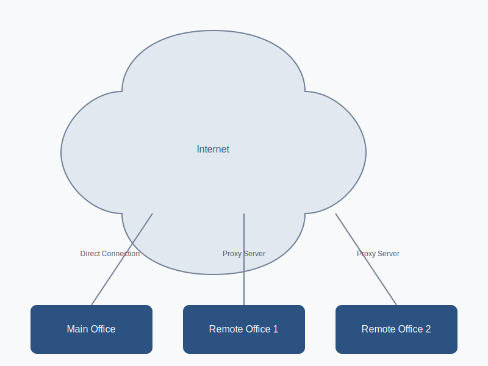
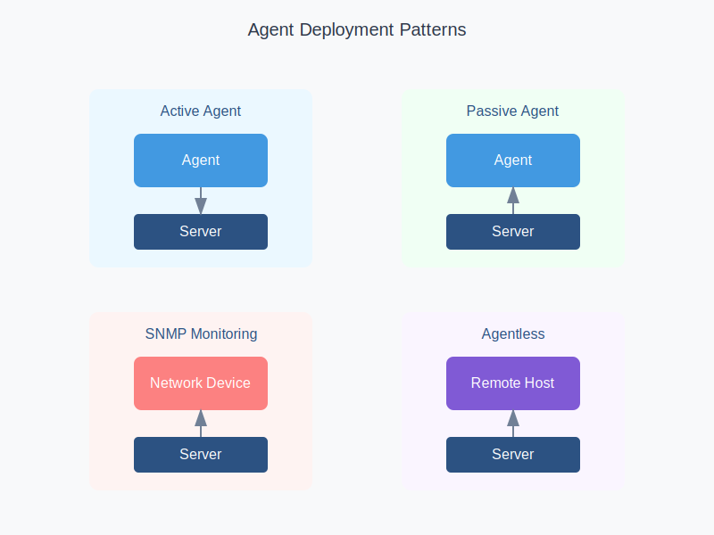
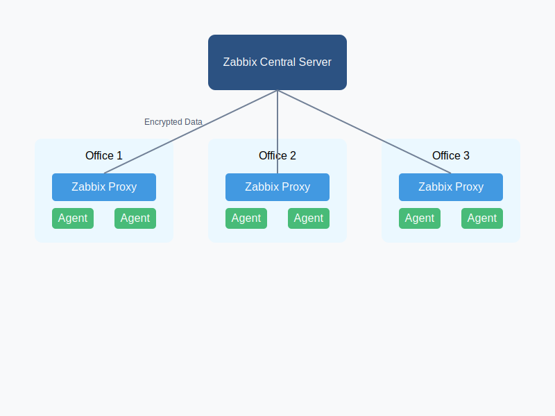
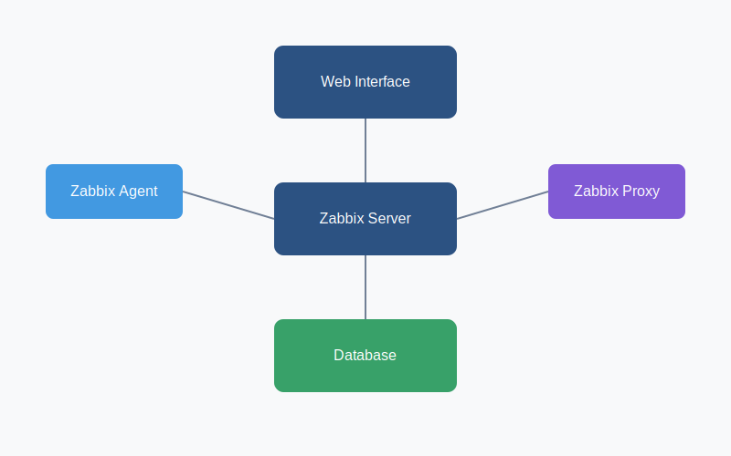
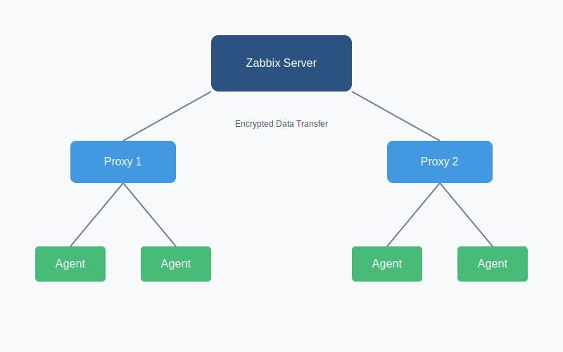

# Sissejuhatus Zabbix'i

## Ülevaade
Zabbix on võimas avatud lähtekoodiga tööriist rakenduste, võrkude ja serverite reaalajas jälgimiseks. See aitab IT-meeskondadel tagada süsteemide optimaalse toimimise ja hoiatab neid võimalike probleemide eest enne, kui need kasutajaid mõjutavad.

### Üldine Võrgu Topoloogia


Topoloogia seadistamine sõltub keskkonna suurusest:

**Väike Keskkond** (kuni 100 seadet):
```ini
# zabbix_server.conf
StartPollers=5
CacheSize=8M
HistoryCacheSize=16M
```

**Keskmine Keskkond** (100-1000 seadet):
```ini
StartPollers=20
CacheSize=256M
HistoryCacheSize=128M
```

**Suur Keskkond** (1000+ seadet):
```ini
StartPollers=100
CacheSize=1G
HistoryCacheSize=512M
```

## Miks Me Vajame Rakenduste Jälgimist?

### 1. Informatsiooni Kogumine
Rakendused genereerivad ulatuslikke andmeid, mida on vaja jõudluse analüüsiks ja äri parendamiseks.



Andmete kogumise seadistamine:
```bash
# Active Agent seadistus
Server=zabbix.company.com
ServerActive=zabbix.company.com
Hostname=webserver01
EnableRemoteCommands=1

# Kohandatud kontrollid
UserParameter=mysql.status[*],/usr/local/bin/check_mysql.sh $1
UserParameter=nginx.connections,/usr/local/bin/check_nginx.sh
```

### 2. Ööpäevaringne Monitooring
Automatiseeritud tööriistad nagu Zabbix tagavad pideva jälgimise, mida inimestel on käsitsi võimatu saavutada.



Hajutatud monitooringu seadistamine:
```ini
# Proxy seadistus
Server=main.zabbix.com
Hostname=proxy01
DBName=zabbix_proxy
ConfigFrequency=3600
StartPollers=100
StartPreprocessors=20
StartDiscoverers=15
CacheSize=2G
```

### 3. Ennetav Teavitamine (Pre-emptive Alerting)
Zabbix toimib kui nähtamatu meeskonnaliige, teavitades meeskonda süsteemi probleemidest ennetavalt.

Alertide seadistamine:
```yaml
Actions:
  - name: "High CPU Usage"
    conditions:
      - type: "trigger"
        operator: ">="
        value: "90"
    operations:
      - type: "email"
        media: "admin@company.com"
      - type: "script"
        script: "/usr/local/bin/remediate.sh"
```

## Mis on Zabbix?
Zabbix'i lõi Alexei Vladishev 1998. aastal ja see avaldati avatud lähtekoodiga tööriistana 2001. aastal. Tänu oma ulatuslikele võimalustele ja tugevale kogukonna toele on see nüüd üks populaarsemaid monitooringu tööriistu.

### Põhiomadused (Key Features):
- Avatud lähtekood ja tasuta
- Mitme meetrika reaalajas jälgimine
- Tsentraliseeritud veebipõhine liides andmete visualiseerimiseks

## Zabbix'i Arhitektuur


### Peamised Komponendid:

#### 1. Zabbix Server
Keskne tuum, mis töötleb agentidelt ja proksidelt saadud andmeid

```ini
# Server optimaalne seadistus
StartPollers=100
StartDiscoverers=15
StartPingers=15
StartTrappers=10
StartPreprocessors=20
CacheSize=2G
HistoryCacheSize=1G
```

#### 2. Web Server
Majutab Zabbix'i veebiliidest kasutajate interaktsiooniks

```apache
# Apache seadistus
<VirtualHost *:80>
    ServerName zabbix.company.com
    DocumentRoot /usr/share/zabbix
    
    <Directory "/usr/share/zabbix">
        Options FollowSymLinks
        AllowOverride None
        Require all granted
    </Directory>
</VirtualHost>
```

#### 3. Andmebaas (RDBMS)
Salvestab konfiguratsiooni, kogutud andmed ja ajaloo

```sql
-- MySQL optimaalne seadistus
innodb_buffer_pool_size = 10G
innodb_log_file_size = 2G
innodb_flush_method = O_DIRECT
innodb_flush_log_at_trx_commit = 2
```

### Proxy Arhitektuur


Proxy serveri seadistamine:
```ini
# Proxy põhiseadistus
ProxyMode=0
Server=zabbix.company.com
Hostname=proxy01
DBName=zabbix_proxy
ConfigFrequency=3600
DataSenderFrequency=1

# Jõudluse seadistused
StartPollers=100
StartPreprocessors=20
StartDiscoverers=15
CacheSize=2G
```

### Põhikomponendid:

#### 1. Zabbix Agent
Paigaldatud jälgitavatele serveritele kohalike andmete kogumiseks

```ini
# Agendi seadistus
Server=zabbix.company.com
ServerActive=zabbix.company.com
Hostname=webserver01

# Kohandatud kontrollid
UserParameter=mysql.status[*],/usr/local/bin/check_mysql.sh $1
UserParameter=nginx.connections,/usr/local/bin/check_nginx.sh
```

#### 2. Zabbix Proxy
Kogub andmeid serveri nimel kaugjälgimise seadistuste jaoks

```ini
# Proxy seadistus suurele koormusele
StartPollers=250
StartIPMIPollers=10
StartPollersUnreachable=50
StartPreprocessors=50
StartDiscoverers=15

# Puhverdamine
ConfigFrequency=1800
DataSenderFrequency=1
```

#### 3. Zabbix Sender
Saadab kohandatud andmeid välistest rakendustest

```bash
# Näide kasutamisest
zabbix_sender -z zabbix.company.com -s "WebServer" -k http.response.time -o 0.85
```

## Jälgimise Seadistamine Zabbix'is

### 1. Items
Määratlege kogutavad meetrikad:
```yaml
items:
  - key: system.cpu.load[percpu,avg1]
    name: CPU Load
    type: Zabbix agent
    update: 1m
  
  - key: vm.memory.size[available]
    name: Available memory
    type: Zabbix agent
    update: 2m
```

### 2. Triggers
Seadke tingimused:
```sql
-- CPU koormus
{host:system.cpu.load[percpu,avg1].avg(5m)}>4

-- Mälu kasutus
{host:vm.memory.size[available].last()}<100M

-- Kettaruum
{host:vfs.fs.size[/,pfree].last()}<10
```

### 3. Templates
Mallid, mis sisaldavad items'eid, triggers'eid ja graafikuid:
```yaml
template:
  name: "Linux Server Basic"
  items:
    - system.cpu.load
    - vm.memory.size
    - vfs.fs.size
  triggers:
    - cpu.high
    - memory.low
    - disk.full
  graphs:
    - CPU Usage
    - Memory Usage
```

### 4. Alerts
Seadistatud vastused päästikutele:
```yaml
actions:
  - name: "High CPU Alert"
    conditions:
      - type: trigger
        value: CPU > 90%
    operations:
      - type: email
        recipients: admin@company.com
      - type: script
        script: /usr/local/bin/remediate_cpu.sh
```

## Troubleshooting

### 1. Agent Ei Ühendu
```bash
# Kontrolli ühendust
telnet zabbix.company.com 10050

# Kontrolli agendi logisid
tail -f /var/log/zabbix/zabbix_agentd.log

# Kontrolli firewall seadistusi
iptables -L | grep 10050
```

### 2. Andmed Ei Jõua Serverisse
```bash
# Kontrolli proxy staatust
zabbix_proxy -R config_cache_reload

# Vaata andmebaasi järjekorda
mysql -e "SELECT count(*) FROM proxy_history" zabbix_proxy
```

### 3. Aeglased Päringud
```sql
-- Optimeeri andmebaasi
ANALYZE TABLE history;
OPTIMIZE TABLE history_uint;

-- Kontrolli aeglasi päringuid
SELECT * FROM information_schema.processlist 
WHERE time > 10;
```

## Praktiline Näide

### Veebiserveri tervise jälgimine

```yaml
# Veebiserveri monitooring
Template:
  name: "Web Server Monitoring"
  
  Items:
    - http.response.time[http://example.com]
    - proc.num[apache2]
    - net.tcp.port[,80]
    
  Triggers:
    - {http.response.time.avg(5m)}>2s
    - {proc.num[apache2].last()}=0
    
  Actions:
    - Send Email to: webmaster@company.com
    - Restart Apache if down: systemctl restart apache2
```

## Parimad Praktikad

1. Andmete Säilitamine
   - History: 7-30 päeva
   - Trends: 365 päeva
   - Regular housekeeping

2. Jõudluse Seadistamine
```ini
StartPollers=100
StartPreprocessors=50
CacheSize=1G
```

3. Turvalisus
   - Krüpteeritud ühendused
   - Tugev autentimine
   - Regulaarsed uuendused

## Kasulikud Käsud ja Skriptid

```bash
# Zabbix serveri staatuse kontroll
systemctl status zabbix-server

# Andmebaasi suuruse kontroll
du -sh /var/lib/mysql/zabbix/

# Logide analüüs
grep "error" /var/log/zabbix/zabbix_server.log

# Jõudluse monitooring
zabbix_server -R housekeeper_execute
```

### Täiendavad Ressursid
- Zabbix Documentation: [zabbix.com/documentation](https://www.zabbix.com/documentation)
- Zabbix Share: [share.zabbix.com](https://share.zabbix.com)
- Community Forums: [zabbix.com/forum](https://www.zabbix.com/forum)