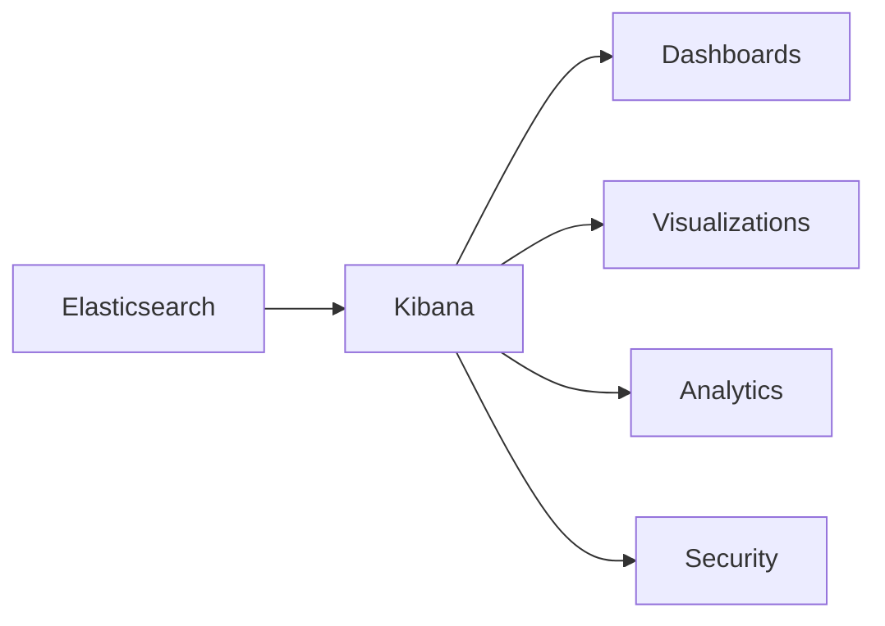
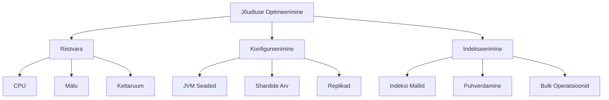
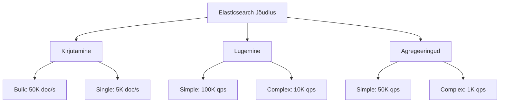
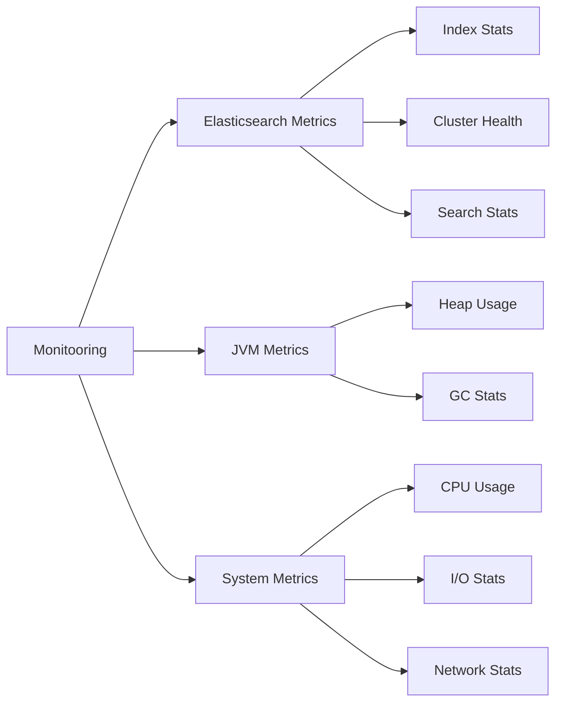
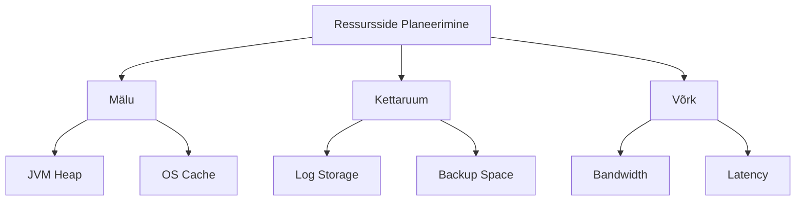

# ELK Stack ja Vector Õppematerjal

## Sisukord
- [Ülevaade](#ülevaade)
- [Komponendid](#komponendid)
  - [Elasticsearch](#elasticsearch)
  - [Logstash](#logstash)
  - [Beats](#beats)
  - [Vector](#vector)
  - [Kibana](#kibana)
- [Arhitektuur ja Andmevood](#arhitektuur-ja-andmevood)
- [Kasutusjuhud](#kasutusjuhud)
- [Seadistamine](#seadistamine)

## Ülevaade

ELK Stack (Elasticsearch, Logstash, ja Beats) koos Vectoriga moodustavad võimsa logihalduse ja analüütika platvormi. See dokument kirjeldab iga komponendi rolli ja nende koostööd.

## Komponendid

### Elasticsearch

Elasticsearch on skaleeritav otsingu- ja analüütikamootor, mis pakub:
- Reaalajas andmetöötlust
- Täistekstiotsingut
- Keerukaid analüütikavõimalusi
- RESTful API
- Hajutatud arhitektuuri

### Logstash

Logstash on keskne andmetöötlusplatvorm:
- Toetab mitmeid sisend- ja väljundformaate
- Võimaldab andmete filtreerimist ja transformeerimist
- Pakub rikkalikku pluginate ökosüsteemi
- Skaleeritav töötlusvõimekus

### Beats

Beats on kerged andmekogujad:
- **Filebeat**: Logifailide jälgimine
- **Metricbeat**: Süsteemi mõõdikute kogumine
- **Packetbeat**: Võrguliikluse jälgimine
- **Heartbeat**: Teenuste kättesaadavuse monitooring
- **Auditbeat**: Auditandmete kogumine

### Vector

Vector on moodne andmete kogumise ja töötlemise tööriist:
- Madal ressursikasutus
- Kõrge jõudlus
- Paindlik konfiguratsioon
- Lai toetatavate formaatide valik

## Täiendavad Komponendid ja Tööriistad

### Kibana

Kibana on visuaalne liides, mis töötab koos Elasticsearchiga ja pakub mitmekülselt andmete uurimise ja analüütika võimalusi:

- **Interaktiivsed Dashboardid**
- **Visualisatsioonid**
- **Päringute Jälgimine ja Otsing**: Kibana Query Language (KQL) või Lucene päringukeelt.
- **Logide Reaalajas Jälgimine**
- **Analüütika**
- **Alerting ja Teavitused**



### X-Pack
- Turvalisuse laiendus
- Autentimine ja autoriseerimine
- Krüpteerimine
- Monitooring
- Teavitused ja hoiatused

### APM (Application Performance Monitoring)
- Rakenduste jõudluse jälgimine
- Kooditaseme probleemide tuvastamine
- Transaktsioonianalüüs
- Teenuste kaardistamine

## Turvalisus ja Jõudlus

### Turvalisuse Põhimõtted
- SSL/TLS krüpteerimine
- Kasutajate autentimine
- Rollipõhine juurdepääsukontroll (RBAC)
- Andmete krüpteerimine
- Võrgu segmenteerimine

### Jõudluse Optimeerimine


### Skaleeritavus
- Horisontaalne ja vertikaalne skaleerimine
- Klastri haldus
- Koormusjaotus
- Tõrkesiire

## Tõrkeotsing ja Monitooring
- Logide analüüs
- Jõudluse mõõdikud
- Teavituste seadistamine
- Probleemide diagnoosimine

## Jõudluse Võrdlused ja Analüüs

### Andmekogujate Võrdlus

| Komponent | CPU Kasutus | Mälu Kasutus | Läbilaskevõime | Latentsus | Skaleeritavus |
|-----------|-------------|--------------|----------------|------------|---------------|
| Filebeat  | Madal (2-5%) | 50-100MB    | ~10K events/s  | < 1ms      | Hea           |
| Logstash  | Keskmine (20-30%) | 500MB-1GB  | ~20K events/s  | 2-5ms     | Väga hea      |
| Vector    | Madal (3-7%) | 100-200MB   | ~30K events/s  | < 1ms      | Suurepärane   |

### Elasticsearch Jõudlusnäitajad



### Süsteeminõuded ja Soovitused

#### Minimaalsed Nõuded (Väike keskkond, <100GB andmeid)
| Komponent      | CPU  | RAM   | Disk     |
|----------------|------|--------|----------|
| Elasticsearch  | 2    | 8GB    | 50GB SSD |
| Logstash      | 2    | 4GB    | 10GB     |
| Kibana        | 1    | 2GB    | 5GB      |

#### Soovituslikud Nõuded (Keskmine keskkond, <1TB andmeid)
| Komponent      | CPU  | RAM    | Disk      |
|----------------|------|---------|-----------|
| Elasticsearch  | 8    | 32GB   | 500GB SSD |
| Logstash      | 4    | 8GB    | 50GB      |
| Kibana        | 2    | 4GB    | 10GB      |

#### Ettevõtte Nõuded (Suur keskkond, >1TB andmeid)
| Komponent      | CPU  | RAM    | Disk        |
|----------------|------|---------|-------------|
| Elasticsearch  | 16+  | 64GB+  | 2TB+ SSD    |
| Logstash      | 8+   | 16GB+  | 100GB+      |
| Kibana        | 4+   | 8GB+   | 20GB+       |

### Jõudluse Optimeerimine

#### Elasticsearch Häälestamine
```yaml
# Mälu seaded
bootstrap.memory_lock: true
indices.memory.index_buffer_size: 30%

# Kirjutamise optimeerimine
index.refresh_interval: "30s"
index.number_of_replicas: 1
index.number_of_shards: 5

# Otsingu optimeerimine
indices.queries.cache.size: 15%
search.max_buckets: 10000
```

#### Logstash Häälestamine
```ruby
# Kirjutamispuhver
output {
  elasticsearch {
    bulk_size => 5000
    flush_size => 500
    workers => 4
  }
}
```

### Jõudluse Monitooring



### Andmete Säilitamise Strateegia

| Andmete Vanus | Säilitamise Koht | Replikate Arv | Otsingu Kiirus |
|---------------|------------------|---------------|----------------|
| < 7 päeva     | Hot nodes       | 2             | Kiireim        |
| 7-30 päeva    | Warm nodes      | 1             | Kiire          |
| 30-90 päeva   | Cold nodes      | 1             | Keskmine       |
| > 90 päeva    | Frozen/Archive  | 0             | Aeglane        |

### Võrdlus Teiste Lahendustega

| Aspekt        | ELK Stack     | Graylog      | Splunk       | Vector + ELK |
|---------------|---------------|--------------|--------------|--------------|
| Jõudlus       | Hea          | Hea          | Väga hea     | Suurepärane  |
| Skaleeritavus | Suurepärane  | Hea          | Suurepärane  | Suurepärane  |
| Hind          | Tasuta/Maksev| Tasuta/Maksev| Tasuline     | Tasuta       |
| Seadistamine  | Keskmine     | Lihtne       | Keeruline    | Keskmine     |
| Tugi          | Kogukond/Ent.| Kogukond/Ent.| Ettevõte     | Kogukond     |

## Seadistamine

### Elasticsearch Põhiseadistus
```yaml
cluster.name: my-elk-cluster
node.name: node-1
network.host: 0.0.0.0
discovery.seed_hosts: ["127.0.0.1"]
cluster.initial_master_nodes: ["node-1"]
```

### Logstash Põhikonfiguratsioon
```ruby
input {
  beats {
    port => 5044
  }
  vector {
    port => 5045
  }
}

filter {
  grok {
    match => { "message" => "%{COMBINEDAPACHELOG}" }
  }
}

output {
  elasticsearch {
    hosts => ["localhost:9200"]
    index => "logs-%{+YYYY.MM.dd}"
  }
}
```

## Integratsioonid ja Laiendused

### Populaarsed Integratsioonid
- Kubernetes logging
- Docker container logging
- Cloud platform integrations (AWS, Azure, GCP)
- Third-party tools and plugins

### API ja Programmeerimise Võimalused
- RESTful API kasutamine
- Programmikeelte klienditeegid
- Custom plugin development
- Elasticsearch DSL

## Parimad Praktikad

### Indeksite Haldus
- Index lifecycle management (ILM)
- Indeksite roteerimine
- Arhiveerimine
- Varundamine ja taaste

### Logimise Standardid
- Struktureeritud logimine
- JSON formaadi kasutamine
- Ajaformaadid
- Metaandmete lisamine

### Ressursside Planeerimine


## Lisaressursid
- Ametlik dokumentatsioon
- Kogukonna ressursid
- Õpetused ja juhendid
- Kasutajate foorumid
```

### Vector Näidiskonfiguratsioon
```toml
[sources.nginx_logs]
type = "file"
include = ["/var/log/nginx/access.log"]
read_from = "beginning"

[sinks.elasticsearch_out]
type = "elasticsearch"
inputs = ["nginx_logs"]
endpoint = "http://localhost:9200"
index = "vector-logs"