# 🔍 Introduction to Logging, Monitoring, and Observability

> 💡 "In the world of modern IT, being blind to your system's health is not an option"

## 📚 Table of Contents

- [What is Logging?](#what-is-logging)
- [What is Monitoring?](#what-is-monitoring)
- [What is Observability?](#what-is-observability)
- [What is Tracing?](#what-is-tracing)
- [The Importance of Logging and Monitoring](#the-importance)
- [History and Evolution](#history)
- [Log Management Processes](#processes)
- [Linux Logging Tools](#linux-tools)
- [Monitoring and Observability Tools](#monitoring-tools)

---

# 🌟 Introduction

Logging, monitoring, and observability are essential practices in modern IT operations, cybersecurity, and system management. These concepts form the foundation of maintaining secure, reliable, and efficient systems.

## 📝 What is Logging?

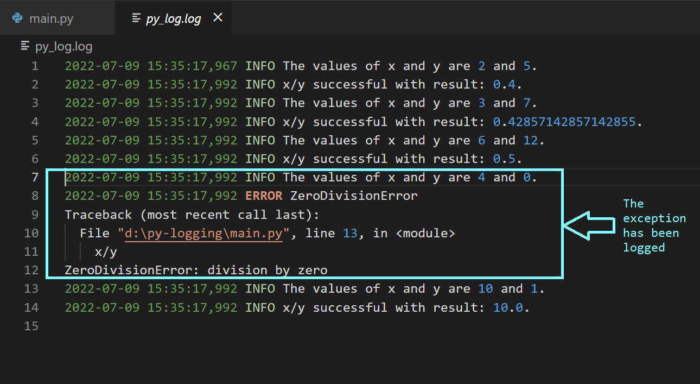

Logging is the process of recording events that occur within a system. Think of it as your system's diary - capturing everything from user logins to system errors and security breaches.

### 🎯 Purpose of Logging

**1. System Monitoring**
- Real-time insight into system behavior
- Detection of traffic spikes
- Identification of service failures
- Performance tracking

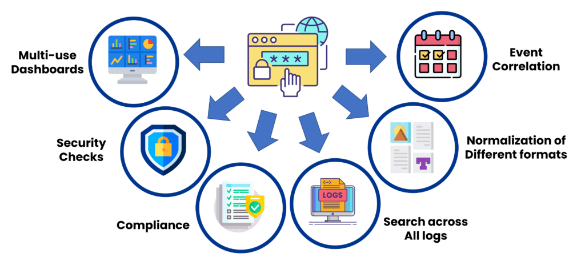

**2. Troubleshooting**
- Creates detailed event timelines
- Helps diagnose problems
- Records error messages
- Enables quick problem resolution

**3. Auditing**
- Ensures compliance (GDPR, HIPAA)
- Maintains verification records
- Tracks user actions
- Documents system changes

**4. Security**
- Detects unauthorized access
- Monitors suspicious activities
- Tracks login attempts
- Alerts on potential threats

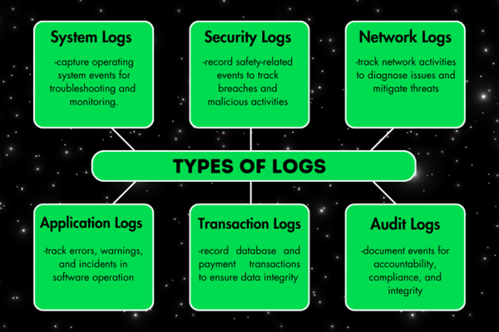

### ✨ Examples of Logging

1. **Web Server Logs** 🌐
Record every request made to a web server, including details such as the client’s IP address, the requested URL, and the response status.
   - Client IP addresses
   - Requested URLs
   - Response status codes
   - Access timestamps

2. **Application Logs** 💻
Capture events generated by software, such as user actions, system errors, or transaction details, providing insights into how the application is functioning.
   - User actions
   - System errors
   - Transaction details
   - Performance metrics

3. **Security Logs** 🔐
Monitor activities related to system security, including failed login attempts, changes to user permissions, and firewall activity.
   - Login attempts
   - Permission changes
   - Firewall activities
   - Security alerts

### 🎓 Best Practices in Logging

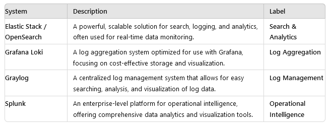

**1. Centralized Logging**
Instead of logs being scattered across different systems, centralize them in one location. This makes it easier to search, analyze, and manage them.
- ✅ Single location for all logs
- ✅ Easier searching and analysis
- ✅ Simplified management
- ✅ Better security control

**2. Log Rotation and Retention**
Logs can grow rapidly, so it’s important to implement log rotation policies to archive old logs and free up space. Ensure important logs are retained for an appropriate period, especially for compliance reasons.
- 🔄 Automatic archiving
- 📊 Space management
- 💾 Compliance adherence
- 🗑️ Clean deletion policies

**3. Log Format Standardization**
Using a standardized log format ensures consistency, making it easier to parse and analyze logs across different systems.
- 📝 Consistent structure
- 🔍 Easy parsing
- 📈 Better analysis
- 🔧 Simplified maintenance

### ⚠️ Common Pitfalls to Avoid
1. Inconsistent logging formats
2. Missing critical events
3. Inadequate retention policies
4. Poor searchability

### 💡 Pro Tips
- Always include timestamps in a standard format
- Log relevant context, not just events
- Implement proper log rotation
- Secure sensitive log data

# 📊 What is Monitoring?

> 💡 "Monitoring is like having a health dashboard for your entire IT system"

Think of monitoring as your system's vital signs monitor - continuously observing performance, availability, and overall health.
Monitoring involves continuously observing a system’s performance, availability, and overall health. Unlike logging, which records discrete events, monitoring focuses on metrics and indicators that reflect the system’s operational status over time.

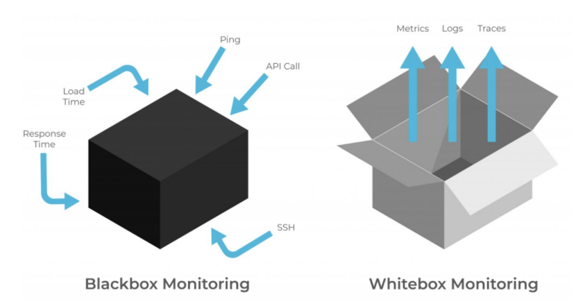

Here’s a rewritten, more engaging version of the text tailored to teenagers learning about monitoring, with a fun and relatable tone:

---

### Why Monitoring is Awesome (and Super Important!)

**Keeping Your Tech in Check:**
Imagine you’re running a gaming server or a cool app for your friends. Monitoring helps you spot problems before they get out of hand. Think of it as having a sixth sense for your system’s health! By keeping tabs on things like CPU usage, memory, and network traffic, you can catch the weird stuff early.

🕵️‍♂️ **Example:** Your server’s CPU suddenly goes into overdrive (maybe someone’s trying to crash it or there's a bug). A monitoring tool can give you a heads-up before your game lags or crashes. Crisis averted, hero!

**Boosting Performance Like a Pro:**
Monitoring gives you all the juicy data about how well your system is running. It’s like keeping track of your scores in a game—you spot trends, find weak spots, and get better over time. Use this intel to level up your system's performance and plan for those epic days when everyone’s online.

⚡ **Example:** Over time, you notice your app slows down every Friday evening (weird, right?). Monitoring shows it’s because of a user traffic spike. Boom—now you know to boost your resources on Fridays. You’re a tech wizard!

**Always On, Always Ready:**
Nobody likes downtime, especially when you’re in the middle of something important (or fun). Monitoring keeps an eye on your systems 24/7, so if something goes down, you’ll know ASAP. Fix it fast and keep the good vibes going.

🌐 **Example:** If an e-commerce website can lose tons of money during downtime, think about how annoyed your friends would be if your gaming server went down during a tournament. Monitoring saves the day!

## 🎯 Key System Metrics

When you’re monitoring a system, it’s like being a detective looking for clues to keep everything running smoothly. Here’s what you need to focus on:

### 1. **System Vitals**
Think of these as your system’s heartbeat, breathing, and energy levels. Keeping an eye on these tells you how your system is feeling overall:

- **LoadAvg & CPU Utilization**  
  The CPU is the brain of your system. LoadAvg and CPU utilization metrics show how much work the CPU is doing. If it’s constantly maxed out, it might be overwhelmed and need a break—or more resources!

- **Memory/DISK Usage**  
  Memory (RAM) is like your system’s short-term memory, while the disk is its long-term storage. If either is running low, your system could slow down or even crash. Regular checks prevent these "out of memory" headaches.

- **Network Performance (bps/pps)**  
  This is how fast data flows in and out of your system—like your internet speed. Bits per second (bps) and packets per second (pps) tell you if your network is cruising along or stuck in traffic.

- **DISK Load**  
  This measures how much your storage drives are working. If they’re overworked, you could face slower performance or even failures. Monitoring this keeps your files and apps safe.

---

### 2. **System Health Indicators**
These metrics are like regular check-ups to see if your system is "feeling good" and operating efficiently:

- **📝 "Cleanliness" of System Logs**  
  Logs are like your system’s diary—they record everything happening behind the scenes. If they’re full of error messages or warnings, it’s a sign something’s wrong.  
  Key logs to watch:  
  - `dmesg`: Kernel logs—what’s happening at the core of your system.  
  - `messages`: General system events—like a daily journal for your computer.

- **💾 Backup Status Relevance**  
  Backups are your safety net. Monitoring their status ensures you’ve got up-to-date copies of important data. If something goes wrong (like a hardware failure), you can bounce back without losing anything critical. Keep your backups fresh and test them to make sure they actually work!

By paying attention to these metrics, you’re not just keeping your system running—you’re ensuring it’s optimized, secure, and ready for anything.

## 🔍 Types of Monitoring

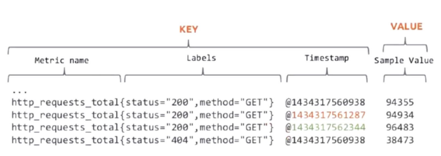

Monitoring isn’t one-size-fits-all; it’s more like a toolkit with specialized tools for different jobs. Here’s a breakdown:

---

### 1. **Infrastructure Monitoring** 🏗️  
This is like checking the foundation and scaffolding of a building—it ensures the core components of your system are solid.  

- **Physical Components**: Keeps tabs on servers, power supplies, and cooling systems. Is the hardware running too hot? Is a disk about to fail? Stay ahead of issues!  
- **Virtual Resources**: Monitors virtual machines (VMs), containers, and cloud instances. These are the flexible building blocks of modern systems.  
- **Network Devices**: Tracks routers, switches, and modems. If a network bottleneck occurs, you’ll spot it here.  
- **Storage Systems**: Ensures your data storage isn’t running out of space or experiencing performance hiccups.  

🛠️ **Why it matters:** Infrastructure monitoring helps you identify hardware or resource limitations before they slow down your system.

---

### 2. **Application Performance Monitoring (APM)** 💻  
Your apps are the stars of the show, and APM ensures they’re performing their best for users.  

- **Response Times**: How fast is your app reacting to user actions? Slow response times can lead to frustration and drop-offs.  
- **Error Rates**: Tracks issues like failed requests or bugs. High error rates are red flags that need fixing ASAP.  
- **User Satisfaction**: Measures user experiences, often through metrics like Apdex (Application Performance Index). Happy users mean a successful app!  
- **Transaction Flows**: Visualizes the journey of data and actions through your app, helping pinpoint bottlenecks.  

🎮 **Why it matters:** APM helps you keep your apps smooth, fast, and user-friendly.

---

### 3. **Security Monitoring** 🔐  
This is the watchdog guarding your system against malicious activity and unauthorized access.  

- **Login Attempts**: Tracks failed and successful logins. Multiple failed attempts? Could be someone trying to hack in.  
- **Access Control**: Monitors who’s accessing what, ensuring only authorized users get through.  
- **Firewall Activity**: Keeps an eye on blocked or suspicious network traffic.  
- **Security Breaches**: Detects anomalies or breaches in real time, so you can respond quickly and minimize damage.  

🛡️ **Why it matters:** In a world of constant cyber threats, security monitoring is your first line of defense.

---

By combining these types of monitoring, you get a complete picture of your system’s health, performance, and security. Ready to be the Sherlock Holmes of your tech setup? 🔎🚀

## 📈 Example of Service Metrics

### "Diagnostic Request" Approach
Think of this as a health check-up for your system:
- Engages most system components
- Measures response/processing time
- Tracks requests per time unit
- Monitors simultaneous requests

### 🕒 "Metric = Time Series"


Metrics are the bread and butter of monitoring systems, and they are often captured as **time series data**. Think of time series as a timeline of events—each data point tells a story about what’s happening at a specific moment.

---

#### What Makes a Good Time Series?

To make your monitoring effective, your time series data needs to check a few key boxes:

---

1. **Time-oriented** ⏰  
   Time series data is all about when something happened, so timestamps are crucial!  

   - **Each data point has a timestamp:** This helps you understand not just *what* is happening but *when*.  
   - **Sequential recording:** Data is collected in order, making it easy to follow patterns over time.  
   - **Temporal patterns visible:** By looking at the sequence of events, you can spot trends, spikes, or dips in your metrics.  

   🕵️‍♂️ **Example:** Imagine your app's response time suddenly spiked at 2 PM yesterday. The timestamp helps pinpoint when the problem started so you can investigate what caused it.

---

2. **Append-only** ➕  
   Once a data point is added, it’s never changed. This keeps the history intact for analysis.  

   - **Historical preservation:** You can look back and analyze past trends to predict future behavior.  
   - **Trend analysis enabled:** Want to know how your system performed during last year’s holiday traffic? With append-only data, you’ve got all the historical insights at your fingertips.  

   🛠️ **Why it’s important:** Metrics like CPU usage or error rates over time tell you what’s "normal" for your system and when things go out of bounds.

---

3. **Fresh Data Focus** 🆕  
   While history is useful, monitoring is most effective when it prioritizes the present.  

   - **Prioritizes recent information:** Real-time data keeps you in the loop about what’s happening *right now*.  
   - **Real-time analysis:** Immediate insights let you catch and fix problems as they occur.  
   - **Quick response capability:** Got an alert about a sudden server crash? Fresh data helps you react fast and save the day.  

   🚀 **Example:** If you’re monitoring login attempts, seeing a spike in failed attempts this minute is way more useful than noticing it hours later.

---

### Visualizing Time Series

To make sense of time series data, visualization tools are essential.  

- 📊 **Graphs and Dashboards:** Show patterns, trends, and anomalies clearly.  
- 🔍 **Zoom In or Out:** Drill down into specific time periods or get a bird’s-eye view of overall performance.  

With good time series data and the right tools, you’ll always be a step ahead in understanding and managing your system. 🕒✨

## 🛠️ Monitoring Tools

Monitoring tools are your trusty sidekicks in keeping systems healthy and performing their best. Each tool has unique strengths, so choosing the right one depends on your needs. Let’s dive deeper into some popular options:


---

### Popular Tools Comparison  

| **Tool**       | **Best For**         | **Key Features**                                           |
|-----------------|----------------------|-----------------------------------------------------------|
| **Nagios**      | **Infrastructure**   | Reliable and robust, perfect for monitoring servers, network devices, and applications. Classic and widely used. |
| **Zabbix**      | **Enterprise**       | An all-in-one monitoring solution with strong support for custom integrations and a sleek UI. Scales well for large organizations. |
| **Prometheus**  | **Cloud-native**     | Designed for cloud environments, excels in capturing time-series data, flexible querying, and alerting. Popular with Kubernetes setups. |
| **Grafana**     | **Visualization**    | Turns raw data into stunning dashboards, integrates seamlessly with Prometheus, InfluxDB, and more. Ideal for tracking trends and creating eye-catching reports. |

---
### Tool Highlights  

- **Nagios:**  
  Nagios is the granddaddy of monitoring tools. It’s been around for ages and is perfect for tracking system uptime and health. While its interface is a bit old-school, its reliability and simplicity make it a solid choice for infrastructure monitoring.  

- **Zabbix:**  
  Zabbix stands out for its powerful enterprise-level features. It can handle everything from application monitoring to network device tracking, all under one roof. The pre-built templates and integrations make setup quick and easy.  

- **Prometheus:**  
  Built for modern, dynamic environments, Prometheus specializes in time-series data and excels in cloud-native setups. If you’re working with Kubernetes or microservices, Prometheus is a go-to tool for capturing metrics and sending out alerts when things go awry.  

- **Grafana:**  
  Grafana doesn’t collect data but shines as a visualization platform. It takes the data from tools like Prometheus or InfluxDB and turns it into dashboards that are not only functional but beautiful. From performance tracking to forecasting trends, Grafana is the perfect way to make data meaningful.  

---

### 🚨 Alerting Methods

Effective alerting is the heart of monitoring systems—it’s all about making sure you’re notified at the right time, in the right way. In Europe, alerting often considers regional nuances like compliance with GDPR and availability of specific tools.

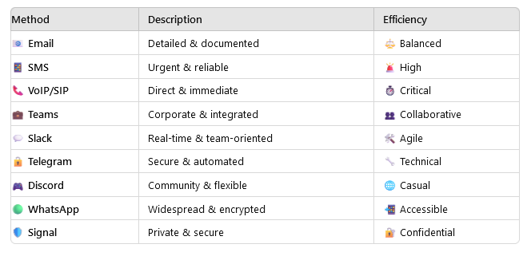

---

## ✅ Best Practices in Monitoring

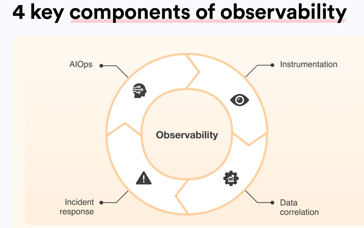

Good monitoring isn’t just about tools and metrics—it’s about doing it the *right way*. Here’s how you can set up a monitoring system that’s smart, effective, and sustainable:

---

### 1. **Clear Metrics and Alerts**  
- **Define specific thresholds:** Avoid vague alerts like “CPU high”—be precise (e.g., “CPU usage > 80% for 5 minutes”).  
- **Set meaningful alerts:** Focus on what truly matters—only alert for issues that need action.  
- **Avoid alert fatigue:** Too many alerts can overwhelm your team, causing them to miss critical ones. Prioritize severity and suppress minor noise.  
- **Document alert responses:** For every alert, ensure there’s a clear guide on how to investigate and resolve it.

💡 **Pro Tip:** Use alert escalation—start with low-priority alerts and escalate only if unresolved.

---

### 2. **Regular Review Process**  
Monitoring isn’t “set it and forget it.” You need to keep improving:  

- **Analyze monitoring data:** Use historical trends to refine your setup and predict potential issues.  
- **Adjust thresholds as needed:** If your system changes, your thresholds might need to change too.  
- **Update monitoring rules:** Add new metrics or retire outdated ones to stay relevant.  
- **Verify alert effectiveness:** Test alerts to ensure they trigger when they should and don’t miss critical scenarios.  

📈 **Example:** If a spike in traffic causes false-positive alerts, tweak thresholds or add conditions to reduce unnecessary noise.

---

### 3. **Integration Best Practices**  
Make monitoring a seamless part of your workflow:  

- **Connect with incident management:** Integrate with tools like PagerDuty, Opsgenie, or Slack for real-time alerts and collaboration.  
- **Establish clear workflows:** Define who handles what when an alert is triggered—no guessing games!  
- **Automate common responses:** For recurring issues (e.g., restarting a service), automate responses to save time.  
- **Document procedures:** Create playbooks for common incidents to speed up resolutions.

🤖 **Pro Tip:** Use webhooks or APIs to trigger automated actions directly from alerts.

---

### ⚠️ Common Monitoring Pitfalls  

Avoid these common traps that can weaken your monitoring system:  

1. **Too many alerts:** Flooding your team with notifications leads to desensitization and missed critical issues.  
2. **Poor threshold configuration:** Overly sensitive or overly lax thresholds make alerts meaningless.  
3. **Missing critical metrics:** Neglecting key performance indicators can leave you blind to major issues.  
4. **Inadequate documentation:** Without clear instructions, resolving alerts becomes a guessing game.

---

### 💡 Pro Tips for Monitoring Success  

Here’s how to take your monitoring game to the next level:  

1. **Start with essential metrics:** Focus on CPU, memory, disk, and network usage—expand gradually as you identify more needs.  
2. **Build gradually:** Don’t try to monitor everything at once. Begin with the basics, then layer on complexity.  
3. **Document everything:** From alert configurations to troubleshooting steps, keep clear and accessible records.  
4. **Regular review and updates:** Make monitoring reviews a scheduled activity to ensure you stay effective.  
5. **Train your team:** Teach everyone how to respond to alerts, use monitoring tools, and follow escalation workflows.

---

# 🔭 What is Observability?  

> 💡 "Observability is like having X-ray vision into your system’s internal workings."

While monitoring tells you *what’s happening*, observability helps you understand *why*. It’s the ability to dive deep into your system’s outputs—logs, metrics, and traces—to uncover the internal state and solve problems faster.

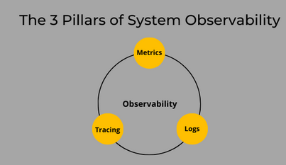

---

## 🎯 Core Concept  

Observability isn’t just a buzzword; it’s the evolution of monitoring. It provides rich insights into complex systems by analyzing their outputs. Here’s what makes it stand out:  

- **Logs** 📝: Capture the details of events, errors, and processes.  
- **Metrics** 📊: Provide numerical snapshots of system performance and health.  
- **Traces** 🔍: Map the journey of requests across services to spot bottlenecks and dependencies.  

Together, these components form a powerful toolkit to diagnose and improve your systems.

---

## 🏗️ Components of Observability  

### 1. **Logs** 📝  
Logs are like your system’s diary—they record detailed events that happen over time.  

- **Detailed event records:** They tell you *what* happened, *when*, and *where*.  
- **Contextual information:** Logs include rich details like error codes, user IDs, or stack traces, which help in troubleshooting.  
- **Timestamps and sequences:** They allow you to trace the flow of events step by step.  
- **Debug information:** If something breaks, logs are your first stop to find the root cause.

🛠️ **Example:** A web server log might show that a specific API call failed due to a missing authentication token.  

---

### 2. **Metrics** 📊  
Metrics provide quantifiable insights into your system's performance and resource utilization.  

- **Quantitative measurements:** Track CPU usage, memory consumption, disk I/O, and more.  
- **Performance indicators:** Metrics like response time or throughput tell you how well your system is performing.  
- **Resource usage:** Monitor how resources are being consumed to avoid overload or underutilization.  
- **Business KPIs:** Go beyond tech—track metrics like user engagement or sales to tie system performance to business goals.

📈 **Example:** A sudden spike in CPU usage accompanied by increased page load time indicates a performance bottleneck.  

---

### 3. **Traces** 🔍  
Traces follow the journey of a single request or transaction through your system, revealing how different services interact.  

- **Request journeys:** Understand how data flows from user input to database queries and back.  
- **Service interactions:** See how different components of your system communicate.  
- **Performance bottlenecks:** Pinpoint delays or errors in the request path.  
- **System dependencies:** Map out which services rely on each other, helping identify cascading failures.

🔎 **Example:** Traces can reveal that a delay in your payment processing system is due to a slow response from a third-party API.  

---

### 🌟 Why Observability Matters  

In today’s complex, distributed systems, monitoring alone isn’t enough. Observability gives you the tools to:  

- Quickly troubleshoot issues with clear insights.  
- Understand system behavior, even in unpredictable scenarios.  
- Optimize performance and improve user experiences.  

With observability, you’re not just watching your system—you’re mastering it. 🚀

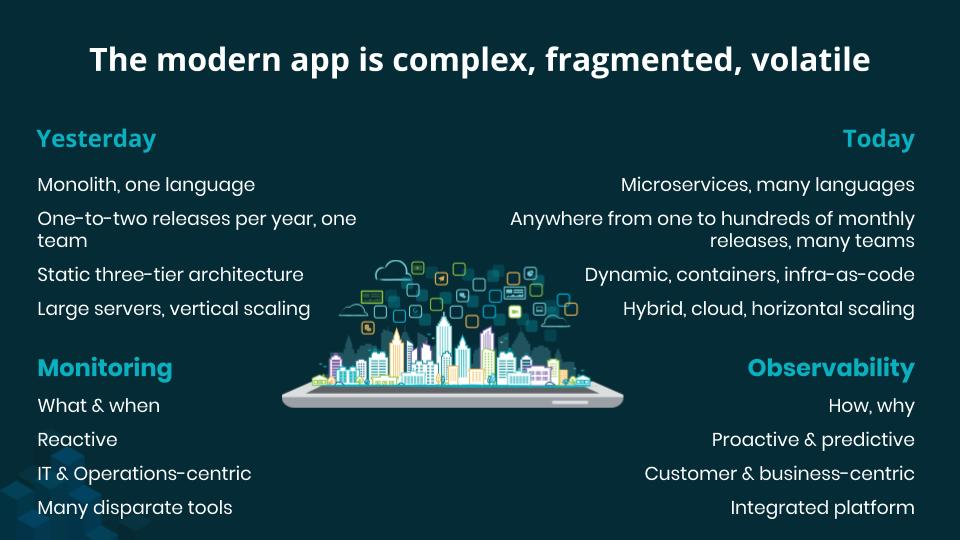

---

## 🌟 The Role in Modern Systems

### Managing Complex Systems
Think of it like having a GPS for your microservices:
- 🗺️ Maps service interactions
- 🔍 Tracks request flows
- ⚡ Identifies bottlenecks
- 🔧 Enables quick fixes

### Proactive vs Reactive Approach

| Traditional Monitoring | Modern Observability |
|----------------------|---------------------|
| Reacts to issues | Prevents issues |
| Limited visibility | Full system insight |
| Fixed dashboards | Dynamic exploration |
| Known unknowns | Unknown unknowns |

---

## 🛠️ Tools for Observability

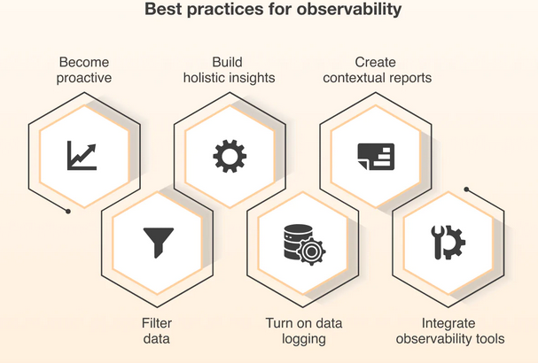

### Tracing Tools
1. **Jaeger** 
   - Distributed tracing
   - Performance monitoring
   - Root cause analysis

2. **Zipkin**
   - Request flow tracking
   - Latency analysis
   - Service dependency mapping

### Integrated Platforms
1. **OpenTelemetry**
   - Standard framework
   - Multiple data types
   - Easy integration

2. **Honeycomb & Datadog**
   - Comprehensive monitoring
   - Advanced analytics
   - Real-time insights

---

## ✅ Best Practices in Observability

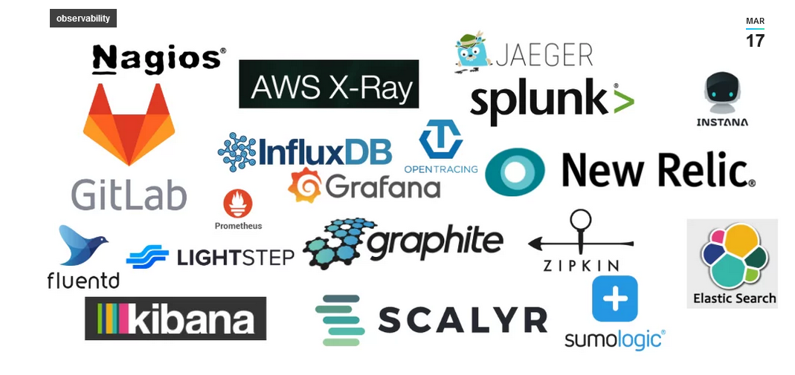


| **Category**                 | **Best Practices**                                                                                                                                             |
|------------------------------|-----------------------------------------------------------------------------------------------------------------------------------------------------------------|
| **1. Unified Approach**      | - 🔄 Integrate all data sources<br>- 📊 Ensure consistent metrics collection<br>- 🔍 Use standardized analysis methods<br>- 📱 Create a single view of system health |
| **2. Focus on Business Impact** | - 💼 Monitor critical transactions<br>- 📈 Track user experience<br>- 💰 Measure business metrics<br>- 🎯 Prioritize key services                                  |
| **3. Continuous Improvement** | - 📝 Conduct regular review cycles<br>- 🔄 Update monitoring strategies<br>- 📊 Refine metrics collection<br>- 🎓 Provide team training                           |

| **Common Pitfalls**          | **Pro Tips**                                                                                                                                                   |
|------------------------------|-----------------------------------------------------------------------------------------------------------------------------------------------------------------|
| 1. Tool proliferation        | - Start with business-critical paths                                                                                                                           |
| 2. Data silos                | - Build gradually                                                                                                                                              |
| 3. Missing context           | - Automate wherever possible                                                                                                                                   |
| 4. Alert fatigue             | - Document everything and train your team                                                                                                                      |

---


## 🔄 Practical Implementation

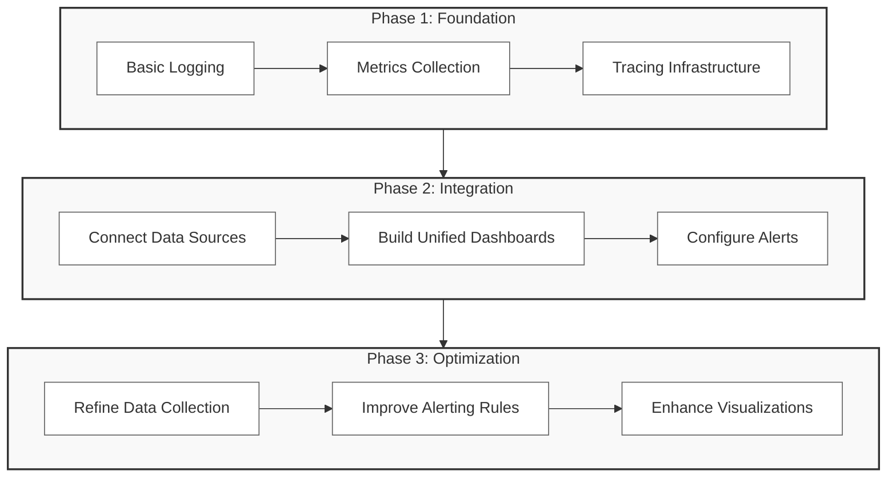


# 🔍 What is Tracing?

> 💡 "Tracing is like having a GPS for your requests as they travel through your system"

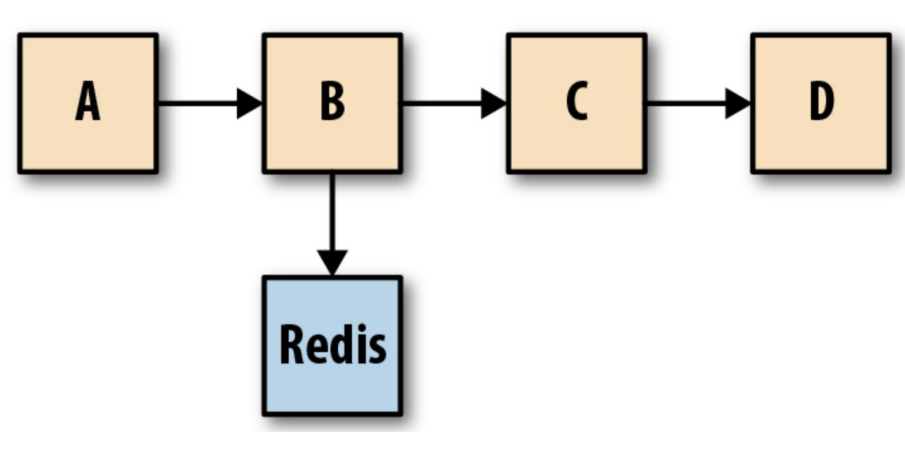

## 🎯 Core Purpose
Tracing follows requests as they move through different services or components in distributed systems, especially in microservices architectures.

---

| **Key Capability**        | **Description**                                                                                                                                   |
|----------------------------|---------------------------------------------------------------------------------------------------------------------------------------------------|
| **1. Measure Execution Time** ⏱️ | - Track operation duration<br>- Identify slow components<br>- Measure service latency<br>- Monitor performance trends                              |
| **2. Profile Requests** 📊  | - Analyze request patterns<br>- Measure resource usage<br>- Track user journeys<br>- Identify bottlenecks                                           |
| **3. Map Dependencies** 🗺️  | - Discover service connections<br>- Visualize request flows<br>- Understand system architecture<br>- Track service interactions                        |
| **4. Performance Analysis** 📈 | - Measure system throughput<br>- Analyze response delays<br>- Track resource utilization<br>- Monitor system capacity                                 |

---

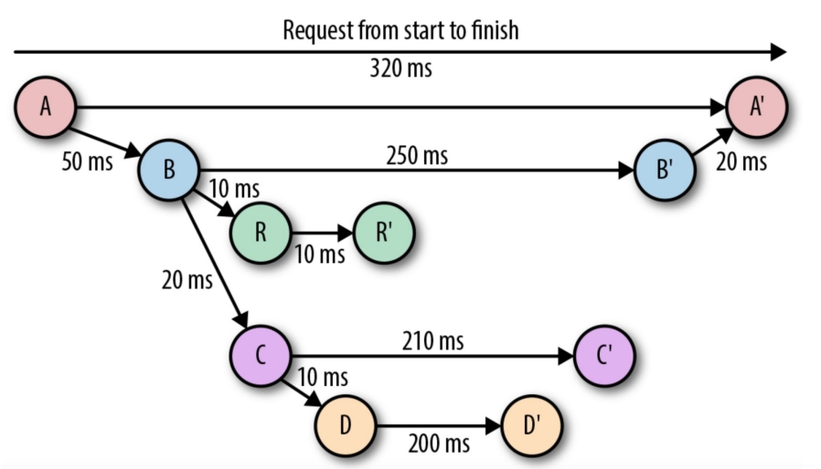

## 🛠️ Tracing Tools

---

| **Tool**           | **Features**                                                                                                  |
|---------------------|--------------------------------------------------------------------------------------------------------------|
| **1. Zipkin**       | - Distributed tracing system<br>- Request flow visualization<br>- Performance analysis<br>- Service dependency mapping |
| **2. Grafana Tempo** | - Scalable tracing backend<br>- Seamless Grafana integration<br>- High-performance design<br>- Easy visualization         |
| **3. OpenTelemetry** | - Open-source framework<br>- Standardized instrumentation<br>- Support for multiple languages<br>- Easy integration       |

---

# 🚨 The Importance of Logging and Monitoring

## Incident Management

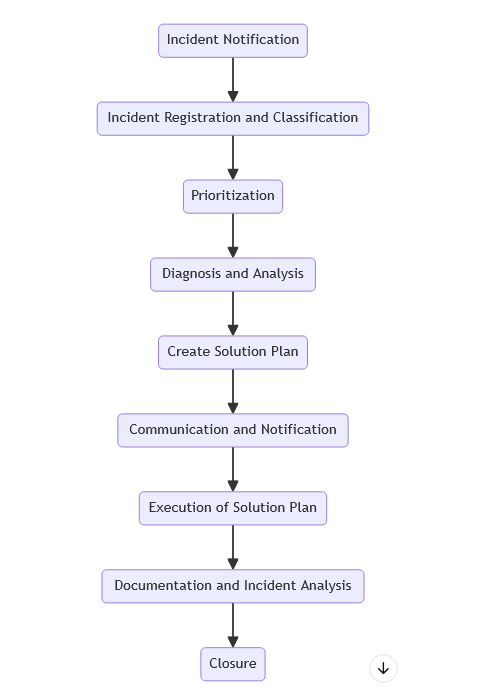

Imagine your app crashes in the middle of a big launch. What do you do? That’s where **incident management** swoops in to save the day!  

### **Key Players**  
Here’s the dream team you’ll call to action:  
- **Dev Team:** Fixing bugs like pros.  
- **Ops Team:** Keeping the servers running like a well-oiled machine.  
- **SRE Heroes:** The wizards who make sure systems don’t just survive—they thrive.  
- **ITIL Framework:** Think of it as the rulebook for handling chaos.  

---

### **Pro Tips for Epic Incident Management**  
1. **Classify Issues:** Is it a small glitch or a full-blown meltdown? Know the difference.  
2. **Have a Plan:** Don’t panic. Follow pre-written response steps to fix problems faster.  
3. **Practice Makes Perfect:** Regular drills ensure your team knows what to do in a real crisis.  
4. **Document Everything:** Keep logs of what happened so you don’t repeat mistakes.  

---

## 🔐 Security and Compliance

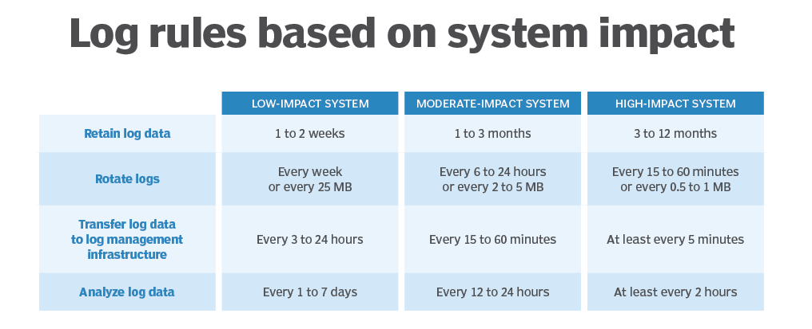

Ever heard of hackers trying to break into systems? Your monitoring tools are like your fortress guards.  

### **How Monitoring Detects Bad Stuff**  
- **Real-time Monitoring:** Like a live security camera for your system.  
- **Pattern Recognition:** Spot the weird stuff early (e.g., “Why is this IP trying to log in 100 times?”).  
- **Anomaly Detection:** Notices if something feels *off*—like a sudden data spike.  
- **Threat Assessment:** Figures out whether it’s just a curious kid or a full-blown attack.  

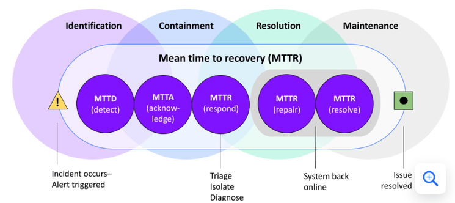

---


### **Staying Out of Trouble with Compliance**  
Governments and industries have rules, and breaking them can get you in big trouble.  

1. **Keep an Audit Trail:** Logs are like a diary of what’s happened—who accessed what, when, and why.  
   - Did someone try to hack in? Logs have your back.  
   - Did your system change? You’ll know who did it.  

2. **Follow the Rules:** Different regions and industries have strict guidelines to follow:  
   - **GDPR:** Protects user privacy in Europe.  
   - **HIPAA:** Keeps medical data secure.  
   - **SOX:** Ensures financial records aren’t shady.  
   - **Industry Regulations:** Whatever field you’re in, there’s probably a rulebook to follow.

---

## 🔧 How to Troubleshoot Like a Pro  

When something breaks in IT, troubleshooting is your superpower! Here’s how you can go from "What just happened?!" to "Crisis averted!" 

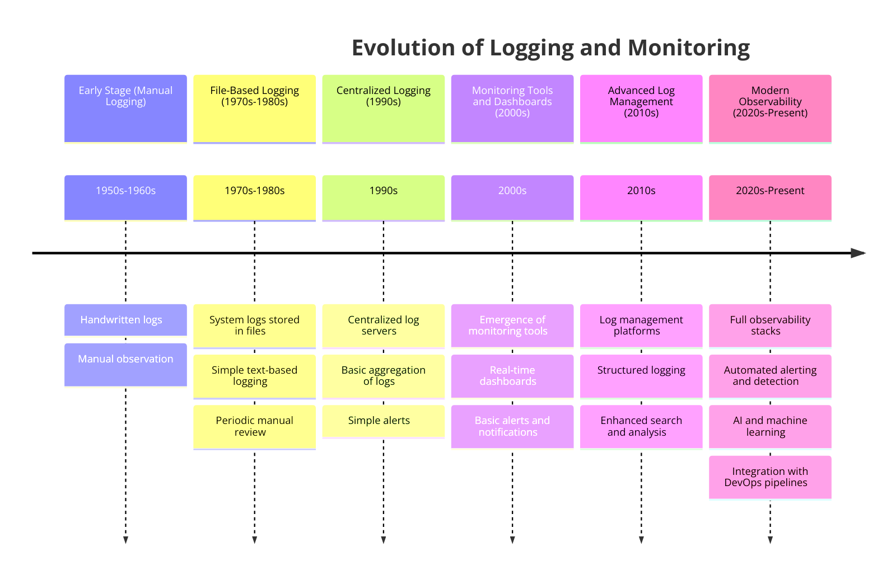

---

### **Your 3-Step Plan for Saving the Day**  

#### **1. Initial Detective Work 🕵️‍♂️**  
Start by gathering clues, just like solving a mystery:  
- Spot the symptoms—what’s acting weird?  
- Check the logs—they’re like your system’s diary.  
- Dive into monitoring dashboards for real-time updates.  
- Review any recent changes—did someone update the system or add a new feature?  

---

#### **2. Find the Root Cause 🌟**  
Now, dig deeper to uncover what went wrong:  
- Look for patterns in logs—are the same errors popping up?  
- Analyze metrics—did CPU, memory, or network usage spike?  
- Spot correlations—did the issue start after a specific event?  
- Pinpoint triggers—what caused the meltdown?  

---

#### **3. Fix It and Make It Stick 🛠️**  
Time to save the day:  
- Implement your fixes—restart a service, patch a bug, or update configurations.  
- Test to make sure the problem is really gone.  
- Write everything down—what happened, how you fixed it, and lessons learned.  
- Update your procedures to prevent the issue from happening again.  

---

### ⚠️ **Common Roadblocks (and How to Beat Them!)**  

1. **Missing Logs:** Logs not set up properly? You’ll feel blind.  
   💡 Pro Tip: Always configure detailed logging.  
2. **No Metrics:** Without monitoring, you’re flying without instruments.  
   💡 Pro Tip: Use tools like Grafana or Prometheus.  
3. **Poor Correlation:** If you can’t connect the dots, you’ll miss the big picture.  
   💡 Pro Tip: Use dashboards that show metrics and logs together.  
4. **Weak Documentation:** No notes = no lessons learned.  
   💡 Pro Tip: Write down everything, even the tiny details!  

---

---

# 📚 The Evolution of Logging and Monitoring  

> 💡 "From keeping it simple with text files to using powerful tools that feel like magic—logging and monitoring have come a long way."

---

## 🕰️ **Back in the Day: The Early Days of Monitoring**  

Before all the fancy dashboards and real-time alerts, logging and monitoring were as basic as it gets.

### **Basic Tools and Approaches**  
- **Text Log Files:** Logs were just text files—no frills, no visuals, just plain old text.  
- **Basic System Commands:** Tools like `tail` or `grep` were used to sift through logs line by line.  
- **Manual Review:** Finding issues meant scrolling endlessly through logs and hoping to spot the problem.  
- **Limited Monitoring:** No fancy graphs, just occasional checks to make sure things weren’t completely broken.  

---

### **The Struggles Were Real**  

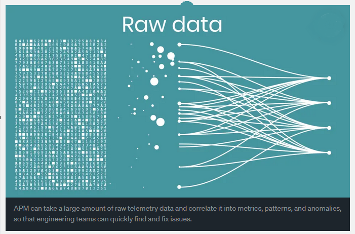

#### 🚫 **Big Problems with Early Methods:**  
1. **Manual Madness:** Everything was done by hand, which was slow and painful.  
2. **Scaling? Nope.** As systems grew, this approach just couldn’t keep up.  
3. **No Real-Time Insights:** Issues could go unnoticed for hours—or longer.  
4. **Hard Troubleshooting:** Finding the cause of a problem was like searching for a needle in a haystack.

---

## 🌟 **Welcome to the Modern Era of Monitoring**  

Now, monitoring tools are fast, smart, and downright awesome. Here’s how they’ve evolved:  

---

### **Next-Level Tools: The Evolution of Tech**  

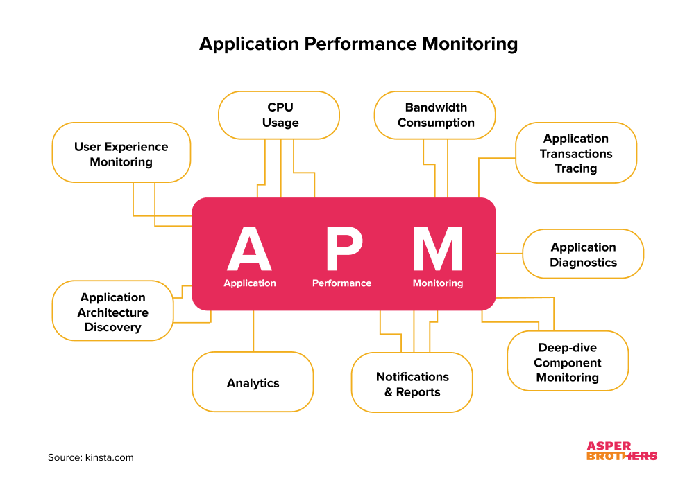

#### **1. Prometheus**  
- **Open-source Power:** Built for modern, cloud-native setups.  
- **Real-time Alerts:** Get notified instantly when something goes wrong.  
- **Advanced Queries:** Ask super-specific questions about your data.  
- **Cloud Ready:** Works beautifully with systems like Kubernetes.

---

#### **2. ELK Stack (Elasticsearch, Logstash, Kibana)**  
- **Log Wizardry:** Manage and search through massive amounts of logs effortlessly.  
- **Real-time Insights:** Spot trends or issues as they happen.  
- **Search Like a Pro:** Find exactly what you need with lightning-fast queries.  
- **Dashboards:** Turn raw data into eye-popping visualizations.

---

#### **3. Grafana**  
- **All-in-One Visuals:** Combine data from multiple sources in a single dashboard.  
- **Interactive Dashboards:** Click, zoom, and explore your data in real time.  
- **Alerting:** Set up smart alerts that ping you only when necessary.  
- **Plugins Galore:** Add features and integrations with ease.

---

### 🚀 **Why It Matters**  

Modern logging and monitoring aren’t just about detecting problems—they’re about understanding your system, predicting issues, and keeping everything running smoothly.  

From digging through text logs to using tools that give you X-ray vision into your systems, we’ve come a long way. And guess what? The future of observability is even brighter. 🌟

---

## 💪 **Why Modern Monitoring Tools Rock**  

Modern monitoring tools don’t just make life easier—they’re like having a supercharged assistant that never sleeps. Here’s why they’re awesome:

---

### **1. Scalability** 🚀  
Say goodbye to limits. Modern tools grow with your system, no matter how big it gets.  

- **Handle Huge Data Loads:** Millions of logs? No problem.  
- **Support Distributed Systems:** Perfect for cloud setups or apps running in multiple places.  
- **Cloud-Native Ready:** Works seamlessly with tools like Kubernetes and AWS.  
- **Flexible Deployment:** Use them in the cloud, on-premises, or a mix of both.

---

### **2. Automation** 🤖  
Let the tools do the heavy lifting while you focus on the cool stuff.  

- **Automated Data Collection:** Forget manual inputs—tools pull data in real time.  
- **Smart Alerts:** Get notified *only* when something important happens—no more spammy alerts!  
- **Scheduled Reports:** Tools deliver insights straight to your inbox (or dashboard) like clockwork.  
- **Automated Fixes:** Set up responses for common problems—fixes happen while you sleep.

---

### **3. Real-Time Analysis** ⏱️  
Modern tools don’t just observe—they act fast.  

- **Instant Insights:** See what’s happening in your system *right now*.  
- **Quick Problem Detection:** Spot issues the moment they appear.  
- **Lightning-Fast Response:** Tackle problems before they become disasters.  
- **Predict the Future:** Advanced tools can even forecast issues based on trends.

---

## 🔄 **Making the Shift to Observability**  

Moving from basic monitoring to full-blown observability is like upgrading from binoculars to a telescope—you get a much clearer, deeper view of your systems.


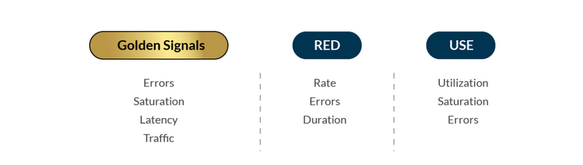

---

### **Key Observability Methods**  

Observability isn’t just about collecting data—it’s about collecting the *right* data and making sense of it. Here are the top methods to master:

#### **1. USE Method** 🚀  
(Utilization, Saturation, Errors)  
Perfect for tracking how your system resources are holding up:  
- **Utilization:** See how much of your resources (CPU, memory, etc.) are in use.  
- **Saturation:** Spot if your system is nearing its limits.  
- **Errors:** Keep an eye on problems like failed requests or system crashes.  
- **Goal:** Make sure your system is efficient and bottleneck-free.

---

#### **2. RED Method** 📊  
(Rate, Errors, Duration)  
The go-to for monitoring services like APIs or apps:  
- **Rate:** How many requests are coming in?  
- **Errors:** How many are failing?  
- **Duration:** How long does each request take?  
- **Goal:** Ensure your service delivers high quality and stays responsive.

---

#### **3. The Four Golden Signals** 🌟  
Think of these as the ultimate health indicators for your system:  
- **Latency:** How fast is your system responding?  
- **Traffic:** How much data or how many requests are being handled?  
- **Errors:** What’s breaking?  
- **Saturation:** How full are your resources?  
- **Goal:** Keep your system running smoothly for users.

---

### 🎯 **Key Focus Areas**  

#### **1. Error Analysis** 🛠️  
- Clearly define what counts as an error (don’t overdo it!).  
- Avoid false positives that flood you with unnecessary alerts.  
- Spot patterns in errors—are they random or connected to something?  
- Understand the *impact*—does it affect users or just background processes?  

---

#### **2. Latency Monitoring** ⏱️  
- Keep tabs on how fast your system responds—nobody likes waiting!  
- Identify bottlenecks—what’s slowing things down?  
- Measure user experience—happy users mean everything’s working.  
- Set performance baselines—know what "normal" looks like so you can spot problems fast.  

---

#### **3. Resource Management** ⚡  
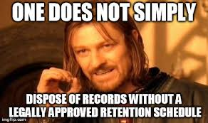  
Managing resources is like being a budget master for your system:  
- **Monitor Usage:** Check how much CPU, memory, and disk space you’re using.  
- **Track Saturation:** Spot when resources are about to run out.  
- **Predict Needs:** Plan for peak times so you’re not caught off guard.  
- **Scale Smartly:** Add resources when needed, but don’t overspend.  

---

## 🛠️ **Modern Log Management: The Cool Way to Handle Logs**  

Logs are like your system’s secret diary, recording everything that happens. Managing them well can make you a true IT pro!  

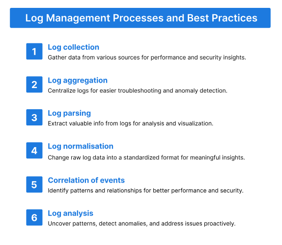

---

### **Top Tools for Log Management**  

#### **1. Splunk** 🚀  
Splunk is like the brainiac of log management tools—it does more than just store logs:  
- **Advanced Analytics:** Dive deep into your data to find patterns.  
- **Machine Learning:** Predict issues before they happen.  
- **Real-Time Monitoring:** See what’s happening in your system right now.  
- **Custom Dashboards:** Make your data look sleek and organized.  

---

#### **2. ELK Stack Components** 🌟  
ELK Stack is the ultimate DIY toolkit for log management:  
- **Elasticsearch:** The search engine that makes finding logs lightning-fast.  
- **Logstash:** Gathers and processes logs from all over your system.  
- **Kibana:** Turns your logs into beautiful charts and graphs.  

---

### **🔄 The Log Management Process**  

Managing logs isn’t just about storing them—it’s a full-on process:  
1. **Collection:** Grab logs from apps, servers, and devices.  
2. **Aggregation:** Bring all the logs together in one place.  
3. **Processing:** Clean and structure the data to make it useful.  
4. **Analysis:** Find insights, errors, or patterns.  
5. **Visualization:** Use charts and dashboards to make sense of it all.  

---

### ⚠️ **Common Log Management Headaches (and Fixes)**  

#### The Struggles:  
1. **Too Much Data:** Logs can get overwhelming fast!  
2. **Storage Costs:** Keeping all that data isn’t cheap.  
3. **Slow Searches:** Sifting through massive logs can be a drag.  
4. **Retention Issues:** How long do you keep logs before deleting them?

---

#### 💡 **Pro Tips to Be a Log Guru**  
- **Set Retention Rules:** Only keep logs as long as you need them—save space and money.  
- **Rotate Logs:** Automatically archive or delete old logs to avoid clutter.  
- **Use Structured Logging:** Make your logs easy to search by organizing them in a standard format.  
- **Automate Analysis:** Let tools handle repetitive tasks—don’t spend hours staring at logs.  
- **Do Regular Checkups:** Ensure your system isn’t missing logs or running out of space.  

---

Modern log management isn’t just about keeping records—it’s about using data to keep your systems running like a dream. Ready to level up your logging game? 💻🔥

# 🐧 Overview of Linux Logging Tools

> 💡 "Linux logging tools are the foundation of modern system observability"


| **Tool**          | **Key Features**                                                                                                   | **Example Use Case/Configuration**                                                                                                                                   | **Limitations**                                                                                     |
|--------------------|--------------------------------------------------------------------------------------------------------------------|---------------------------------------------------------------------------------------------------------------------------------------------------------------------|-----------------------------------------------------------------------------------------------------|
| **syslog** 📝      | - Centralized logging<br>- Standardized format<br>- Minimal configuration<br>- Universal support                   | ```bash<br># Typical syslog entry<br>Nov 19 10:23:45 server sshd[12345]: Failed password for user root from 192.168.1.100<br>```                                      | - Basic filtering<br>- Limited customization<br>- Simple processing options<br>- Basic security     |
| **rsyslog** 🔄    | - Advanced filtering with custom rules<br>- Remote logging and secure forwarding<br>- JSON and custom templates     | ```conf<br># rsyslog configuration example<br>*.error /var/log/error.log<br>mail.* /var/log/mail.log<br>auth.* @logserver.example.com:514<br>```                    | - Can be complex to configure for beginners                                                        |
| **journalctl** 🔍 | - Structured binary logging<br>- Advanced querying (time, service, priority)<br>- Rich metadata and fast searches   | ```bash<br># View recent logs<br>journalctl -n 50<br># Follow logs in real-time<br>journalctl -f<br># View logs for a service<br>journalctl -u nginx.service<br>``` | - Requires familiarity with binary logs and journal-specific commands                              |
| **logrotate** 📦   | - Automated log rotation<br>- Compression for space saving<br>- Customizable retention policies and rules          | ```conf<br># Example logrotate config<br>/var/log/nginx/*.log {<br>daily<br>rotate 7<br>compress<br>create 0640 nginx adm<br>postrotate<br>kill -USR1 `cat /pid`<br>} ``` | - Focuses only on rotation and retention, not real-time logging or analysis                        |


---

### Best Practices Overview
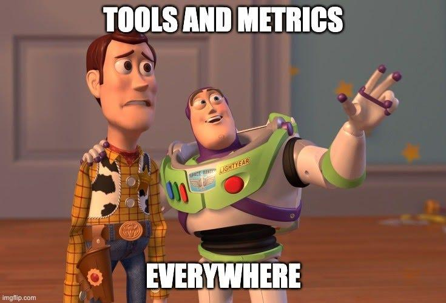

#### ✅ Implementation Tips
1. Regular rotation schedule
2. Appropriate compression
3. Sufficient retention period
4. Security permissions

