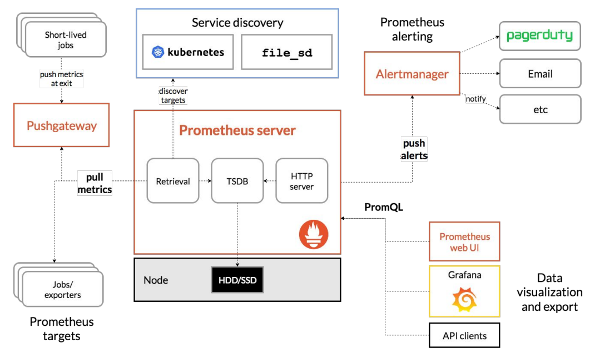
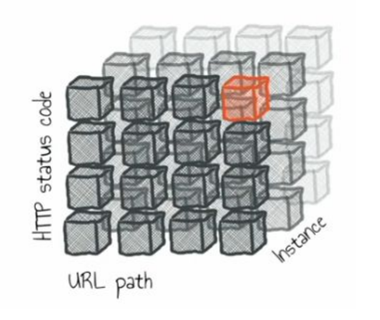

# 🔍 Introduction to Logging, Monitoring, and Observability

> 💡 "In the world of modern IT, being blind to your system's health is not an option"

## 📚 Table of Contents

- [What is Logging?](#what-is-logging)
- [What is Monitoring?](#what-is-monitoring)
- [What is Observability?](#what-is-observability)
- [What is Tracing?](#what-is-tracing)
- [The Importance of Logging and Monitoring](#the-importance)
- [History and Evolution](#history)
- [Log Management Processes](#processes)
- [Linux Logging Tools](#linux-tools)
- [Monitoring and Observability Tools](#monitoring-tools)

---

# 🌟 Introduction

Logging, monitoring, and observability are essential practices in modern IT operations, cybersecurity, and system management. These concepts form the foundation of maintaining secure, reliable, and efficient systems.

## 📝 What is Logging?


Logging is the process of recording events that occur within a system. Think of it as your system's diary - capturing everything from user logins to system errors and security breaches.

### 🎯 Purpose of Logging

**1. System Monitoring**
- Real-time insight into system behavior
- Detection of traffic spikes
- Identification of service failures
- Performance tracking


**2. Troubleshooting**
- Creates detailed event timelines
- Helps diagnose problems
- Records error messages
- Enables quick problem resolution

**3. Auditing**
- Ensures compliance (GDPR, HIPAA)
- Maintains verification records
- Tracks user actions
- Documents system changes

**4. Security**
- Detects unauthorized access
- Monitors suspicious activities
- Tracks login attempts
- Alerts on potential threats


### ✨ Examples of Logging

1. **Web Server Logs** 🌐
   - Client IP addresses
   - Requested URLs
   - Response status codes
   - Access timestamps

2. **Application Logs** 💻
   - User actions
   - System errors
   - Transaction details
   - Performance metrics

3. **Security Logs** 🔐
   - Login attempts
   - Permission changes
   - Firewall activities
   - Security alerts

### 🎓 Best Practices in Logging


**1. Centralized Logging**
- ✅ Single location for all logs
- ✅ Easier searching and analysis
- ✅ Simplified management
- ✅ Better security control

**2. Log Rotation and Retention**
- 🔄 Automatic archiving
- 📊 Space management
- 💾 Compliance adherence
- 🗑️ Clean deletion policies

**3. Log Format Standardization**
- 📝 Consistent structure
- 🔍 Easy parsing
- 📈 Better analysis
- 🔧 Simplified maintenance

### ⚠️ Common Pitfalls to Avoid
1. Inconsistent logging formats
2. Missing critical events
3. Inadequate retention policies
4. Poor searchability

### 💡 Pro Tips
- Always include timestamps in a standard format
- Log relevant context, not just events
- Implement proper log rotation
- Secure sensitive log data

# 📊 What is Monitoring?

> 💡 "Monitoring is like having a health dashboard for your entire IT system"

Think of monitoring as your system's vital signs monitor - continuously observing performance, availability, and overall health.


## 🎯 Key System Metrics

### 1. System Vitals
- LoadAvg & CPU utilization
- Memory/DISK usage
- Network performance (bps/pps)
- DISK Load

### 2. System Health Indicators
- 📝 "Cleanliness" of system logs
   - dmesg
   - messages
- 💾 Backup status relevance

## 🔍 Types of Monitoring


### 1. Infrastructure Monitoring 🏗️
- Physical components
- Virtual resources
- Network devices
- Storage systems

### 2. Application Performance Monitoring (APM) 💻
- Response times
- Error rates
- User satisfaction
- Transaction flows

### 3. Security Monitoring 🔐
- Login attempts
- Access control
- Firewall activity
- Security breaches

## 📈 Example of Service Metrics

### "Diagnostic Request" Approach
Think of this as a health check-up for your system:
- Engages most system components
- Measures response/processing time
- Tracks requests per time unit
- Monitors simultaneous requests

### 🕒 "Metric = Time Series"


#### What Makes a Good Time Series?
1. **Time-oriented** ⏰
   - Each data point has a timestamp
   - Sequential recording
   - Temporal patterns visible

2. **Append-only** ➕
   - Data only adds, never changes
   - Historical preservation
   - Trend analysis enabled

3. **Fresh Data Focus** 🆕
   - Prioritizes recent information
   - Real-time analysis
   - Quick response capability

## 🛠️ Monitoring Tools


### Popular Tools Comparison

| Tool | Best For | Key Feature |
|------|----------|-------------|
| Nagios | Infrastructure | Classic monitoring |
| Zabbix | Enterprise | All-in-one solution |
| Prometheus | Cloud-native | Time-series data |
| Grafana | Visualization | Beautiful dashboards |

### 🚨 Alerting Methods (Europe)


## ✅ Best Practices in Monitoring


### 1. Clear Metrics and Alerts
- Define specific thresholds
- Set meaningful alerts
- Avoid alert fatigue
- Document alert responses

### 2. Regular Review Process
- Analyze monitoring data
- Adjust thresholds as needed
- Update monitoring rules
- Verify alert effectiveness

### 3. Integration Best Practices
- Connect with incident management
- Establish clear workflows
- Automate common responses
- Document procedures

### ⚠️ Common Monitoring Pitfalls
1. Too many alerts (alert fatigue)
2. Poor threshold configuration
3. Missing critical metrics
4. Inadequate documentation

### 💡 Pro Tips
- Start with essential metrics
- Build gradually
- Document everything
- Regular review and updates
- Train team on response procedures

# 🔭 What is Observability?

> 💡 "Observability is like having X-ray vision into your system's internal state"


## 🎯 Core Concept
Observability goes beyond simple monitoring - it's about understanding the internal states of a system by analyzing its outputs through:
- 📝 Logs
- 📊 Metrics
- 🔍 Traces

## 🏗️ Components of Observability

### 1. Logs 📝
- Detailed event records
- Contextual information
- Timestamps and sequences
- Debug information

### 2. Metrics 📊
- Quantitative measurements
- Performance indicators
- Resource usage
- Business KPIs

### 3. Traces 🔍
- Request journeys
- Service interactions
- Performance bottlenecks
- System dependencies


## 🌟 The Role in Modern Systems

### Managing Complex Systems
Think of it like having a GPS for your microservices:
- 🗺️ Maps service interactions
- 🔍 Tracks request flows
- ⚡ Identifies bottlenecks
- 🔧 Enables quick fixes

### Proactive vs Reactive Approach

| Traditional Monitoring | Modern Observability |
|----------------------|---------------------|
| Reacts to issues | Prevents issues |
| Limited visibility | Full system insight |
| Fixed dashboards | Dynamic exploration |
| Known unknowns | Unknown unknowns |

## 🛠️ Tools for Observability


### Tracing Tools
1. **Jaeger** 
   - Distributed tracing
   - Performance monitoring
   - Root cause analysis

2. **Zipkin**
   - Request flow tracking
   - Latency analysis
   - Service dependency mapping

### Integrated Platforms
1. **OpenTelemetry**
   - Standard framework
   - Multiple data types
   - Easy integration

2. **Honeycomb & Datadog**
   - Comprehensive monitoring
   - Advanced analytics
   - Real-time insights

## ✅ Best Practices in Observability


### 1. Unified Approach
- 🔄 Integrate all data sources
- 📊 Consistent metrics collection
- 🔍 Standardized analysis methods
- 📱 Single view of system health

### 2. Focus on Business Impact
- 💼 Monitor critical transactions
- 📈 Track user experience
- 💰 Measure business metrics
- 🎯 Prioritize key services

### 3. Continuous Improvement
- 📝 Regular review cycles
- 🔄 Update monitoring strategies
- 📊 Refine metrics collection
- 🎓 Team training

### ⚠️ Common Pitfalls
1. Tool proliferation
2. Data silos
3. Missing context
4. Alert fatigue

### 💡 Pro Tips
- Start with business-critical paths
- Build gradually
- Automate where possible
- Document everything
- Train your team

## 🔄 Practical Implementation

### Phase 1: Foundation
1. Implement basic logging
2. Set up metrics collection
3. Establish tracing infrastructure

### Phase 2: Integration
1. Connect data sources
2. Build unified dashboards
3. Configure alerts

### Phase 3: Optimization
1. Refine data collection
2. Improve alerting rules
3. Enhance visualizations

# 🔍 What is Tracing?

> 💡 "Tracing is like having a GPS for your requests as they travel through your system"


## 🎯 Core Purpose
Tracing follows requests as they move through different services or components in distributed systems, especially in microservices architectures.

## 🛠️ Key Capabilities

### 1. Measure Execution Time ⏱️
- Track operation duration
- Identify slow components
- Measure service latency
- Monitor performance trends

### 2. Profile Requests 📊
- Analyze request patterns
- Measure resource usage
- Track user journeys
- Identify bottlenecks

### 3. Map Dependencies 🗺️
- Discover service connections
- Visualize request flows
- Understand system architecture
- Track service interactions

### 4. Performance Analysis 📈
- Measure system throughput
- Analyze response delays
- Track resource utilization
- Monitor system capacity


## 🛠️ Tracing Tools

### 1. Zipkin
- Distributed tracing system
- Request flow visualization
- Performance analysis
- Service dependency mapping

### 2. Grafana Tempo
- Scalable tracing backend
- Grafana integration
- High-performance design
- Easy visualization

### 3. OpenTelemetry
- Open-source framework
- Standardized instrumentation
- Multiple language support
- Easy integration

# 🚨 The Importance of Logging and Monitoring

## Incident Management


### Key Components
- Development team response
- Operations team coordination
- SRE (Site Reliability Engineering) involvement
- ITIL framework integration

### Best Practices
1. Clear incident classification
2. Defined response procedures
3. Regular team training
4. Documentation requirements

## 🔐 Security and Compliance


### Security Incident Detection
- Real-time monitoring
- Pattern recognition
- Anomaly detection
- Threat assessment


### Compliance Requirements
1. **Audit Trail Maintenance**
   - User actions
   - System changes
   - Access attempts
   - Security events

2. **Regulatory Compliance**
   - GDPR requirements
   - HIPAA standards
   - SOX compliance
   - Industry regulations

## 🔧 Troubleshooting and Response


### Incident Analysis Process
1. **Initial Assessment**
   - Identify symptoms
   - Gather relevant logs
   - Check monitoring data
   - Review recent changes

2. **Root Cause Analysis**
   - Analyze log patterns
   - Review metrics
   - Check correlations
   - Identify triggers

3. **Resolution Steps**
   - Implement fixes
   - Verify solutions
   - Document actions
   - Update procedures

### ⚠️ Common Challenges
1. Incomplete logging
2. Missing metrics
3. Poor correlation
4. Inadequate documentation

### 💡 Pro Tips
- Maintain detailed logs
- Set up proper monitoring
- Document everything
- Train team regularly
- Review and improve procedures

# 📚 History and Evolution of Logging and Monitoring

> 💡 "From simple log files to advanced observability platforms - the journey of system monitoring"

## 🕰️ Early Days

### Basic Tools and Approaches
- Simple text log files
- Basic system commands
- Manual log review
- Limited monitoring capabilities

### Initial Challenges


#### 🚫 Common Problems
1. Manual processes
2. Limited scalability
3. No real-time monitoring
4. Difficult troubleshooting

## 🌟 Modern Systems


### Advanced Tooling Evolution
1. **Prometheus**
   - Open-source monitoring
   - Real-time alerting
   - Perfect for cloud-native
   - Advanced querying

2. **ELK Stack**
   - Log management
   - Real-time analysis
   - Powerful search
   - Visual dashboards

3. **Grafana**
   - Multi-source visualization
   - Interactive dashboards
   - Alerting capabilities
   - Rich plugin ecosystem

## 💪 Benefits of Modern Tools

### 1. Scalability
- Handle large data volumes
- Support distributed systems
- Cloud-native integration
- Flexible deployment

### 2. Automation
- Automated data collection
- Intelligent alerting
- Scheduled reporting
- Automated responses

### 3. Real-Time Analysis
- Instant insights
- Quick problem detection
- Rapid response
- Predictive capabilities

## 🔄 The Transition to Observability


### Key Methodologies

#### 1. USE Method
(Utilization, Saturation, Errors)
- Resource usage tracking
- Bottleneck identification
- Error monitoring
- System efficiency

#### 2. RED Method
(Rate, Errors, Duration)
- Request rate monitoring
- Error rate tracking
- Duration measurement
- Service quality assessment

#### 3. Four Golden Signals
- Latency monitoring
- Traffic analysis
- Error tracking
- Saturation measurement

### 🎯 Focus Areas

#### 1. Error Analysis
- Mark errors correctly
- Avoid false positives
- Track error patterns
- Understand impact

#### 2. Latency Monitoring
- Track response times
- Identify bottlenecks
- Measure user experience
- Set performance baselines

#### 3. Resource Management


- Monitor resource usage
- Track saturation levels
- Predict capacity needs
- Plan scaling

## 🛠️ Modern Log Management

### Tools and Platforms


#### 1. Splunk
- Advanced analytics
- Machine learning
- Real-time monitoring
- Custom dashboards

#### 2. ELK Stack Components
- Elasticsearch (search & analytics)
- Logstash (data processing)
- Kibana (visualization)

### 🔄 Log Management Process
1. Collection
2. Aggregation
3. Processing
4. Analysis
5. Visualization

### ⚠️ Common Challenges
1. Data volume management
2. Storage costs
3. Search performance
4. Retention policies

### 💡 Pro Tips
- Define clear retention policies
- Implement log rotation
- Use structured logging
- Automate log analysis
- Regular maintenance checks

# 🐧 Overview of Linux Logging Tools

> 💡 "Linux logging tools are the foundation of modern system observability"

## 📝 syslog

### Core Functionality


#### 🎯 Key Features
1. **Centralized Logging**
   - Single collection point
   - Standardized format
   - System-wide logging
   - Easy management

2. **Simplicity**
   - Minimal configuration
   - Easy setup
   - Standard formats
   - Universal support

#### ⚠️ Limitations
- Basic filtering capabilities
- Simple processing options
- Limited customization
- Basic security features

#### 💡 Example Use Case
```bash
# Typical syslog entry
Nov 19 10:23:45 server sshd[12345]: Failed password for user root from 192.168.1.100
```

## 🔄 rsyslog

### Enhanced Capabilities
Think of rsyslog as syslog's more powerful cousin!

#### 🚀 Key Features
1. **Advanced Filtering**
   - Complex rule sets
   - Custom conditions
   - Multiple criteria
   - Flexible routing

2. **Log Forwarding**
   - Remote logging
   - Multiple destinations
   - Secure transmission
   - Load balancing

3. **Multiple Formats**
   - JSON support
   - Custom templates
   - Structured logging
   - Format conversion

#### 💻 Example Configuration
```conf
# rsyslog configuration example
*.error                     /var/log/error.log
mail.*                      /var/log/mail.log
auth.*                      @logserver.example.com:514
```

## 🔍 journalctl

### Modern Logging Solution

#### 🎯 Key Features
1. **Structured Logging**
   - Binary format
   - Efficient storage
   - Fast queries
   - Rich metadata

2. **Advanced Querying**
   - Time-based filters
   - Service filtering
   - Priority levels
   - Pattern matching

#### 🛠️ Common Commands
```bash
# View recent logs
journalctl -n 50

# Follow logs in real-time
journalctl -f

# View logs for specific service
journalctl -u nginx.service
```

## 📦 logrotate


### Automated Log Management

#### 🎯 Key Features
1. **Rotation Rules**
   - Size-based
   - Time-based
   - Custom conditions
   - Flexible scheduling

2. **Compression**
   - Automatic compression
   - Multiple formats
   - Space saving
   - Archive management

3. **Customization**
   - Pre/post scripts
   - Custom retention
   - Multiple configurations
   - Service-specific rules

#### 📄 Example Configuration
```conf
/var/log/nginx/*.log {
    daily
    missingok
    rotate 7
    compress
    delaycompress
    notifempty
    create 0640 nginx adm
    sharedscripts
    postrotate
        [ -f /var/run/nginx.pid ] && kill -USR1 `cat /var/run/nginx.pid`
    endscript
}
```

### Best Practices Overview


#### ✅ Implementation Tips
1. Regular rotation schedule
2. Appropriate compression
3. Sufficient retention period
4. Security permissions

# 🔍 Expanded Introduction to Monitoring Tools

## 🎯 Prometheus


### 📚 Prometheus Facts
- Started: 2012 at SoundCloud
- Inspiration: Google's Borgmon
- Language: Golang
- License: Apache 2 (100% open source)
- Support: Cloud Native Computing Foundation


### 🌟 Key Features
1. Active monitoring
2. Rich ecosystem
3. Metric specialization
4. Service discovery
5. Visualization capabilities

# 🎯 Deep Dive: Prometheus and Monitoring

## 📦 White Box vs Black Box Monitoring

> 💡 "Different approaches for different visibility needs"

### 🔲 Black Box Administration
Think of it like using a device without knowing its internals:


#### Key Characteristics
- Predefined operations
- Known input/output
- Limited internal visibility
- Standard procedures

#### When to Use
- Standard systems
- Well-documented tools
- Regular operations
- Predictable behaviors

### ⬜ White Box Monitoring
Like having X-ray vision into your system:
- Complete internal visibility
- Understanding of components
- Access to internal metrics
- Deep troubleshooting capability

## 🌟 Real-Life Example

### Initial Setup Scenario
**Website Configuration:**
- 2 machines (8 cores each)
- 8GB RAM per machine
- Stack: Apache2, PHP, MySQL, Memcache

### 🚨 The Problem
Common symptoms:
- Website slowdown
- 10-30 second response times
- Occasional no response


### Two Different Approaches

#### 1️⃣ Black Box Approach
**Symptoms Observed:**
- Low free memory
- Load average ~20
- Heavy swap usage
- High iowait

**Quick Fix Applied:**
- Apache restart
- Hourly restart cron job
- Problem "solved" temporarily

**Outcome:**
✅ Quick 10-minute fix
❌ Unknown root cause
⚠️ Temporary solution
❌ Problem returned after 6 months

#### 2️⃣ White Box Approach
**Detailed Analysis:**
- Memory usage per request
- Apache child processes
- Swap impact
- I/O patterns

**Comprehensive Solution:**
1. Added Nginx front-end
2. Separated heavy requests
3. Implemented request limits
4. Added Node.js for long-polling

**Results:**
✅ Reduced peak load
✅ Stable memory usage (2-3GB)
✅ No swap usage
✅ Consistent response times
✅ 10x capacity increase

## 🔄 Push vs Pull Model

### Push Model


**Characteristics:**
- Clients send metrics
- Good for short-lived jobs
- More complex client management
- Immediate data transmission

### Pull Model


**Characteristics:**
- Server scrapes metrics
- Better for stable services
- Simpler management
- Regular interval collection

## 🏗️ Prometheus Architecture



### Core Components
1. **Prometheus Server**
   - Metric retrieval
   - TSDB storage
   - HTTP server
   - Web UI

2. **Supporting Components**
   - Pushgateway
   - Alertmanager
   - Exporters
   - Service Discovery

### Workflow Diagram


## 📊 Data Model

### Structure Overview


### Filtering Capabilities


**Key Concepts:**
- Metric names
- Label pairs
- Time series
- Query language (PromQL)

### Data Organization


### Metric Types
1. **Counter** 📈
   - Only increases
   - Reset to zero
   - Example: total_requests

2. **Gauge** 🌡️
   - Up/down values
   - Current state
   - Example: memory_usage

3. **Histogram** 📊
   - Value distribution
   - Bucket configuration
   - Response time tracking

4. **Summary** 📑
   - Pre-calculated quantiles
   - Statistical analysis
   - Performance metrics

## 🔁 Pushgateway


### Use Cases
- Batch jobs
- Short-lived processes
- Intermittent metrics
- Bridge components

### Example Configuration


## ⚠️ Alertmanager


### Features
1. Alert routing
2. Deduplication
3. Grouping
4. Notification channels

### 💡 Pro Tips
- Set meaningful thresholds
- Avoid alert fatigue
- Group related alerts
- Define clear escalation paths

# 📊 Grafana

> 💡 "Turn your metrics into actionable insights with beautiful dashboards"


## 🎯 Key Features

### 1. Visualization Power
- Interactive dashboards
- Multiple data sources
- Real-time updates
- Custom panels

### 2. Integration Capabilities
- Prometheus integration
- Zabbix compatibility
- Multiple databases
- Custom plugins

### 3. Advanced Features
- Alerting system
- Team collaboration
- Template variables
- Dashboard sharing

## 💡 Best Practices
1. **Dashboard Organization**
   - Logical grouping
   - Clear naming
   - Consistent layout
   - Important metrics first

2. **Performance Optimization**
   - Efficient queries
   - Appropriate refresh rates
   - Resource consideration
   - Cache utilization

3. **Team Usage**
   - Role-based access
   - Shared dashboards
   - Documentation
   - Version control

# 🔍 Zabbix

## 🎯 Enterprise Monitoring

### Core Strengths
1. **Comprehensive Monitoring**
   - Network devices
   - Servers
   - Virtual machines
   - Cloud services
   - Applications

2. **Feature Set**
   - Custom dashboards
   - Detailed reporting
   - Flexible alerts
   - Auto-discovery

3. **Scalability**
   - Large environments
   - Distributed monitoring
   - High availability
   - Load balancing

### 🛠️ Implementation Tips
1. **Planning**
   - Define monitoring scope
   - Set up hierarchy
   - Plan capacity
   - Design workflows

2. **Deployment**
   - Proper sizing
   - Security configuration
   - Network considerations
   - Backup strategy

3. **Maintenance**
   - Regular updates
   - Performance tuning
   - Database optimization
   - Configuration management

# 📚 Study Materials

## 🎓 Learning Resources

### 1. Prometheus Fundamentals
- 12-video playlist by Julius Volz
- Core concepts
- Practical implementation
- Best practices

### 2. Querying Resources
- Official Prometheus guide
- PromQL documentation
- Query optimization
- Real-world examples

### 3. Tools and Utilities
- **PromLens**
  - Query building
  - Analysis tools
  - Visualization helpers

### 4. Practical Resources
- 🔗 [Prometheus Demo](https://demo.do.prometheus.io/)
- 🔗 [Karma Alerts Dashboard](https://demo.karma-dashboard.io/)
- 🔗 [Prometheus Routing Tree Editor](https://www.prometheus.io/webtools/alerting/routing-tree-editor/)

## 🚀 Getting Started Tips

### 1. Learning Path
1. **Basic Concepts**
   - Understanding metrics
   - Logging basics
   - Monitoring fundamentals

2. **Tool Mastery**
   - Prometheus setup
   - Grafana dashboards
   - Alert configuration

3. **Advanced Topics**
   - Custom exporters
   - PromQL mastery
   - High availability

### 2. Practical Experience
- Set up test environments
- Create sample dashboards
- Practice troubleshooting
- Experiment with queries

### 3. Community Engagement
- Join forums
- Contribute to projects
- Share experiences
- Learn from others

## 💡 Pro Tips for Success

1. **Start Small**
   - Begin with basic monitoring
   - Add complexity gradually
   - Focus on important metrics
   - Build on successes

2. **Documentation**
   - Keep clear records
   - Document decisions
   - Maintain procedures
   - Share knowledge

3. **Continuous Learning**
   - Stay updated
   - Try new features
   - Learn from incidents
   - Share experiences

### ⚠️ Common Pitfalls to Avoid
1. Over-complicated dashboards
2. Too many alerts
3. Poor documentation
4. Insufficient testing

### 🎯 Final Recommendations
1. Regular system reviews
2. Team training
3. Update procedures
4. Maintain backups
5. Test disaster recovery

---

> 🌟 "Remember: The goal isn't just to collect data, but to gain actionable insights that improve your systems."
