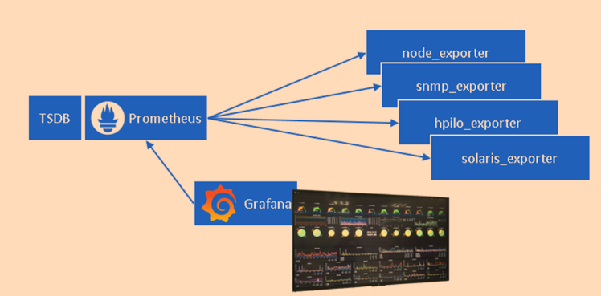

- **Main Lecture is here:** [Prom material](https://docs.google.com/document/d/1NMjHC8qi0RvVOfqVcUhHdsTeAOQCCoa6FQQJv3Tsz74/edit?usp=sharing).

# Monitooring Prometheusega - Osa 1: Sissejuhatus ja Põhimõisted

## 1. Miks me räägime monitooringust?

Kujutage ette järgmist olukorda:
- Teie firma veebileht on maas
- Kliendid helistavad ja on pahased
- Teie boss küsib: "Miks me sellest varem ei teadnud?"

Just sellistel põhjustel vajame monitooringut. See on nagu teie süsteemide tervise pidev jälgimine.

## 2. Mis on Prometheus?


Prometheus on avatud lähtekoodiga monitoorimissüsteem:
- Loodi 2012. aastal SoundCloudis
- Inspireeritud Google'i Borgmonist
- Kirjutatud Go keeles
- Nüüdseks pilverakenduste de facto standard

### 2.1 Põhikomponendid


Prometheus koosneb mitmest põhilisest osast:
1. **Prometheus Server**
   - Andmete kogumine
   - Andmete salvestamine
   - Päringute käitlemine
   
2. **Exporters (Eksportijad)**
   - Koguvad infot süsteemidest
   - Muudavad selle Prometheusele arusaadavaks
   
3. **AlertManager (Hoiatuste Haldur)**
   - Hoiatuste saatmine
   - Hoiatuste grupeerimine
   - Teavituste haldamine

4. **Visualization (Visualiseerimine)**
   - Grafana dashboard'id
   - Prometheuse enda UI

## 3. Monitooringu Põhitüübid

### 3.1 White Box vs Black Box Monitooring


#### Black Box Monitooring
- **Mis see on?** Süsteemi jälgimine väljastpoolt
- **Näide:** Kas veebileht vastab päringutele?
- **Eelised:** Lihtne seadistada
- **Puudused:** Ei näe sisemisi probleeme

#### White Box Monitooring
- **Mis see on?** Süsteemi jälgimine seestpoolt
- **Näide:** CPU, mälu, protsesside jälgimine
- **Eelised:** Detailne ülevaade
- **Puudused:** Keerukam seadistada

### 3.2 Praktiline Näide

Kujutage ette populaarset veebilehte:
- 2 serverit
- Igaühel 8 tuuma ja 8GB RAM
- Kasutab Apache, PHP, MySQL stack'i

**Probleem:** Leht muutub aeglaseks

**Black Box lähenemine:**
```
1. Näeme: Leht laeb 30 sekundit
2. Lahendus: Restart serverile
3. Tulemus: Ajutiselt töötab
```

**White Box lähenemine (Prometheusega):**
```
1. Näeme: 
   - CPU kasutus 90%
   - Mälu 95% täis
   - MySQL päringud aeglased
2. Lahendus:
   - Optimeerime päringuid
   - Lisame caching'u
   - Skaleerime ressursse
3. Tulemus: Püsiv lahendus
```

## 4. Prometheuse Põhimõtted

### 4.1 Pull vs Push mudel


**Kuidas Prometheus andmeid kogub?**
1. Pull mudel:
   - Prometheus küsib andmeid
   - Regulaarsed intervallid
   - Parem kontroll

2. Konfiguratsioon näide:
```yaml
scrape_configs:
  - job_name: 'webapp'
    scrape_interval: 15s
    static_configs:
      - targets: ['server:9090']
```

### 4.2 Miks Pull mudel?
- Lihtsam hallata
- Parem turvalisus
- Automaatne surnud serverite avastamine
- Keskne kontroll

## Järgmises osas...

Järgmises osas vaatame:
1. Kuidas Prometheus andmeid salvestab
2. Erinevad metrika tüübid
3. PromQL päringukeel
4. Praktilised näited

*Tähtis: Enne järgmist osa proovige mõelda oma süsteemidele - milliseid asju tahaksite monitoorida?*

# Monitooring Prometheusega - Osa 2: Andmete Kogumine ja Metrikad

## 1. Prometheuse Andmemudel

### 1.1 Põhikontseptsioonid


Prometheusel on lihtne, kuid võimas andmemudel:
- **Metrika nimi** - mis asja mõõdame
- **Sildid (Labels)** - lisainfo andmete kohta
- **Ajatempel** - millal mõõdeti
- **Väärtus** - mõõdetud number

Näide metrikast:
```
http_requests_total{method="POST", endpoint="/login"} 2345
```
Siin:
- `http_requests_total` on metrika nimi
- `method="POST"` ja `endpoint="/login"` on sildid
- `2345` on väärtus

### 1.2 Filtreerimine


Saame andmeid filtreerida:
- Metrika nime järgi
- Siltide järgi
- Ajavahemiku järgi

## 2. Metrika Tüübid

### 2.1 Counter (Loendur)
```
# Näide: HTTP päringute arv
http_requests_total{method="GET"} 1234
```
- Ainult kasvav number
- Ei saa väheneda
- Saab nullida
- **Kasutus:** Päringute arv, vigade arv

### 2.2 Gauge (Mõõdik)
```
# Näide: Mälu kasutus
memory_usage_bytes{server="web-1"} 2345678
```
- Võib tõusta ja langeda
- Nagu auto spidomeeter
- **Kasutus:** Mälu, CPU, temperatuur

### 2.3 Histogram (Histogramm)
```
# Näide: Päringu kestvused
http_request_duration_seconds_bucket{le="0.1"} 2345
```
- Mõõdab väärtuste jaotust
- Jagab tulemused "ämbritesse"
- **Kasutus:** Vastuse ajad, päringu suurused

### 2.4 Summary (Kokkuvõte)
```
# Näide: Päringu kestvuse kvantiilid
http_request_duration_quantile{quantile="0.95"} 0.2
```
- Arvutab statistilisi väärtusi
- Näitab kvantiilid (nt 95% päringutest)
- **Kasutus:** Detailne jõudluse analüüs

## 3. Andmete Kogumine

### 3.1 Exporters (Eksportijad)


Eksportijad on programmid, mis:
- Koguvad infot süsteemist
- Muudavad selle Prometheuse formaati
- Teevad kättesaadavaks üle HTTP

Populaarsed eksportijad:
```
1. Node Exporter
   - Süsteemi metrikad (CPU, mälu, kettad)
   - Port: 9100

2. MySQL Exporter
   - Andmebaasi metrikad
   - Port: 9104

3. Blackbox Exporter
   - Väliste teenuste kontroll
   - Port: 9115
```

### 3.2 Kuidas andmeid kogutakse?


1. **Seadistamine:**
```yaml
scrape_configs:
  - job_name: 'node'
    static_configs:
      - targets: ['localhost:9100']
```

2. **Protsess:**
   - Prometheus teeb HTTP GET päringu
   - Exporter vastab metrikatega
   - Prometheus salvestab andmed
   - Kordub vastavalt intervallile

## 4. Pushgateway


### 4.1 Millal kasutada?
- Lühiajalised tööd (batch jobs)
- Kui pull pole võimalik
- Firewall'i taga olevad teenused

### 4.2 Kuidas töötab?
1. Teenus saadab metrikad Pushgateway'le
2. Prometheus kogub need Pushgateway'st
3. Andmed säilivad ka pärast teenuse lõppu

## 5. Praktilised Näited

### 5.1 Veebiserveri monitooring:
```yaml
# HTTP päringud
http_requests_total{path="/api/users"} 12345

# Vastuse ajad
http_response_time_seconds{path="/api/users"} 0.23

# Vigade arv
http_errors_total{code="500"} 12
```

### 5.2 Andmebaasi monitooring:
```yaml
# Aktiivsed ühendused
mysql_connections{state="active"} 48

# Päringute arv
mysql_queries_total{type="SELECT"} 1234567

# Kettakasutus
mysql_database_size_bytes{db="users"} 1234567890
```

## Järgmises osas...

Kolmandas osas käsitleme:
1. Hoiatuste seadistamine (Alerting)
2. Visualiseerimine Grafanaga
3. Parimad praktikad
4. Tüüpilised probleemid ja lahendused

*Proovige nüüd mõelda - milliseid metrikaid teie süsteemid vajavad?*

# Monitooring Prometheusega - Osa 3: Hoiatused, Visualiseerimine ja Parimad Praktikad

## 1. Alert Manager (Hoiatuste Haldur)



### 1.1 Miks hoiatused on olulised?
- Probleemide varajane avastamine
- Automaatne reageerimine
- SLA (Service Level Agreement) tagamine

### 1.2 Hoiatuste seadistamine
```yaml
groups:
- name: example
  rules:
  - alert: KõrgeCPUKasutus
    expr: cpu_usage_percent > 90
    for: 5m
    labels:
      severity: warning
    annotations:
      summary: "Kõrge CPU kasutus ({{ $value }}%)"
```

### 1.3 Hoiatuste töövoog:
1. Prometheus kontrollib reegleid
2. AlertManager grupeerib hoiatused
3. AlertManager saadab teavitused
4. Meeskond reageerib

## 2. Visualiseerimine

### 2.1 Grafana Dashboards


Grafana võimaldab:
- Luua ilusaid dashboarde
- Kombineerida erinevaid andmeallikaid
- Lisada hoiatusi
- Jagada tiimiga

### 2.2 Dashboard'i näide:
```
1. Süsteemi ülevaade
   - CPU kasutus
   - Mälu kasutus
   - Ketta kasutus

2. Rakenduse metrics
   - Päringute arv
   - Vastuse ajad
   - Vigade arv

3. Äri metrics
   - Kasutajate arv
   - Tehingute arv
   - Käive
```

## 3. Parimad Praktikad

### 3.1 Metrikate nimetamine
```
# ÕIGE
http_requests_total
process_cpu_seconds_total

# VALE
requests
cpu_time
```

Reeglid:
1. Kasuta selgeid nimesid
2. Lisa mõõtühik nime lõppu
3. Kasuta standardset prefiksit

### 3.2 Siltide kasutamine
```yaml
# ÕIGE
http_requests_total{method="GET", endpoint="/api/users", status="200"}

# VALE
http_requests_total_get_api_users_200
```

Põhimõtted:
1. Kasuta silte filtreerimiseks
2. Ära lisa liiga palju silte
3. Vali sildid hoolikalt

### 3.3 Hoiatuste konfigureerimine

**Head praktikad:**
```yaml
# 1. Lisa kontekst
- alert: KõrgeCPUKasutus
  annotations:
    summary: "Server {{ $labels.instance }} CPU kasutus on {{ $value }}%"
    description: "Võimalikud põhjused:..."

# 2. Väldi müra
  for: 5m  # Oota 5 minutit enne hoiatust

# 3. Määra õige tõsidus
  labels:
    severity: critical  # või warning/info
```

## 4. Tüüpilised Probleemid ja Lahendused

### 4.1 Ressursside kasutamine
```
Probleem: Prometheus võtab liiga palju ressursse

Lahendus:
1. Vähenda scrape_interval
2. Optimeeri päringuid
3. Seadista andmete säilitusaeg
```

### 4.2 Skaleerumine
```
Probleem: Liiga palju metrikaid

Lahendus:
1. Kasuta hierarhilist Prometheust
2. Filtreeri mittevajalikke metrikaid
3. Suurenda ressursse
```

## 5. Jõudluse Optimeerimine

### 5.1 Kogumine
```yaml
global:
  scrape_interval: 15s  # Vaikimisi
  scrape_timeout: 10s   # Timeout

scrape_configs:
  - job_name: 'critical-service'
    scrape_interval: 5s  # Kriitilised teenused tihedamini
```

### 5.2 Säilitamine
```yaml
# prometheus.yml
storage:
  tsdb:
    retention.time: 15d    # Kui kaua hoida
    retention.size: 50GB   # Maksimaalne maht
```

## 6. Kokkuvõte ja Soovitused

### 6.1 Alustades
1. Alusta väikeselt
2. Määratle olulised metrikad
3. Seadista põhilised hoiatused
4. Loo lihtne dashboard

### 6.2 Edasised sammud
1. Lisa rohkem metrikaid
2. Täiusta hoiatusi
3. Automaatne skaleerumine
4. Integreeri teiste tööriistadega

### 6.3 Pidage meeles
- Monitooring on pidev protsess
- Regulaarne ülevaatus on vajalik
- Koguge tagasisidet tiimilt
- Optimeerige vastavalt vajadusele

*Lõppmärkus: Monitooring on nagu kindlustus - parem on seda omada ja mitte vajada, kui vajada ja mitte omada!*
