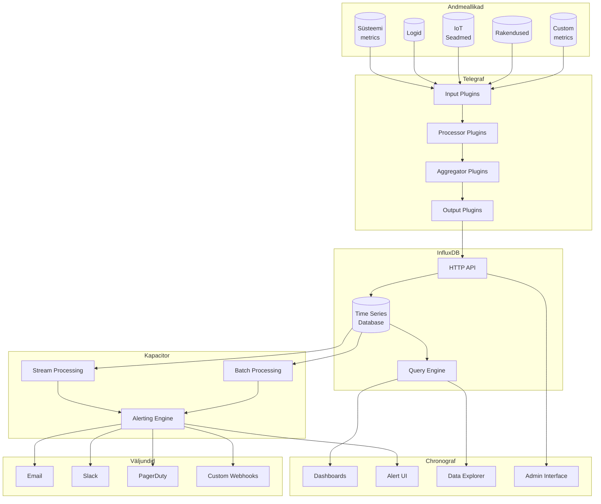

# TICK Stack

## Ajalugu ja areng

TICK Stack sai alguse 2013. aastal, kui InfluxData (tollal nime all Errplane) alustas InfluxDB arendamist. Paul Dix ja tema meeskond nägid vajadust modernsema ajaseeria andmebaasi järele, mis vastaks kaasaegsete hajussüsteemide vajadustele.

### Olulised verstapostid:
- **2013**: InfluxDB esmaversioon
- **2014**: Telegraf'i väljalaske
- **2015**: TICK Stack ametlik väljakuulutamine
- **2016**: Chronograf'i täielik ümberkujundamine
- **2019**: InfluxDB 2.0 väljalase, mis tõi kaasa Flux päringkeele
- **2020**: Kasutajate arv ületas 500,000 piiri
- **2023**: Üle 650,000 aktiivse paigalduse globaalselt

## Tuntud kasutajad

### Tehnoloogiaettevõtted:
- **Netflix**: Kasutab platvormide jälgimiseks ja striimimisteenuste analüüsiks
- **Cisco**: Võrguseadmete monitoorimiseks
- **eBay**: E-kaubanduse platvormide jõudluse jälgimiseks
- **PayPal**: Tehingute ja süsteemide monitoorimiseks
- **Tesla**: IoT andmete kogumiseks ja analüüsiks

### Teadusasutused:
- **CERN**: Teaduslike eksperimentide andmete kogumiseks
- **NASA**: Kosmoseuuringute andmete analüüsiks

### Eesti näited:
- **Telia**: Võrgu monitooring
- **Bolt**: Sõitude ja tellimuste analüütika
- **Wise**: Finantstehingute jälgimine
- **Taltech**: Teadustöö ja laborite seire

## Populaarsuse põhjused

### Tehniline üleolek:
1. **Skaleeruvus**: Võimeline töötlema miljoneid kirjutamisoperatsioone sekundis
2. **Paindlikkus**: Toetab paljusid andmeallikaid ja väljundformaate
3. **Lihtne seadistamine**: "Battery-included" lähenemine

### Ärilised eelised:
1. **Avatud lähtekood**: Madal sisenemisbarjäär
2. **Tugev kogukond**: Kiire abi probleemide korral
3. **Tasuta alustada**: Sobiv nii väikestele kui suurtele projektidele

## Turupositsioon

### Võrdlus konkurentidega:
- **Prometheus**: Populaarne Kubernetes keskkonnas
- **Graphite**: Vanem, traditsioonilisem lahendus
- **Elastic Stack**: Laiem fookus, mitte ainult ajaseeria andmed

TICK Stack eristub:
- Parem kirjutamiskiirus
- Lihtsam seadistamine
- Väiksem ressursikasutus
- Integreeritud tööriistad

## Kasutusstsenaariumid

### DevOps:
- Konteinerite ja mikroteenuste jälgimine
- Rakenduste jõudluse monitooring
- Logide analüüs

### IoT:
- Sensoriandmete kogumine
- Seadmete jälgimine
- Anomaaliate tuvastamine

### Ärianalüütika:
- Reaalaja dashboardid
- Kasutajate käitumise analüüs
- Müügitrendide jälgimine

### Finantssektor:
- Tehingute monitooring
- Turvariskide tuvastamine
- Jõudluse optimeerimine

## Tulevikusuunad

### Arenduses olevad funktsioonid:
- Parem masinõppe integratsioon
- Edge Computing tugi
- Täiustatud visualiseerimistööriistad
- Automaatne skaleerimine

### Kogukonna fookus:
- Kubernetes integratsioon
- Serverless lahendused
- IoT optimeerimine
- 5G võrkude tugi

## Kogukonna ressursid:
- Online õpetused
- Konverentsid (InfluxDays)
- Kohalikud kasutajagrupid

# TICK Stack

TICK Stack on avatud lähtekoodiga platvormi komplekt, mis on mõeldud ajaseeria andmete kogumiseks, salvestamiseks, analüüsimiseks ja visualiseerimiseks. See koosneb neljast peamisest komponendist:

## Komponendid



## Components

### 📊 Telegraf
Telegraf on agent, mis kogub ja saadab meetrika andmeid erinevatest süsteemidest ja teenustest.

**Tehnilised omadused:**
- Kirjutatud Go keeles
- Väike mälukasutus (~20MB)
- Üle 200 sisend-plugina
- Toetab mitmeid väljundformaate

**Konfiguratsiooninäide:**
```toml
[[inputs.cpu]]
  percpu = true
  totalcpu = true
  collect_cpu_time = false
  report_active = false

[[outputs.influxdb_v2]]
  urls = ["http://localhost:8086"]
  token = "your-token"
  organization = "your-org"
  bucket = "your-bucket"
```

### 💾 InfluxDB
InfluxDB on võimas ajaseeria andmebaas, optimeeritud kõrge läbilaskevõimega operatsioonideks.

**Päringute näited:**
```sql
// InfluxQL näide
SELECT mean("usage_idle") 
FROM "cpu" 
WHERE time > now() - 1h 
GROUP BY time(5m)
```

### 📈 Chronograf
Chronograf on TICK Stacki visuaalne liides.

### ⚡ Kapacitor
Kapacitor on reaalajas töötlev mootor.

## Technical Details

### System Requirements

#### Minimum:
- CPU: 2 cores
- RAM: 4GB
- Storage: 10GB
- OS: Linux (Ubuntu 20.04+, CentOS 8+), macOS 10.15+

#### Recommended:
- CPU: 4+ cores
- RAM: 16GB+
- SSD: 100GB+
- OS: Linux (Ubuntu 22.04 LTS)

### Docker Setup

```yaml
version: '3'
services:
  influxdb:
    image: influxdb:latest
    ports:
      - "8086:8086"
    volumes:
      - influxdb-storage:/var/lib/influxdb2

  telegraf:
    image: telegraf:latest
    volumes:
      - ./telegraf.conf:/etc/telegraf/telegraf.conf:ro

  chronograf:
    image: chronograf:latest
    ports:
      - "8888:8888"
    depends_on:
      - influxdb

  kapacitor:
    image: kapacitor:latest
    ports:
      - "9092:9092"
    depends_on:
      - influxdb

volumes:
  influxdb-storage:
```

## History and Usage

### Timeline
- **2013**: InfluxDB esmaversioon
- **2014**: Telegraf'i väljalase
- **2015**: TICK Stack ametlik väljakuulutamine
- **2016**: Chronograf'i täielik ümberkujundamine
- **2019**: InfluxDB 2.0 väljalase
- **2020**: 500,000+ kasutajat
- **2023**: 650,000+ aktiivset paigaldust

### Notable Users
- Netflix
- Cisco
- eBay
- PayPal
- Tesla
- CERN
- NASA

### Estonian Users
- Telia
- Bolt
- Wise
- Taltech

## Security

- SSL/TLS krüpteering
- RBAC (Role-Based Access Control)
- Token-põhine autentimine
- Andmete krüpteerimine
- Audit logging

## Troubleshooting

Log locations:
```bash
/var/log/telegraf/telegraf.log
/var/log/influxdb/influxd.log
/var/log/chronograf/chronograf.log
/var/log/kapacitor/kapacitor.log
```

## Resources

- [Official Documentation](https://docs.influxdata.com/)
- [Telegraf Plugins](https://docs.influxdata.com/telegraf/latest/plugins/)
- [Kapacitor Alerts](https://docs.influxdata.com/kapacitor/latest/guides/alerts/)
- [Chronograf Dashboards](https://docs.influxdata.com/chronograf/latest/guides/dashboard-template-variables/)

---

<div align="center">
  <p>Made with ❤️ for time series data</p>
</div>