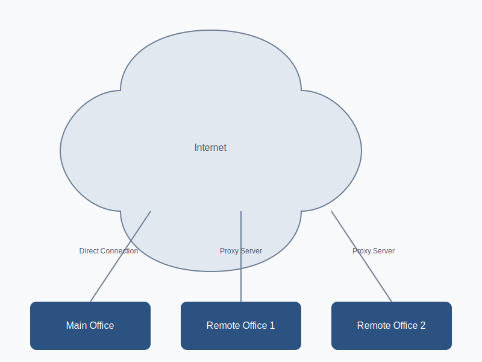
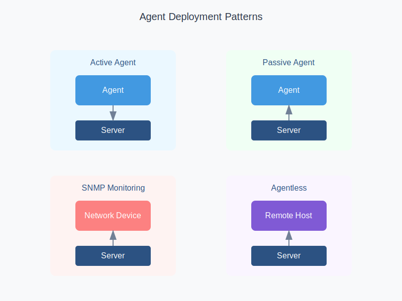
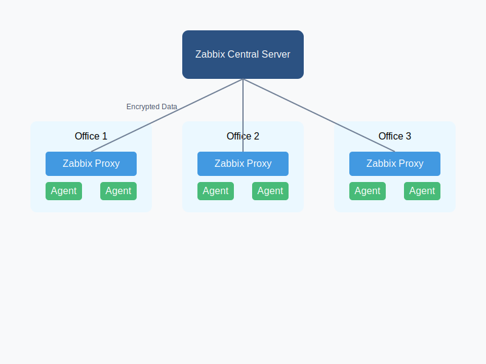
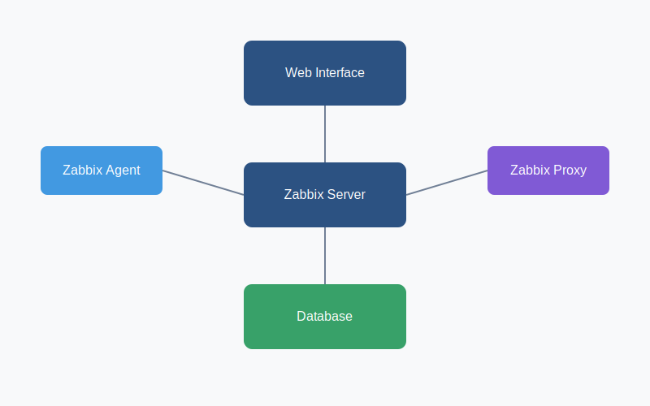
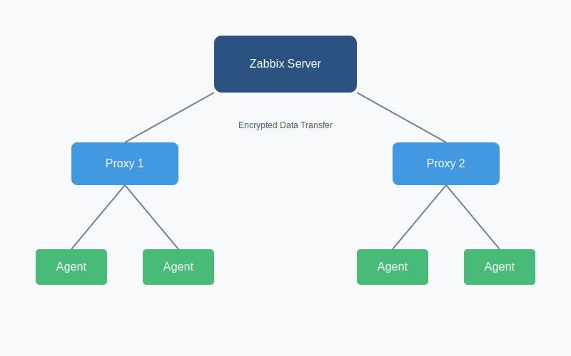

# Sissejuhatus Zabbix'i

Zabbix on avatud lähtekoodiga jälgimistarkvara, mis aitab IT-meeskondadel tagada rakenduste, serverite ja võrkude katkematu toimimise. See tööriist pakub reaalajas monitooringut ja aitab tuvastada probleeme enne, kui need kasutajate tööd segavad. Zabbix'i lõi Alexei Vladishev 1998. aastal ja 2001. aastal avaldati see avatud lähtekoodiga projektina, mis tähendab, et seda saab kasutada tasuta.

## Mis on Zabbix?

Zabbix on väärtuslik tööriist IT-infrastruktuuri jälgimiseks, pakkudes põhjalikku ülevaadet võrkude, serverite ja rakenduste tööseisundist. Zabbix võimaldab monitoorida erinevaid ressursse, sealhulgas protsessori kasutust, mälu olekut, kettaruumi, võrguliiklust ja palju muud. Seda kasutatakse laialdaselt, kuna see on paindlik, skaleeritav ja toetab suurt hulka integreerimisvõimalusi.

### Põhiomadused
- **Avatud lähtekoodiga ja tasuta** – Zabbix'i saab kasutada ilma litsentsitasudeta, mis teeb selle sobivaks nii suurtele ettevõtetele kui ka väikestele organisatsioonidele.
- **Reaalajas monitooring ja analüüs** – Zabbix pakub võimalust monitoorida sadu meetrikaid erinevatest seadmetest ja rakendustest, pakkudes kohest ülevaadet probleemidest.
- **Veebiliides visualiseerimiseks** – tsentraliseeritud veebiliidese kaudu saab visualiseerida kogutud andmeid, luua graafikuid ja aruandeid.

### Üldine Võrgu Topoloogia


## Miks Me Vajame Rakenduste Jälgimist?

### Informatsiooni Kogumine
Rakenduste ja infrastruktuuri jälgimine on kriitiline äriprotsesside tagamiseks. Andmete kogumine aitab parandada äritulemusi ja efektiivsust, pakkudes olulist teavet selle kohta, kuidas teie IT-süsteemid toimivad ja millal on vaja sekkuda.



### Ööpäevaringne Monitooring
Zabbix pakub automaatset jälgimist, mis tähendab, et võite olla kindlad oma võrkude ja rakenduste seisukorra osas 24/7. See on eriti oluline, kuna manuaalne jälgimine ei ole realistlik ja automatiseeritud lahendused pakuvad paremat usaldusväärsust.



### Ennetav Teavitamine
Zabbix toimib kui valvur, teavitades IT-meeskonda võimalikest probleemidest enne, kui need muutuvad kriitilisteks. See võimaldab probleemidele reageerida kiiremini ja minimeerida katkestuste mõju.

#### Alertide Seadistamine
Zabbix'is saab seadistada erinevaid teavitusi vastavalt eeldefineeritud tingimustele:
```yaml
Actions:
  - name: "High CPU Usage"
    conditions:
      - type: "trigger"
        operator: ">="
        value: "90"
    operations:
      - type: "email"
        media: "admin@company.com"
      - type: "script"
        script: "/usr/local/bin/remediate.sh"
```

## Zabbix'i Arhitektuur

Zabbix'i arhitektuur koosneb mitmest põhikomponendist, mis töötavad koos, et pakkuda paindlikku ja skaleeritavat jälgimist.



### Peamised Komponendid

#### Zabbix Server
Zabbix server on keskne komponent, mis haldab kõiki kogutud andmeid. See suhtleb agentidega ja salvestab andmeid andmebaasi.

```ini
# Server optimaalne seadistus
StartPollers=100
StartDiscoverers=15
StartPingers=15
StartTrappers=10
StartPreprocessors=20
CacheSize=2G
HistoryCacheSize=1G
```

#### Web Server
Veebiserver majutab Zabbix'i veebiliidest, mis võimaldab kasutajatel seadistusi teha ja kogutud andmeid visualiseerida.

```apache
# Apache seadistus
<VirtualHost *:80>
    ServerName zabbix.company.com
    DocumentRoot /usr/share/zabbix
    
    <Directory "/usr/share/zabbix">
        Options FollowSymLinks
        AllowOverride None
        Require all granted
    </Directory>
</VirtualHost>
```

#### Andmebaas (RDBMS)
Zabbix vajab andmebaasi, et salvestada kogu kogutud informatsioon. Seda kasutatakse ka kõikide seadistuste hoidmiseks.

```sql
-- MySQL optimaalne seadistus
innodb_buffer_pool_size = 10G
innodb_log_file_size = 2G
innodb_flush_method = O_DIRECT
innodb_flush_log_at_trx_commit = 2
```

### Proxy Arhitektuur
Zabbix proxy on vahekomponent, mis võimaldab jälgimist hajutada, eriti suuremate võrkude puhul.



```ini
# Proxy põhiseadistus
ProxyMode=0
Server=zabbix.company.com
Hostname=proxy01
DBName=zabbix_proxy
ConfigFrequency=3600
DataSenderFrequency=1

# Jõudluse seadistused
StartPollers=100
StartPreprocessors=20
StartDiscoverers=15
CacheSize=2G
```

### Põhikomponendid

#### Zabbix Agent
Zabbix agent paigaldatakse serveritele, et koguda kohalikke andmeid. See on võimeline koguma erinevaid meetrikaid nagu protsessori koormus, mälu kasutus jne.

```ini
# Agendi seadistus
Server=zabbix.company.com
ServerActive=zabbix.company.com
Hostname=webserver01

# Kohandatud kontrollid
UserParameter=mysql.status[*],/usr/local/bin/check_mysql.sh $1
UserParameter=nginx.connections,/usr/local/bin/check_nginx.sh
```

#### Zabbix Proxy
Zabbix proxy võimaldab koondada andmeid erinevatest allikatest, lihtsustades suurte võrkude jälgimist ja vähendades Zabbix serveri koormust.

```ini
# Proxy seadistus suurele koormusele
StartPollers=250
StartIPMIPollers=10
StartPollersUnreachable=50
StartPreprocessors=50
StartDiscoverers=15

# Puhverdamine
ConfigFrequency=1800
DataSenderFrequency=1
```

#### Zabbix Sender
Zabbix Sender on kasulik andmete saatmiseks kohandatud allikatest, mis ei pruugi olla otseselt Zabbix agendiga seotud.

```bash
# Näide kasutamisest
zabbix_sender -z zabbix.company.com -s "WebServer" -k http.response.time -o 0.85
```

## Jälgimise Seadistamine Zabbix'is

### Items
Items on Zabbix'i komponendid, mis määravad, milliseid andmeid kogutakse.

```yaml
items:
  - key: system.cpu.load[percpu,avg1]
    name: CPU Load
    type: Zabbix agent
    update: 1m
  
  - key: vm.memory.size[available]
    name: Available memory
    type: Zabbix agent
    update: 2m
```

### Triggers
Triggers määratlevad, millal peaks Zabbix teavitusi saatma, näiteks kui ressursside kasutus läheb liiga kõrgeks.

```sql
-- CPU koormus
{host:system.cpu.load[percpu,avg1].avg(5m)}>4

-- Mälu kasutus
{host:vm.memory.size[available].last()}<100M

-- Kettaruum
{host:vfs.fs.size[/,pfree].last()}<10
```

### Templates
Template'id võimaldavad seadistuste korduvkasutust, koondades items'eid, triggers'eid ja graafikuid.

```yaml
template:
  name: "Linux Server Basic"
  items:
    - system.cpu.load
    - vm.memory.size
    - vfs.fs.size
  triggers:
    - cpu.high
    - memory.low
    - disk.full
  graphs:
    - CPU Usage
    - Memory Usage
```

### Alerts
Zabbix'is saab seadistada automaatseid tegevusi, mis lähevad käiku, kui mingi triggrer käivitub.

```yaml
actions:
  - name: "High CPU Alert"
    conditions:
      - type: trigger
        value: CPU > 90%
    operations:
      - type: email
        recipients: admin@company.com
      - type: script
        script: /usr/local/bin/remediate_cpu.sh
```

## Troubleshooting

### Agent Ei Ühendu
Kui agent ei suuda Zabbix serveriga ühenduda, võib probleem olla võrguseadistustes või serveri konfiguratsioonis.

```bash
# Kontrolli ühendust
telnet zabbix.company.com 10050

# Kontrolli agendi logisid
tail -f /var/log/zabbix/zabbix_agentd.log

# Kontrolli firewall seadistusi
iptables -L | grep 10050
```

### Andmed Ei Jõua Serverisse
Kui andmed ei jõua serverisse, võib probleem olla proxy seadistustes või andmebaasis.

```bash
# Kontrolli proxy staatust
zabbix_proxy -R config_cache_reload

# Vaata andmebaasi järjekorda
mysql -e "SELECT count(*) FROM proxy_history" zabbix_proxy
```

### Aeglased Päringud
Kui Zabbix'i päringud on aeglased, võib olla vajalik andmebaasi optimeerimine.

```sql
-- Optimeeri andmebaasi
ANALYZE TABLE history;
OPTIMIZE TABLE history_uint;

-- Kontrolli aeglasi päringuid
SELECT * FROM information_schema.processlist 
WHERE time > 10;
```

## Praktiline Näide: Veebiserveri tervise jälgimine

Zabbix võimaldab jälgida veebiserverite töökindlust ja ressursside kasutust, kasutades selleks erinevaid items'eid ja triggers'eid.


```yaml
# Veebiserveri monitooring
Template:
  name: "Web Server Monitoring"
  
  Items:
    - http.response.time[http://example.com]
    - proc.num[apache2]
    - net.tcp.port[,80]
  
  Triggers:
    - {http.response.time.avg(5m)}>2s
    - {proc.num[apache2].last()}=0
  
  Actions:
    - Send Email to: webmaster@company.com
    - Restart Apache if down: systemctl restart apache2
```

## Parimad Praktikad

1. **Andmete Säilitamine**
   - History: 7-30 päeva
   - Trends: 365 päeva
   - Regulaarne hooldus ja kustutamine

2. **Jõudluse Seadistamine**
   ```ini
   StartPollers=100
   StartPreprocessors=50
   CacheSize=1G
   ```

3. **Turvalisus**
   - Krüpteeritud ühendused
   - Tugev autentimine
   - Regulaarsed uuendused ja turvapaigad

## Kasulikud Käsud ja Skriptid

```bash
# Zabbix serveri staatuse kontroll
systemctl status zabbix-server

# Andmebaasi suuruse kontroll
du -sh /var/lib/mysql/zabbix/

# Logide analüüs
grep "error" /var/log/zabbix/zabbix_server.log

# Jõudluse monitooring
zabbix_server -R housekeeper_execute
```

### Täiendavad Ressursid
- **Zabbix Documentation**: [zabbix.com/documentation](https://www.zabbix.com/documentation)
- **Zabbix Share**: [share.zabbix.com](https://share.zabbix.com)
- **Community Forums**: [zabbix.com/forum](https://www.zabbix.com/forum)

See juhend on mõeldud alustavale kasutajale, kes soovib saada põhjalikku ülevaadet Zabbix'i võimalustest ja selle kasutuselevõtust. Edukat jälgimist!

