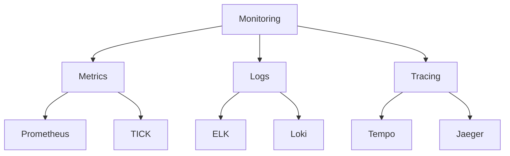
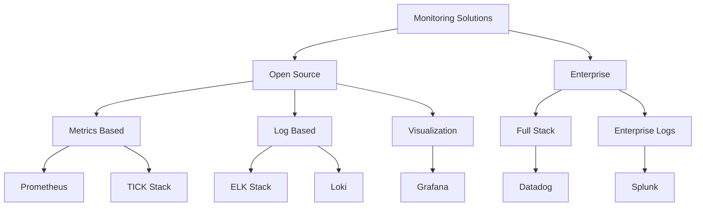
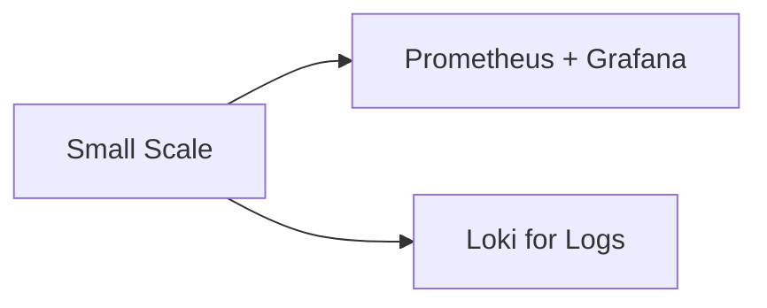
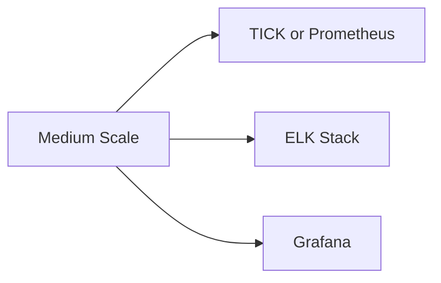
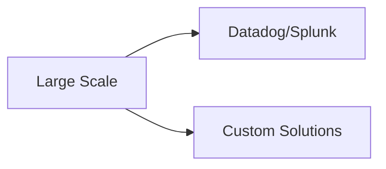
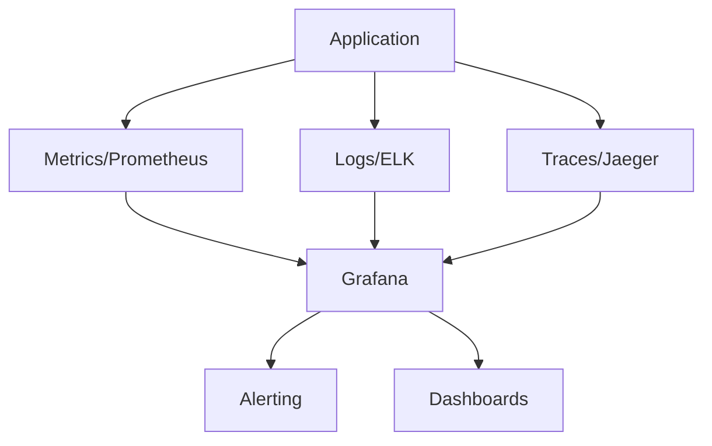

# Monitoring Solutions Overview

## Core Solutions We'll Study

### Prometheus

- Metrics collection and alerting
- Perfect for Kubernetes monitoring
- Pull-based architecture

### TICK Stack

- Time-series data platform
- **Components:**
  - Telegraf: Data collection
  - InfluxDB: Time-series database
  - Chronograf: Visualization
  - Kapacitor: Processing and alerting

### ELK Stack

- Logs processing and analysis
- **Components:**
  - Elasticsearch: Search & storage
  - Logstash: Log processing
  - Kibana: Visualization
  - Beats: Data shippers

### Grafana

- Visualization platform
- Multiple data source support
- Dashboarding solution

## Additional Solutions (Overview Only)

### Modern Alternatives
- **Grafana Loki**

  - Like Prometheus, but for logs
  - Lightweight and cost-effective

### Enterprise Solutions
- **Datadog**

  - Full-stack monitoring
  - Cloud-native platform

- **Splunk**

  - Enterprise log management
  - Security and analytics focus

## Detailed Comparison

| Solution | Type | Cost | Specific Use Cases | Best For | Infrastructure | Course Coverage |
|----------|------|------|-------------------|-----------|----------------|-----------------|
| Prometheus | Metrics | Free, Open Source | • Container monitoring • Microservices metrics • Auto-scaling | • Kubernetes environments • Cloud-native apps | • Small to large scale • Requires own infrastructure | Detailed |
| TICK | Metrics & Events | Free + Enterprise options | • IoT monitoring • System metrics • Network data | • Real-time analytics • Custom metrics | • Medium to large scale • Can be resource-heavy | Detailed |
| ELK | Logs | Free + Paid features | • Log analysis • Application monitoring • Search functionality | • Full-text search • Application logs • Business analytics | • Resource intensive • Scales well | Detailed |
| Grafana | Visualization | Free + Enterprise | • Dashboard creation • Metric visualization • Alert management | • Multi-source dashboards • Metric visualization | • Light on resources • Works with any data source | Detailed |
| Loki | Logs | Free, Open Source | • Container logs • Application logs | • Kubernetes environments • Cost-sensitive setups | • Lightweight • Efficient storage | Overview |
| Datadog | Full-stack | Expensive, Commercial | • Full system monitoring • APM • Cloud monitoring | • Enterprise environments • Complex systems | • SaaS (no infrastructure needed) | Overview |
| Splunk | Logs & Analytics | Most Expensive, Enterprise | • Security monitoring • Compliance • Business intelligence | • Large enterprises • Security operations | • Very resource intensive • Complex setup | Overview |

### Cost Scale:
- **Free**: Prometheus, Community versions
- **Moderate**: ELK Stack (with paid features), TICK (enterprise), Grafana Enterprise
- **Expensive**: Datadog ($15-23 per host/month)
- **Very Expensive**: Splunk ($150+ per GB/day)

### Key Decision Factors:
1. **Budget**: Free (Prometheus) vs Enterprise (Splunk)
2. **Scale**: Small (Loki) vs Large (ELK/Splunk)
3. **Use Case**: 
   - Containers → Prometheus
   - IoT → TICK
   - Logs → ELK/Loki
   - Enterprise → Datadog/Splunk
4. **Resources**:
   - Limited resources → Loki/Prometheus
   - Heavy processing → ELK/Splunk

# Final Overview

## 1. Monitoring Landscape Overview

## 2. Core Solutions Comparison

| Solution | Type | Cost | Main Strength | Main Challenge | Best Use Case |
|----------|------|------|---------------|----------------|---------------|
| Prometheus | Metrics | Free | K8s Integration | Scaling Storage | Container Monitoring |
| TICK | Time Series | Mixed | Real-time Data | Complex Setup | IoT & Streaming |
| ELK | Logs | Mixed | Search Power | Resource Heavy | Log Analysis |
| Grafana | Visualization | Free+ | Multi-Source | Plugin Management | Universal Dashboards |
| Loki | Logs | Free | K8s Friendly | Limited Search | Container Logs |
| Datadog | Full Stack | $$$$ | Easy to Use | Expensive | Enterprise Cloud |
| Splunk | Enterprise | $$$$ | Power & Scale | Very Expensive | Large Enterprise |

## 3. Modern Monitoring Trends

### Current Trends
- 🔄 Observability over Monitoring
- 🤖 AI/ML Integration
- ☁️ Cloud-Native Solutions
- 🔗 OpenTelemetry Adoption
- 📊 Real-Time Analytics

### Future Directions
- 🎯 AIOps Integration
- 🔐 Enhanced Security Monitoring
- 🌐 Edge Monitoring
- ⚡ Real-Time Processing
- 🤝 Unified Observability

## 4. Selection Guide

### Startup/Small Business

- Low cost
- Community support
- Easy start

### Medium Enterprise

- Balanced features
- Mixed open/commercial
- Good scalability

### Large Enterprise

- Full support
- Enterprise features
- Comprehensive tools

## 5. Key Takeaways

### Monitoring Best Practices
- 📌 Start small, scale as needed
- 📌 Consider total cost of ownership
- 📌 Plan for growth
- 📌 Consider team expertise
- 📌 Evaluate integration needs

### Common Pitfalls
- ⚠️ Over-engineering early
- ⚠️ Ignoring scalability
- ⚠️ Underestimating resources
- ⚠️ Tool lock-in
- ⚠️ Missing security aspects

## 6. Real-World Integration Example

## 7. Decision Framework

### When to Choose What:

#### Prometheus
- ✅ Kubernetes environment
- ✅ Need metrics monitoring
- ✅ Limited budget
- ❌ Complex log analysis needed

#### TICK Stack
- ✅ IoT monitoring
- ✅ Need real-time analytics
- ✅ Custom metrics important
- ❌ Limited resources

#### ELK Stack
- ✅ Log analysis crucial
- ✅ Full-text search needed
- ✅ Custom processing required
- ❌ Resource constrained

#### Enterprise Solutions
- ✅ Large scale operations
- ✅ Need full support
- ✅ Complex requirements
- ❌ Limited budget

## 8. Future Considerations

### Emerging Technologies
- 🔮 eBPF Monitoring
- 🔮 Serverless Monitoring
- 🔮 Zero Trust Monitoring
- 🔮 Autonomous Systems
- 🔮 Edge Computing Monitoring

### Skill Development Areas
- 📚 Cloud-Native Technologies
- 📚 Automation/IaC
- 📚 Data Analytics
- 📚 Security Practices
- 📚 Machine Learning Basics

## 9. Resources for Continued Learning

### Documentation
- 📖 Official Docs
- 📖 Community Guides
- 📖 Best Practices
- 📖 Case Studies

### Communities
- 👥 GitHub
- 👥 Stack Overflow
- 👥 Reddit
- 👥 Discord

This overview encapsulates the key aspects of modern monitoring solutions, helping guide decisions based on specific needs and circumstances.